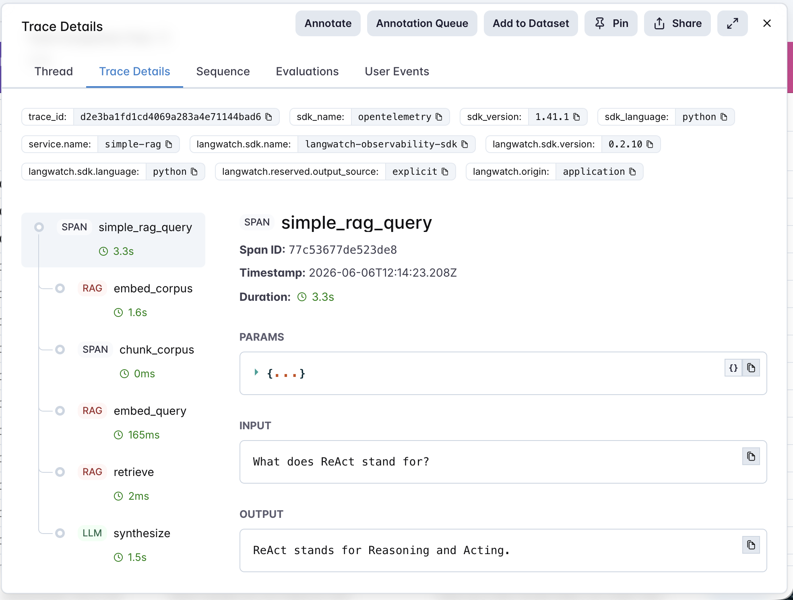

# 01 · Simple RAG

The most basic RAG pattern: chunk a small corpus, embed the chunks, retrieve the top-k by cosine similarity, and synthesize an answer. Wired end-to-end with LangWatch so every step is visible in the trace tree.

## The corpus

A short mini-encyclopedia of ten AI agent patterns ([`corpus.md`](corpus.md)) — RAG, ReAct, Chain-of-Thought, Tree of Thoughts, Function Calling, Agentic Router, Multi-Agent Orchestration, Reflexion, Constitutional AI, and Plan-and-Execute. Each entry is one paragraph (~150-200 words). Distinctive enough that retrieval matters, with enough overlapping terminology to make the task realistic.

## The golden dataset

15 hand-labeled questions ([`dataset.csv`](dataset.csv)) spanning three difficulty bands:
- **Easy** — direct definition lookups ("What does ReAct stand for?")
- **Medium** — comparative ("How is Reflexion different from a single Chain-of-Thought attempt?")
- **Hard** — indirect, use-case framed ("What pattern would you use to solve a logic puzzle that needs trying multiple approaches?")

Each row carries the expected source entry, expected keywords in the answer, and a difficulty tag.

## The pipeline

```
chunk corpus  →  embed chunks  →  embed query  →  retrieve top-k  →  synthesize
```

Every step is a LangWatch span. The trace's root carries the user's question as input and the synthesized answer as output; children carry per-step inputs, outputs, model, and token usage. The result is a complete audit trail of one query — exactly the kind of artifact you'd want in production to debug an "I don't trust this answer" report.



*One real query, fully instrumented: parent `simple_rag_query` span with five typed children. Synthesis dominates the 3.3s end-to-end latency; everything else is sub-second.*

See [`agent.py`](agent.py) — ~150 lines, no frameworks, raw OpenAI + LangWatch.

## The evaluators

Three scorers, two cheap and one LLM-judged ([`evals.py`](evals.py)):

| Evaluator | Type | Measures |
|---|---|---|
| `retrieval_at_k` | Programmatic | Did the top-k retrieved chunks include the *expected source* entry? Binary. |
| `keyword_match` | Programmatic | Does the answer contain every expected keyword? Lenient proxy for completeness. |
| `faithfulness` | LLM-as-judge (gpt-4o-mini, rubric 1-5) | Is every factual claim in the answer supported by the retrieved context? Penalizes hallucinations. |

## The tuning experiment

> **Chunk size 128 vs 256 vs 512 — measured impact on retrieval, completeness, and faithfulness**

Run all three sizes with one command — `python run_eval.py --sweep` runs the whole 15-row dataset against each chunk size in sequence and prints a comparison table.

### Results

| chunk_size | retrieval_at_k | keyword_match | faithfulness |
|---|---|---|---|
| 128 | 0.93 (93%) | 0.61 (40%) | 0.93 (93%) |
| 256 | 0.93 (93%) | 0.61 (40%) | 0.93 (93%) |
| 512 | 0.93 (93%) | 0.59 (40%) | 0.93 (93%) |

*(Score is the mean across the dataset; % is the pass rate.)*

### What this actually tells us

The textbook advice on RAG tuning starts with "sweep your chunk size." On this corpus, it moves nothing. Retrieval is at 93% across all three sizes; faithfulness is at 93% across all three sizes; keyword match wobbles by two percentage points.

**That's the finding.** And it's worth more than another "chunk size 256 won" blog post because it's actually true on this data, measured directly.

The reason chunk size is a non-lever here is the shape of the corpus: ten short entries (~150 words each) on distinct topics with little vocabulary overlap. Embedding-based retrieval saturates regardless of how you cut the entries — the right chunk is always findable.

Chunk size becomes a real lever when:
- The corpus is **much larger** (thousands of docs, vocabulary repeats across many entries)
- Entries are **long** (whole pages or chapters) so smaller chunks isolate distinct ideas
- Entries **overlap in terminology** so retrieval has to discriminate between similar passages
- Synthesis quality starts depending on **the surrounding context** of the matched chunk

The meta-lesson for AI PMs: **test your knobs against your own data before trusting blog-post wisdom**. The whole reason the eval framework exists is to give you that test.

### What would actually improve quality on this dataset?

Looking at where the numbers leave room: `keyword_match` is the laggard at ~40% pass rate. That isn't a retrieval problem — the answers are reaching the right context (93% retrieval) and accurately reflecting it (93% faithfulness). It's that the synthesis paraphrases naturally instead of repeating expected vocabulary. The actual lever to move that would be a synthesis-prompt tweak ("include the original term in your answer"), not chunk size.

That's the next experiment if you wanted to extend this agent: tighten the synthesis prompt, re-run, watch only `keyword_match` shift.

## Quick start

```bash
cd agents/01-simple-rag
python -m venv .venv && source .venv/bin/activate
pip install -r requirements.txt

cp .env.example .env
# fill in OPENAI_API_KEY and LANGWATCH_API_KEY

# Smoke test — one query
python agent.py "What does ReAct stand for?"

# Full eval against the golden dataset
python run_eval.py

# The tuning experiment
python run_eval.py --sweep
```

Every query produces a trace in your LangWatch dashboard with the full step-by-step breakdown.

## What you'll learn

How to wire LangWatch around the simplest possible RAG so the next time you add complexity (re-ranking, hybrid search, citation generation), the trace tree shows you exactly which step changed and why. And how a chunk-size sweep — the most basic RAG tuning experiment there is — gives you the language to talk about retrieval quality with numbers instead of vibes.

## Status

✅ Complete. Code, dataset, evaluators, and the chunk-size sweep are all shipped. Traces from a real run live in the author's LangWatch portfolio project alongside production Cookbook RAG work.
