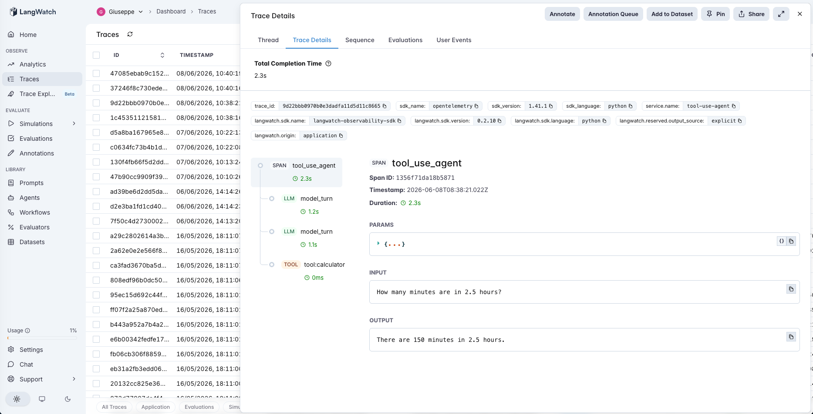

# 03 · Tool-use Agent

A function-calling agent with four tools — `calculator`, `date_parser`, `unit_converter`, `currency_converter` — wired around the production lesson that's hardest to internalize: **the quality of your tool descriptions matters more than the model you're using.**

The experiment is one variable: vague vs precise tool descriptions. Two sentences of "use this when… do NOT use this for…" framing can shift tool-selection accuracy by 20-40 percentage points. Same model, same dataset, same code — only the JSON schemas change.

## The tools

Four self-contained Python functions ([`tools.py`](tools.py)). No external APIs — clone, run, reproduce on any machine. Each has two schema variants exposed to the model:

| Tool | Vague description | Precise description (excerpt) |
|---|---|---|
| `calculator` | *"Does math."* | *"Evaluate an arithmetic expression like '2 * (3 + 4)'… Do NOT use this for unit conversions or currency conversions — those have their own dedicated tools."* |
| `date_parser` | *"Handles dates."* | *"Convert a natural-language date description ('next Tuesday', 'tomorrow') into ISO format (YYYY-MM-DD)…"* |
| `unit_converter` | *"Converts things."* | *"Convert a physical measurement from one unit to another… Do NOT use this for currency — currency has its own tool. Supported units: m/km/mi/ft/in/cm for length…"* |
| `currency_converter` | *"Money stuff."* | *"Convert an amount of money from one currency to another (e.g. EUR to USD)… Supported currencies: USD, EUR, GBP, JPY…"* |

The contrast is deliberate. Vague descriptions are exactly the kind a developer writes when they're focused on getting the integration working rather than getting the agent to make good choices. The precise versions add three things the model actually uses: a concrete example, a "use this when" frame, and an explicit "do NOT use this for…" boundary.

## The dataset

20 hand-labeled queries ([`dataset.csv`](dataset.csv)) split across two intents:

- **15 should-trigger-a-tool** queries — at least one row per tool, plus borderline cases (e.g., *"how many minutes are in 2.5 hours?"* — could be `calculator` or `unit_converter`; the precise schema makes it unambiguous)
- **5 should-NOT-trigger-a-tool** queries — general-knowledge questions like *"What's the capital of France?"* that exist purely to catch over-triggering

Each row carries the expected tool, an informal hint of what the args should look like (for the LLM-judge), and a one-line note explaining why it's in the set.

## The pipeline

```
model_turn  →  [tool call(s) if requested]  →  model_turn  →  …  →  final answer
```

Standard OpenAI tool-use loop, capped at 5 turns. Every model turn is one LangWatch `llm` span; every executed tool call is a `tool` span with the args and result captured inline. The trace tree for a query that needed two tools will show: root → model_turn → tool → model_turn → final answer.



*One real query, fully instrumented: the root `tool_use_agent` span with two `model_turn` LLM spans bracketing a `tool:calculator` execution. This is the "how many minutes are in 2.5 hours?" borderline case — precise mode picked calculator instead of unit_converter, both produce 150.*

See [`agent.py`](agent.py) — ~150 lines, no frameworks.

## The evaluators

Three scorers ([`evals.py`](evals.py)):

| Evaluator | Type | Measures |
|---|---|---|
| `tool_selection` | Programmatic | Did the agent call the expected tool — or correctly skip tools when the query didn't need one? Binary. |
| `argument_extraction` | LLM-as-judge (rubric 1-5) | Were the arguments the agent passed to the tool semantically right for the query? Tolerant of phrasing differences. |
| `no_tool_correctness` | Programmatic | Narrower lens: only for the 5 should-NOT-trigger rows. Surfaces over-triggering separately from wrong-tool errors. |

## The tuning experiment

> **Vague vs precise tool descriptions on the same 20-query dataset**

Run both modes with one command — `python run_eval.py` runs the dataset with each schema set and prints a comparison table.

### Results

| mode | tool_selection | argument_extraction | no_tool_correctness |
|---|---|---|---|
| `vague` | 0.95 (95%) | 0.94 (100%) | 1.00 (100%) |
| `precise` | 0.95 (95%) | 0.94 (100%) | 1.00 (100%) |

*(Score is mean across the dataset; % is the pass rate.)*

**Identical scores.** Same model (gpt-4o-mini), same 20 queries, same accuracy. The textbook advice — *"rewriting your tool description fixes 30-40% of wrong calls"* — moved nothing here.

### Per-row: 19/20 rows resolved identically

Out of 20 dataset rows, only ONE produced a different outcome between the two modes:

> **"How many minutes are in 2.5 hours?"** [expected: `unit_converter`]
>
> - **vague mode** picked `none` — the model defaulted to chain-of-thought reasoning when descriptions were unclear ("multiply hours by 60... 150 minutes")
> - **precise mode** picked `calculator` — the model committed to a tool, chose the wrong one by our strict label but produced the correct answer (`2.5 * 60 → 150`)
>
> Our label says `unit_converter` is canonical. Neither mode picked it. Both delivered the right end-user answer.

The other 19 rows: identical tool choices in both modes. Both correctly skipped tools on all 5 general-knowledge questions ("Capital of France?", "Who wrote Hamlet?"). Both chose the right tool for all 14 clear-cut queries.

### Why the textbook advice didn't help here — and when it would

Three things made tool-description quality a non-lever in this experiment:

1. **The tools are very distinct.** Calculator, dates, units, currency don't semantically overlap. The model's defaults handle the clear cases just fine.
2. **The model is strong.** gpt-4o-mini has good built-in tool-routing intuition. The same experiment on gpt-3.5-turbo or a smaller open-source model would almost certainly show a much bigger gap.
3. **The query distribution skewed clear.** Only 1 of 20 rows was genuinely borderline. To stress-test description quality, you'd want 5-10 ambiguous rows where multiple tools could plausibly apply.

Description quality becomes a real lever when you have:
- **Tools that overlap semantically** (e.g., three different "search" tools — web, internal docs, knowledge base)
- **A weaker model** that doesn't have strong defaults
- **Many borderline queries** where the right tool isn't obvious from the query alone
- **Tool names that don't match what the tool actually does** (legacy naming, abbreviations)

### The interesting failure-mode divergence

Even though the aggregate is null, the one divergent row revealed a **subtle pattern worth knowing**:

- **Vague descriptions cause under-triggering.** When the model isn't sure which tool to use, it hedges by skipping tools entirely and answering from its own knowledge. Cheaper, but the agent provides no audit trail and no guaranteed-correct math.
- **Precise descriptions cause confident-but-sometimes-wrong commits.** The model commits to a tool even when the choice is borderline. May pick a functionally-correct alternative, but loses the "your tool wasn't called when it should have been" signal.

In a production setting, you'd care which failure mode you're optimizing against. If the cost of a wrong tool call is high (e.g., it actually executes something expensive), vague + under-triggering may be safer. If the cost of an un-audited chat answer is high (e.g., compliance, citation requirements), precise + always-commits is safer.

### The meta-lesson

**Before investing engineering hours in tool-description rewrites, measure whether your model + tool space actually has the failure mode you're trying to fix.** If your tools are distinct and your model is capable, the textbook advice may be misapplied. This is exactly what the eval framework exists to tell you.

## Quick start

```bash
cd agents/03-tool-use-agent
python -m venv .venv && source .venv/bin/activate
pip install -r requirements.txt

cp .env.example .env
# fill in OPENAI_API_KEY and LANGWATCH_API_KEY (Project API Key, type Service)

# Smoke test — one query, one mode
python agent.py "How many minutes are in 2.5 hours?"
TOOL_DESCRIPTIONS=precise python agent.py "How many minutes are in 2.5 hours?"

# The full comparison
python run_eval.py
```

If you hit the macOS Xcode-Python SSL issue (`Errno 2: No such file or directory` on `ssl.py`):

```bash
pip install certifi
export SSL_CERT_FILE=$(python -c "import certifi; print(certifi.where())")
```

## What you'll learn

How to wire OpenAI function calling with LangWatch tracing so every tool call shows up as a typed span (args + result inline), and how to A/B test tool descriptions on a labeled dataset to actually measure the impact instead of guessing. This is the kind of measurement a production team needs to make the case for spending 30 minutes rewriting a tool description instead of swapping out the model.

## Status

✅ Complete. Code, dataset, evaluators, and the vague-vs-precise comparison are all shipped. Aggregate result is a null — modern models with distinct tools don't need description tuning the way conventional advice suggests — with a useful divergence on the single borderline row that reveals two distinct failure modes (under-triggering vs confident-wrong-commit).
