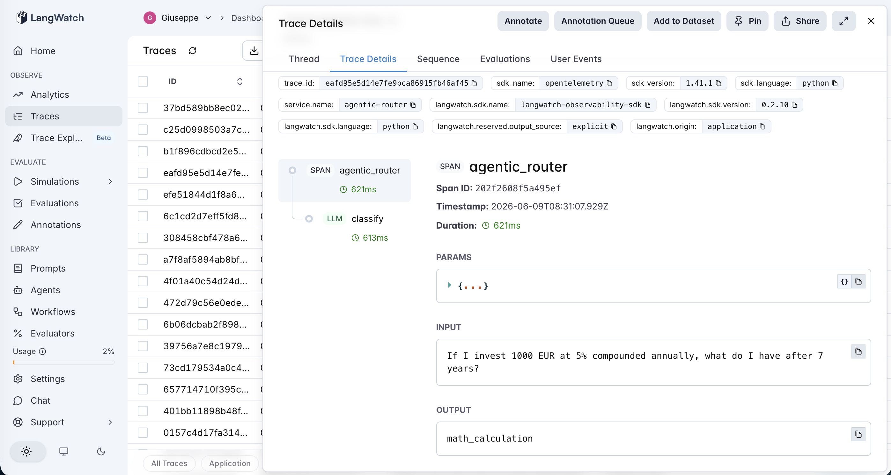
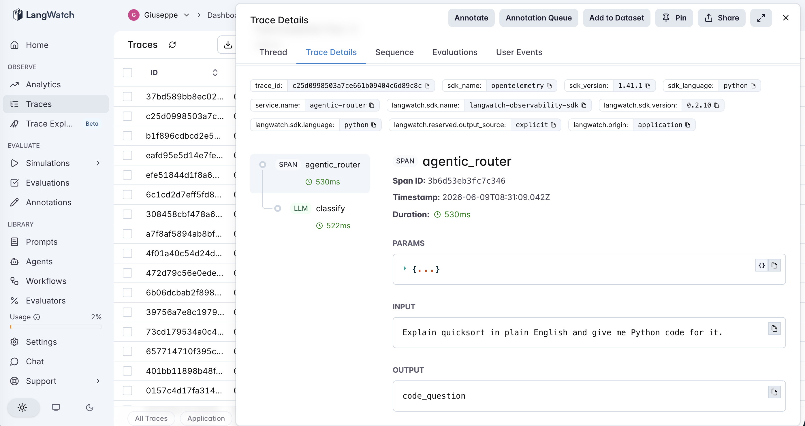
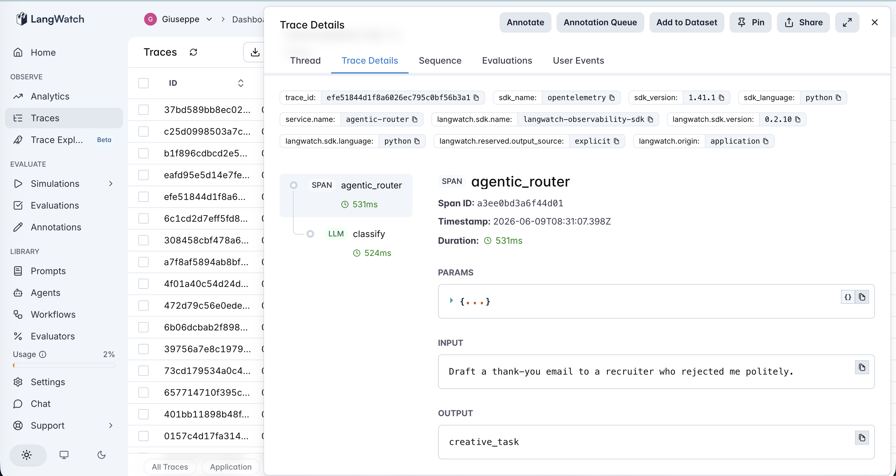
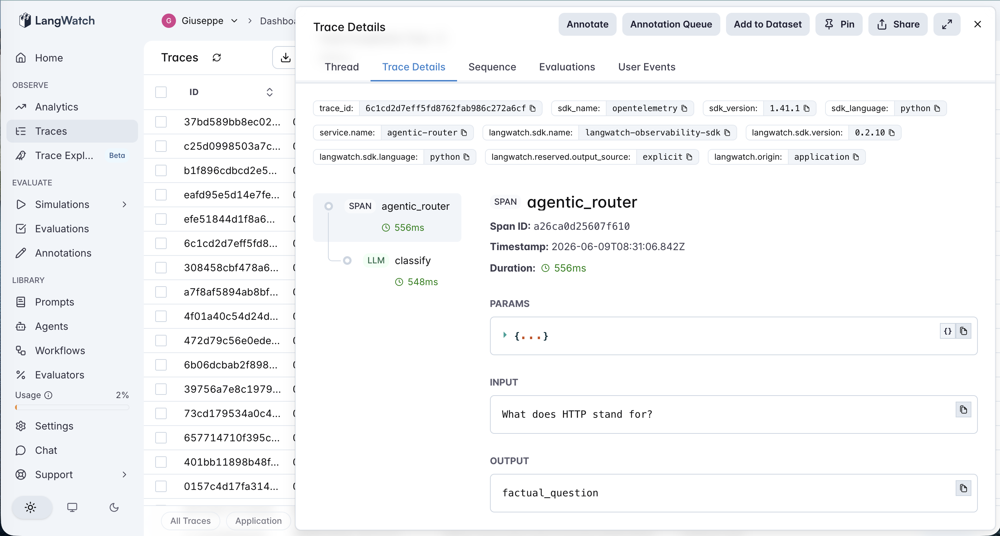
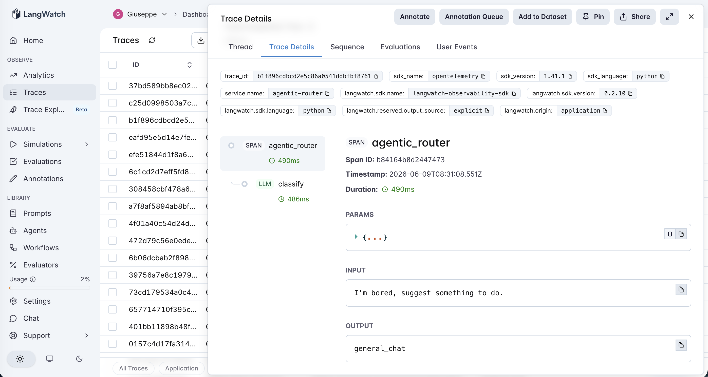

# 04 · Agentic Router

An LLM-as-router agent that classifies incoming queries into one of five categories. This is the generic, reusable version of the routing pattern that production AI products live and die by — the moment an LLM has to decide *which downstream pipeline* should answer a query, you're in router territory.

The experiment is one variable: **bare vs tuned system prompt**. Same model (gpt-4o-mini), same 25-query dataset. The bare prompt is the minimum-viable classifier ("classify into one of these categories"). The tuned prompt adds three things the production-AI prompt-engineering literature swears by — but does it actually move the needle on real-world routing?

## The five categories

| Name | Routes to (in a real product) |
|---|---|
| `code_question` | Programming-help pipeline (search code docs, run examples) |
| `factual_question` | RAG over knowledge base |
| `creative_task` | Long-form generation model with creative-writing prompt |
| `math_calculation` | Calculator tool / formal solver |
| `general_chat` | Default chat path (the fallback) |

The categories are deliberately distinct *and* deliberately overlapping. Code and math overlap on "calculate compound interest in Excel." Creative and general_chat overlap on "suggest a name for my dog." That overlap is where prompt quality earns its keep.

Definitions live in [`categories.json`](categories.json) — swap them out and the agent works for any routing domain.

## The dataset

25 hand-labeled queries ([`dataset.csv`](dataset.csv)) split intentionally:

- **15 clear rows** — single-category queries where the right answer is obvious to a human ("What's 17 times 84?" → `math_calculation`)
- **10 ambiguous rows** — deliberately overloaded queries that fit multiple categories ("Write a story that uses the number pi exactly three times" → math + creative)

The clear rows show whether each prompt style does the basics right. The ambiguous rows are where the experiment actually matters.

## The two prompt styles

| Style | What's in the prompt |
|---|---|
| `bare` | Just the category names + 1-line descriptions. Minimum-viable classifier. |
| `tuned` | Bare + (1) 3 example queries per category, (2) explicit disambiguation rules for the common edge cases ("generation deliverable beats factual lookup"), (3) a fallback rule ("when in doubt, use `general_chat`") |

This is the textbook "improve your system prompt" recipe. The eval framework tells you whether the textbook recipe actually pays off on your data.

## The pipeline

```
classify  →  parse output
```

Two steps — one LangWatch span for the LLM call, plus a thin parser that's tolerant of "I think the answer is..." rambling (it grabs the last valid category name). The trace tree is intentionally simple: the interesting work is all in the prompt, not the orchestration.

### One real trace per category

Five real traces from a single run, one per category, captured directly from LangWatch. The structure is identical across all five (`agentic_router` workflow span with a `classify` LLM child); what changes is which category the router commits to.

| Category | Trace |
|---|---|
| `math_calculation` |  |
| `code_question` |  |
| `creative_task` |  |
| `factual_question` |  |
| `general_chat` |  |

See [`agent.py`](agent.py) — ~150 lines.

## The evaluators

Three scorers ([`evals.py`](evals.py)):

| Evaluator | Type | Measures |
|---|---|---|
| `route_correctness` | Programmatic (exact match) | Did the router pick the labeled category? Strict, binary. |
| `output_format` | Programmatic | Was the response a single valid category name (post-parse)? Catches rambling that breaks downstream parsing. |
| `ambiguity_handling` | LLM-as-judge (rubric 1-5) | Run only on ambiguous rows — was the chosen category *defensible* even if it didn't match the label? Surfaces "label-wrong" vs "actually wrong" so a great router doesn't get unfairly punished. |

Only ambiguity_handling costs LLM calls. The other two are pure code.

## The tuning experiment

> **Bare vs tuned system prompt on 25 queries (15 clear + 10 ambiguous)**

The driver script ([`run_eval.py`](run_eval.py)) splits the comparison three ways — **all rows**, **clear rows only**, and **ambiguous rows only** — so you can see exactly where each style wins.

### Results

**ALL rows (25)**

| style | route_correctness | output_format | ambiguity_handling |
|---|---|---|---|
| `bare` | 0.88 (88%) | 1.00 (100%) | 0.96 (100%) |
| `tuned` | **1.00 (100%)** | 1.00 (100%) | 0.99 (100%) |

**CLEAR rows only (15)**

| style | route_correctness |
|---|---|
| `bare` | 1.00 (100%) |
| `tuned` | 1.00 (100%) |

*Both styles at ceiling. gpt-4o-mini handles the clear cases regardless of prompt — no room for the tuned prompt to add anything.*

**AMBIGUOUS rows only (10)**

| style | route_correctness | ambiguity_handling (judge) |
|---|---|---|
| `bare` | 0.70 (70%) | 0.90 |
| `tuned` | **1.00 (100%)** | **0.97** |

***This is where the prompt earns its keep — +30 percentage points on route correctness, and the LLM-judge score on ambiguity rises too.***

### Every win came from the same failure mode

Three rows flipped from incorrect to correct between styles. All three involved the *same* hidden pattern: a query whose surface phrasing suggests one category but whose actual deliverable is a generation task.

| Query | bare picked | tuned picked | What's hidden |
|---|---|---|---|
| *"What's 2+2 and write it as a haiku?"* | `math_calculation` | `creative_task` | Generation behind math |
| *"What's a good name for my dog?"* | `general_chat` | `creative_task` | Generation behind opinion-seeking |
| *"Who won the 2022 World Cup and write me a celebration tweet for them?"* | `factual_question` | `creative_task` | Generation behind factual lookup |

In every case the user's *actual* need is the generated artifact (haiku, dog name, tweet). The bare prompt's category descriptions weren't specific enough for the model to see past the surface phrasing. The tuned prompt's first disambiguation rule named the pattern explicitly:

> *"If a query has both a factual lookup AND a generation/writing component, the **generation** is the deliverable — pick `creative_task`."*

That single rule caught all three failures.

### The lesson

This is the textbook prompt-engineering result everyone *expects* when they add few-shot examples and disambiguation rules — but it's not automatic. The bare prompt was already correct on 88% of rows; the tuned prompt's lift came **entirely from one specific failure mode that the disambiguation rule names directly**.

The deeper lesson for AI PMs: **prompt engineering works when the prompt change names a specific failure pattern that's actually present in your data.** Adding generic "be careful" instructions or generic few-shot examples isn't what moves the needle. Looking at your eval results, identifying the *one* recurring failure mode, and writing a rule that addresses *that* mode — that's the move.

If we hadn't built a dataset that included ambiguous rows specifically designed to surface generation-hidden-in-another-intent queries, the lift wouldn't have been measurable. The eval framework and the prompt edit are the same intellectual act.

## Quick start

```bash
cd agents/04-agentic-router
python -m venv .venv && source .venv/bin/activate
pip install -r requirements.txt

cp .env.example .env
# fill in OPENAI_API_KEY and LANGWATCH_API_KEY (Project API Key, type Service)

# Smoke test on a clear and an ambiguous case
python agent.py "What's 17 times 84?"
PROMPT_STYLE=tuned python agent.py "Write a story that uses pi exactly three times."

# Full comparison
python run_eval.py
```

If you hit the macOS Xcode-Python SSL issue (`Errno 2: No such file or directory` on `ssl.py`):

```bash
pip install certifi
export SSL_CERT_FILE=$(python -c "import certifi; print(certifi.where())")
```

## What you'll learn

How to build an LLM-as-router with full LangWatch tracing on every classification, and — more importantly — how to measure whether the standard prompt-engineering tricks (few-shot examples, edge-case rules, fallback paths) actually move the needle on your specific routing problem. Routers are everywhere in production AI; "I tuned the prompt and it felt better" isn't an answer that survives a code review.

## Status

✅ Complete. Tuned prompt lifted ambiguous-row accuracy from 70% to 100% — the first cleanly positive result in this catalog after three null-or-mixed findings. All three wins came from a single specific failure mode that the disambiguation rule names directly. The eval framework's job is to surface that.
