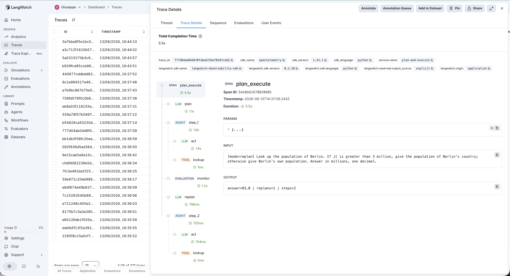
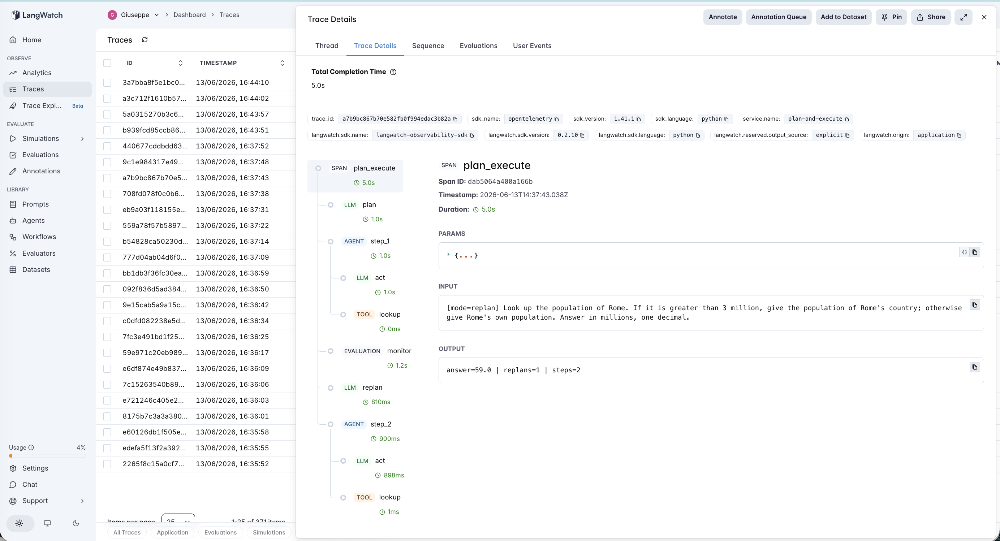

# 08 · Plan-and-Execute

A plan-and-execute agent over a small, deterministic world. A **planner** reads the question once and writes a flat, ordered plan; an **executor** then carries out every step in order, calling tools as it goes. This is the classic Plan-and-Execute pattern reduced to its core tension: **deliberate once and commit — what happens when the world turns out different from the plan?**

The experiment is one variable: **static vs replan**. Same model (gpt-4o-mini), same temperature (0), same 15 questions.

- **static** — plan once, execute every step literally, never re-deliberate.
- **replan** — identical, but after each observation a **monitor** checks whether reality has diverged from the plan, and if so re-invokes the planner for the remaining steps (up to 2 replans).

The headline question isn't "does replanning help?" — it's "**what does adaptivity actually cost, and is it safe?**" Because the easy assumption is that more adaptivity is strictly better. It isn't.

### The one design decision that makes this honest

The **executor never sees the original question.** It sees only the current plan step and the observations so far. So it physically cannot re-derive a branch the plan committed to wrongly — it just executes the step as written. Only the planner (and, in replan mode, the monitor) sees the goal. That is exactly the plan/execute separation: the executor carries out instructions, it does not re-think strategy. Without this, the executor would quietly "fix" bad plans and there would be nothing to measure.

## The pipeline

```
static mode:
    plan ──> step_1 ──> step_2 ──> ... ──> report   (execute the plan, no matter what)

replan mode:
    plan ──> step_1 ──> monitor ──> step_2 ──> monitor ──> ... ──> report
                          │                      │
                          └─ diverged? ─> replan ┘   (regenerate the remaining steps)
```

Each node is one typed LangWatch span under the `plan_execute` workflow root: `plan` (`llm`), each `step_N` (`agent`) wrapping an `act` (`llm`) + a tool span (`tool`), and in replan mode a `monitor` (`evaluation`) before each step plus a `replan` (`llm`) when it fires. The trace tree literally shows whether the agent stuck to its plan or tore it up mid-run.

### Two real traces, side by side

**Replanning rescues a brittle plan** — *"Look up the population of Berlin. If it is greater than 3 million, give the population of Berlin's country; otherwise give Berlin's own population."* Berlin is 3.7M (> 3), so the answer is Germany's population, **83.0**. The static planner can't know Berlin's number when it writes the plan, so it commits to a guess — the "otherwise" branch — and plans `look up Berlin's population → report Berlin's population`. It answers **3.7**: wrong. In replan mode, the `monitor` span fires after step 1 (3.7 > 3 means we need the *country*), a `replan` span rewrites the tail to `look up Germany's population → report it`, and the agent answers **83.0**: correct.



**Replanning breaks a correct plan** — *"Look up the population of Rome. If it is greater than 3 million, give the population of Rome's country; otherwise give Rome's own population."* Rome is 2.8M (< 3), so the answer is Rome's own population, **2.8** — which is the branch the static planner defaults to, so **static gets it right**. But in replan mode the monitor *falsely* fired, the replanner flipped to the country branch, and the agent answered Italy's population instead. **The replan loop broke a row the static plan got right.** Same shape of trace as the Berlin case — but here the `monitor → replan` step is the bug, not the fix.



See [`agent.py`](agent.py) — ~430 lines (it carries its own toy world plus four prompts: planner, executor, monitor, replanner), raw OpenAI + LangWatch, no agent framework.

## The dataset

15 questions ([`dataset.csv`](dataset.csv)) over a tiny in-agent knowledge base of cities and countries (populations in millions). Every question has exactly one correct number, so all scoring is mechanical. Two kinds:

| Kind | Example | Count | Point |
|---|---|---|---|
| `stable` | *"What is the combined population of Paris and Berlin, in millions?"* | 7 | A fixed linear plan suffices. Static should ace these; replanning can only add cost. |
| `branch` | *"Look up X's population. If it's over T, give the country's; otherwise the city's."* | 8 | The right path depends on a value the planner can't know upfront. This is where a committed plan is brittle. |

The `branch` rows are split so that whichever branch the static planner defaults to, it is wrong on roughly half of them — a clean, measurable brittleness signal rather than a coin flip.

## The evaluators

Three scorers ([`evals.py`](evals.py)) — **all programmatic**, since the world is deterministic and every answer is exact (same noise-free choice as agent #7).

| Evaluator | Type | Measures |
|---|---|---|
| `answer_correctness` | Programmatic | Did the final answer match ground truth within the row's tolerance? Pass/fail. Both modes. |
| `adaptation_lift` | Programmatic | Comparing the two modes on the same row: +1 if static was wrong but replan was right (rescued), 0 if no change, −1 if static was right but replan was wrong (thrashed). Normalized to [0,1]. **The discriminator.** |
| `step_efficiency` | Programmatic | LLM calls per run. Lower is better when correctness is equal. Surfaces the price of adaptivity. Both modes. |

## The tuning experiment

> **static vs replan on 15 questions, 7 stable + 8 branch**

The driver ([`run_eval.py`](run_eval.py)) runs every row in both modes, then prints the static-vs-replan pairing that the whole experiment turns on.

### Three hypotheses to discriminate

| | Outcome | What it would teach |
|---|---|---|
| **H1** (textbook) | replan > static on `branch`, neutral on `stable`; positive `adaptation_lift` | Replanning fixes brittleness. The cost is justified. |
| **H2** (null) | replan ≈ static; replanning rarely fires or rarely changes outcomes | For this task class, the upfront plan already captures the structure; adaptivity is a pure tax. |
| **H3** (perverse) | replan introduces NEW errors — negative `adaptation_lift` on some rows | The replan trigger is miscalibrated: it fires when it shouldn't and breaks correct answers. |

### Results

**Aggregate across 15 rows**

| mode | answer_correctness | mean llm_calls | mean replans |
|---|---|---|---|
| `static` | 0.73 (11/15) | 3.9 | 0.00 |
| `replan` | **0.87 (13/15)** | **7.1** | 1.00 |

**Correctness by row kind**

| mode | stable | branch |
|---|---|---|
| `static` | 7/7 | 4/8 |
| `replan` | 7/7 | 6/8 |

The headline reads like a clean H1: replanning beats static by **+14 percentage points**, and the entire gain is on the `branch` rows where a committed plan is supposed to be brittle (4/8 → 6/8). Stable rows are 7/7 in both — replanning never broke an easy one.

**That reading is incomplete.** The pairing metric shows H1 and H3 happening *at the same time.*

### What's actually happening

`adaptation_lift` mean = **0.57** — barely net-positive. Underneath the aggregate:

| Effect | Rows | Which |
|---|---|---|
| **HELPED** (static wrong → replan right) | 4 | Berlin, Cairo, Madrid, Toronto — every `branch` row whose correct answer was the *country*, which the static plan structurally could not reach |
| **HURT** (static right → replan wrong) | 2 | Rome, Lisbon — `branch` rows the static plan got right, which the replan loop **broke** |
| neutral | 9 | 7 stable + 2 branch the static guess happened to match |

Three things the +14pp headline hides:

**1. Static's failures were perfectly predictable, not random.** The static planner defaulted to the same branch every time — "report the city's own population." So it got all 4 city-branch rows right and all 4 country-branch rows wrong. Its brittleness is a *consistent bias*, which is exactly the kind of failure that looks fine in a demo (where you happen to test a city-branch question) and ships a 50% error rate to production.

**2. Replanning didn't just help — it also thrashed.** On Rome and Lisbon the static plan was already correct, the monitor *falsely* decided the plan had diverged, and the replanner flipped to the wrong branch. The loop that fixed 4 rows broke 2 others. Net +4, but the churn is helped-4 / hurt-2, not a clean +4. **A PM who reports only the net is hiding half the behavior of their own system.**

**3. Adaptivity isn't free, and the bill lands on the easy rows too.** Replanning nearly doubled the LLM calls (3.9 → 7.1). The monitor ran on every step of every row — including the 7 stable rows, where it triggered ~1 replan each on average and changed *nothing* but the token count. You pay the adaptivity tax on every request, including the 47% that never needed it.

### The lesson

> **Re-planning is a real fix for plan-and-execute's brittleness — but the replan *trigger* has to be as well-calibrated as the plan itself, or you trade a predictable failure for an unpredictable one.**

The weak link isn't planning or executing — it's the **monitor** that decides *when* reality has diverged. An over-eager monitor converts a brittle-but-predictable system (static: wrong on a known 4 rows) into an adaptive-but-noisy one (replan: right on those 4, but newly wrong on 2 others, at double the cost). The value of adaptivity is bounded by the calibration of the thing that triggers it.

This echoes the catalog's recurring finding from a new angle. In the verification arc (#5, #6, #7) the lesson was *a verifier is only as good as its calibration*. Plan-and-execute adds the control-flow version: **an adaptation trigger is only as good as its calibration.** Bolting on a feedback loop — a fact-checker, a self-critique, a replan monitor — does not reliably add safety. If the controller shares the producer's blind spots or fires on noise, it introduces failures the simpler system never had.

For an AI PM in 2026, the operational takeaway is concrete: when you add a "self-correcting" loop to an agent, the metric that matters is not the aggregate score — it's the **paired diff**. How many rows did the loop fix, how many did it break, and what did it cost on the rows it touched for no reason? `adaptation_lift` answers that; an aggregate "accuracy went up 14 points" celebrates the wins and buries the regressions.

## Quick start

```bash
cd agents/08-plan-and-execute
python -m venv .venv && source .venv/bin/activate
pip install -r requirements.txt

cp .env.example .env
# fill in OPENAI_API_KEY and LANGWATCH_API_KEY (Project API Key, type Service)

# Smoke test: one branch question, static (watch it commit to a guess)
python agent.py "Look up the population of Berlin. If it is greater than 3 million, give the population of Berlin's country; otherwise give Berlin's own population. Answer in millions, one decimal."

# Same question, replan (watch the monitor fire and rewrite the plan)
PLAN_MODE=replan python agent.py "Look up the population of Berlin. If it is greater than 3 million, give the population of Berlin's country; otherwise give Berlin's own population. Answer in millions, one decimal."

# Full comparison
python run_eval.py                  # both modes, all 15 rows
python run_eval.py --limit 3        # smoke test
```

If you hit the macOS Xcode-Python SSL issue (`Errno 2` on `ssl.py`):

```bash
pip install certifi
export SSL_CERT_FILE=$(python -c "import certifi; print(certifi.where())")
```

## What you'll learn

How a plan-and-execute loop looks in LangWatch when the plan, each execution step, the monitor, and each replan are separate typed spans — so you can *see* exactly when the agent abandoned its plan. And the PM-relevant question underneath: whether adding a re-planning loop to a brittle planner actually makes the system better, or just trades one failure mode for another at twice the cost. The answer here is "both, simultaneously" — which is why the paired `adaptation_lift` metric, not the aggregate, is the one that tells the truth.

## Status

✅ Complete. Replanning lifts aggregate correctness +14pp (73% → 87%), entirely on the `branch` rows where a committed plan is structurally brittle — but the paired metric reveals it's H1 and H3 at once: `adaptation_lift` = 0.57 (helped 4, hurt 2, neutral 9), because the monitor over-fired and broke 2 rows the static plan got right, while ~doubling LLM calls (3.9 → 7.1) including on the 7 stable rows that never needed it. Opens the catalog's reasoning/control-flow tier with the control-flow corollary to the verification arc: **an adaptation trigger is only as good as its calibration.**
