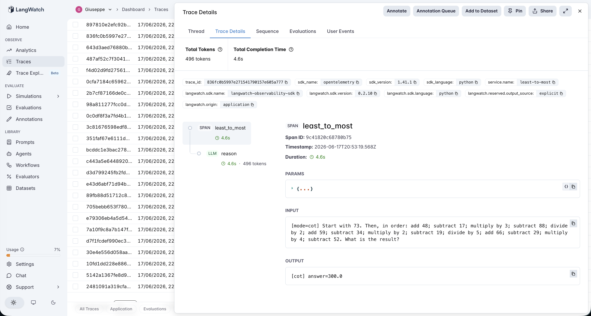
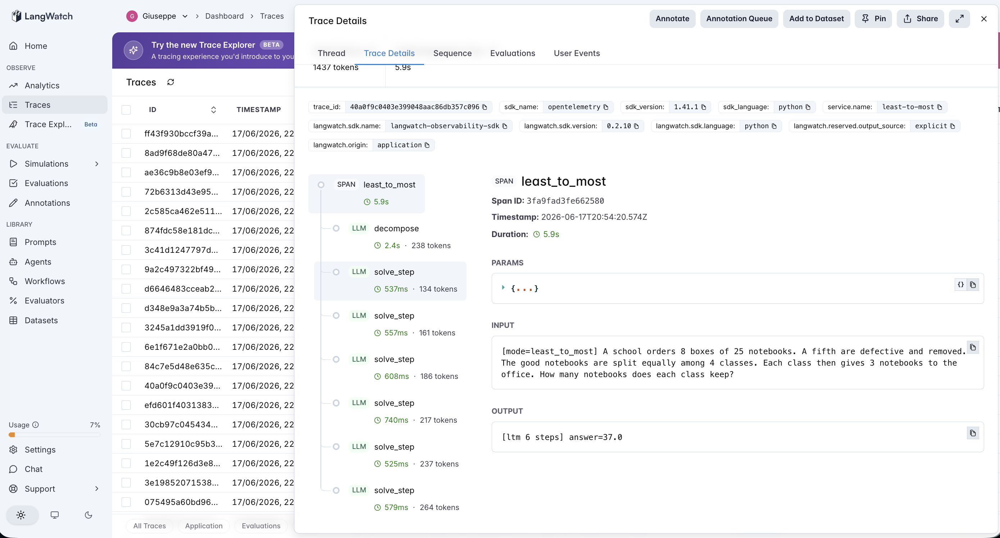

# 12 · Least-to-Most

A least-to-most agent: **decompose a problem into an ordered list of simpler subproblems, then solve them one at a time, each step seeing the answers to the previous ones** — the pattern from Least-to-Most Prompting (Zhou et al., 2022). Where #10 turned reasoning into *search*, this turns it into *explicit sequential decomposition*.

The variable under test is **implicit vs explicit decomposition**:

- **cot** — one chain-of-thought pass: "solve it step by step," ending in `Answer: N`. 1 LLM call. The model decomposes *implicitly*, inside a single call.
- **least_to_most** — call 1 decomposes the problem into ordered subquestions `Q1…QN`; calls 2…N+1 solve each subquestion in sequence, feeding the prior answers forward. 1 + N calls. The decomposition is *explicit* and each step is isolated in its own call.

The PM question isn't "does decomposition help?" — it's "**does making decomposition explicit beat the implicit decomposition a single chain already does, and is it worth the multiple?**" Least-to-most's headline claim is *compositional / length generalization*: it shines on problems deeper than the model can hold in one pass, because isolating each step stops the model from dropping a sub-result midway. So the experiment is built to look for exactly that — a **crossover** where a single chain starts failing as depth grows and explicit decomposition holds.

## The pipeline

```
cot:            reason (one chain) → Answer: N

least_to_most:  decompose  (llm)            → Q1, Q2, …, QN   (ordered, dependent)
                solve_step (llm)  × N        each Qi, with the original problem
                                             + all prior (Qj, Aj) in context
                final answer = the last step's answer
```

Each step is a typed LangWatch span, so the trace shows the decomposition and every sequential solve. See [`agent.py`](agent.py) — ~190 lines, raw OpenAI + LangWatch, no agent framework.

### The domain — dependency-chain arithmetic, depth 2→14

Every problem is a chain where each operation consumes the previous result, so **a single dropped sub-result poisons the final answer** — the precise failure mode least-to-most is meant to prevent. `depth` = the number of sequential operations in the canonical solution. The answer is one integer, mechanically checkable, and a brute-force computation verifies every gold answer (see [`dataset.csv`](dataset.csv) notes).

Crucially, the set runs out to a **stress tier at depths 8, 10, and 14** — long running-value chains with deliberately awkward intermediates — specifically to push a single CoT pass past where it should start dropping values. If a crossover exists, it lives out here.

### Two real traces

**A single chain holds a depth-14 chain in one pass.** `cot` on a 14-operation running-value problem — one `reason` span, no decomposition, correct answer. The implicit decomposition didn't drop a single one of the 14 intermediate values.



**Explicit decomposition — and then some.** `least_to_most` on a depth-5 word problem: the `decompose` span emits the subquestions and a chain of `solve_step` spans works through them. Note the step count — the model routinely produced *more* subquestions than the canonical depth (it split "give 3 to the office" into its own step), so the trace is longer than the problem needs. Same correct answer the single chain already got, at 6–8× the calls.



## The dataset

26 problems ([`dataset.csv`](dataset.csv)), all integer-answer and oracle-verified, spread across depth:

| Tier | Depths | Per depth | What it probes |
|---|---|---|---|
| core | 2, 3, 4, 5, 6 | 4 | normal multi-step word problems |
| stress | 8, 10, 14 | 2 | long running-value chains, awkward intermediates — built to break a single pass |

## The evaluators

Three scorers ([`evals.py`](evals.py)) — **all programmatic** (the domain is mechanically checkable, so no LLM judge and no judge noise, same as #7–#10):

| Evaluator | Type | Measures |
|---|---|---|
| `answer_correctness` | Programmatic | Does the final number equal the gold answer? Pass/fail. Both modes. |
| `ltm_lift` | Programmatic | Paired `cot → least_to_most` per problem: **+1** if cot was wrong and decomposition fixed it, **−1** if cot was right and decomposition broke it, 0 otherwise. Normalized to [0,1]. **The discriminator.** |
| `cost` | Programmatic | LLM calls per run (cot=1, ltm = 1 + #subquestions). The price of explicit decomposition. |

The headline cut is `answer_correctness` **sliced by depth** (in [`run_eval.py`](run_eval.py)) — that table is where a crossover would appear if it existed.

## The tuning experiment

> **cot vs least_to_most on 26 dependency-chain problems, depths 2→14**

### Three hypotheses to discriminate

| | Outcome | What it would teach |
|---|---|---|
| **H1** (textbook) | least_to_most ≫ cot at high depth — explicit decomposition holds chains the single pass drops | Compositional generalization is real and worth the extra calls. The least-to-most-paper result. |
| **H2** (over-correction) | least_to_most < cot — a wrong decomposition poisons the sequential solve | Explicit decomposition can *introduce* errors a single chain wouldn't make. |
| **H3** (null / no headroom) | least_to_most ≈ cot — single-pass reasoning already decomposes implicitly and robustly, so explicit decomposition finds nothing to fix and just adds cost | Explicit decomposition only pays once *implicit* decomposition breaks down. |

### Results

**Aggregate across 26 problems**

| mode | correct | mean llm_calls |
|---|---|---|
| `cot` | **26/26 (100%)** | 1.0 |
| `least_to_most` | **26/26 (100%)** | **7.6** |

**Accuracy by problem depth — where a crossover would show**

| mode | d2 | d3 | d4 | d5 | d6 | d8 | d10 | **d14** |
|---|---|---|---|---|---|---|---|---|
| `cot` | 4/4 | 4/4 | 4/4 | 4/4 | 4/4 | 2/2 | 2/2 | **2/2** |
| `least_to_most` | 4/4 | 4/4 | 4/4 | 4/4 | 4/4 | 2/2 | 2/2 | **2/2** |

**Paired lift + decomposition granularity**

| | value |
|---|---|
| `ltm_lift` mean | **0.50** (the exact neutral midpoint) |
| helped / hurt / no-op | **0 / 0 / 26** |
| decomposition matched canonical depth | **8/26** — finer on **18/26**, coarser on 0 |
| mean subquestions vs mean canonical depth | **6.6 vs 5.5** (it over-decomposes) |

### What's actually happening — H3, demonstrated out to depth 14

**The crossover never comes.** A single chain-of-thought pass solved every problem at every depth — including the depth-14 stress chains where it had to carry fourteen intermediate values without dropping one. The failure mode least-to-most was built to prevent simply doesn't occur for `gpt-4o-mini` on this task class: its *implicit* decomposition is already complete and robust. So explicit decomposition had nothing to recover — `ltm_lift` landing on exactly 0.50 (0 helped, 0 hurt) is the signature of a mechanism that touched nothing — and it cost **7.6× the calls** to confirm answers the single chain already had.

**And it actively over-decomposes.** On only 8/26 problems did the decomposition match the canonical depth; on 18/26 it produced *more* steps than the problem needs (mean 6.6 subquestions for a mean canonical depth of 5.5), routinely spinning a trivial restatement ("how many does each class give away?" → "3") into its own LLM call. Every one of those is a paid round-trip that buys nothing. The over-correction risk (H2) never fired either — but only because each isolated subproblem was easy enough that the model didn't slip.

This is not "the dataset was too easy." It runs to depth 14 with awkward arithmetic *specifically* to find the break, and the break isn't there. The honest result is that the precondition for the pattern to pay off — single-pass reasoning that loses track — is **absent at this depth for this model.**

### The lesson

> **Least-to-most makes decomposition explicit — but a capable model already decomposes implicitly inside one chain. Explicit decomposition only pays once that implicit decomposition breaks down; below that depth it's a 6–8× cost multiplier that finds nothing to fix and tends to over-decompose.**

The value of explicit decomposition is bounded by *reasoning headroom* — the gap between what the model can hold in one pass and what the problem demands. `gpt-4o-mini` had no such gap up to depth 14, so the loop was pure overhead. The pattern is still real (it's why it works on much harder compositional benchmarks and weaker models) — but whether *your* model needs it is an empirical question with a measurable answer: find the depth where single-pass accuracy starts falling, and only there does decomposition earn its multiple.

This is the decomposition-tier entry in the catalog's recurring finding — a bolted-on mechanism only helps under a precondition that must be *measured*, not assumed:

| Agent | Mechanism | Precondition for it to help |
|---|---|---|
| #7 reflexion | self-critique + retry | the critic must be **calibrated** |
| #8 plan-and-execute | replan on divergence | the monitor must be **calibrated** |
| #9 chain-of-thought | self-consistency vote | the samples must actually **disagree** |
| #10 tree-of-thoughts | search + pruning | the value function must be **calibrated** |
| #11 constitutional-ai | critique + revise vs a constitution | the base model must **deviate** from the constitution |
| **#12 least-to-most** | **explicit decompose + sequential solve** | **single-pass reasoning must actually break down (depth headroom)** |

For an AI PM in 2026 weighing "let's decompose the prompt into subtasks," the operational takeaway is concrete: the number that predicts whether it pays off is the **single-pass accuracy-vs-depth curve** for your model and task. If it's flat at 100% across the depths you actually see, explicit decomposition is a cost multiplier with no upside. Measure the curve before you pay 6–8× per query.

## Quick start

```bash
cd agents/12-least-to-most
python -m venv .venv && source .venv/bin/activate
pip install -r requirements.txt

cp .env.example .env
# fill in OPENAI_API_KEY and LANGWATCH_API_KEY (Project API Key, type Service)

# One problem, each mode
python agent.py "A baker has 24 eggs. She uses 6 to make a cake, then splits the rest into 3 cartons. How many per carton?"
LTM_MODE=least_to_most python agent.py "A school orders 8 boxes of 25 notebooks. A fifth are defective..."

# Full comparison (both modes, 26 rows; ltm makes ~7-15 calls/row)
python run_eval.py
python run_eval.py --limit 4     # smoke test
```

If you hit the macOS Xcode-Python SSL issue (`Errno 2` on `ssl.py`):

```bash
pip install certifi
export SSL_CERT_FILE=$(python -c "import certifi; print(certifi.where())")
```

## What you'll learn

How a least-to-most agent looks in LangWatch when the `decompose` step and each sequential `solve_step` are their own spans — and how to read, from the step count alone, whether the decomposition is doing real work or just over-splitting. The PM-relevant takeaway is that explicit decomposition is conditional and measurable: it can only help on problems a single chain gets wrong, so its entire value rides on a *depth headroom* you have to measure — and on a capable model below that depth, it's a multiple-times cost increase that confirms answers the model already had.

## Status

✅ Complete. On 26 dependency-chain problems spanning depth 2→14, `cot` and `least_to_most` both score **26/26** — a single chain holds even the depth-14 stress chains, so explicit decomposition is a **~7.6× cost** no-op (`ltm_lift` = 0.50, 0 helped / 0 hurt) that also **over-decomposes** (matched canonical depth on just 8/26, finer on 18/26). The crossover the pattern promises never appears because the precondition — single-pass reasoning that drops sub-results — is absent at this depth for this model. The decomposition-tier entry in the calibration/precondition thread (#7→#12): a bolted-on mechanism only helps when there's a measured gap for it to close.
