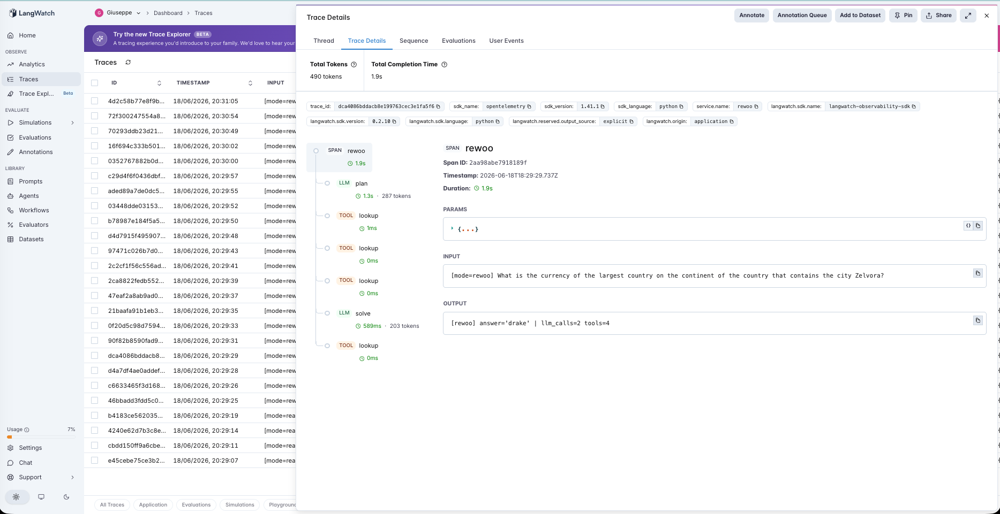
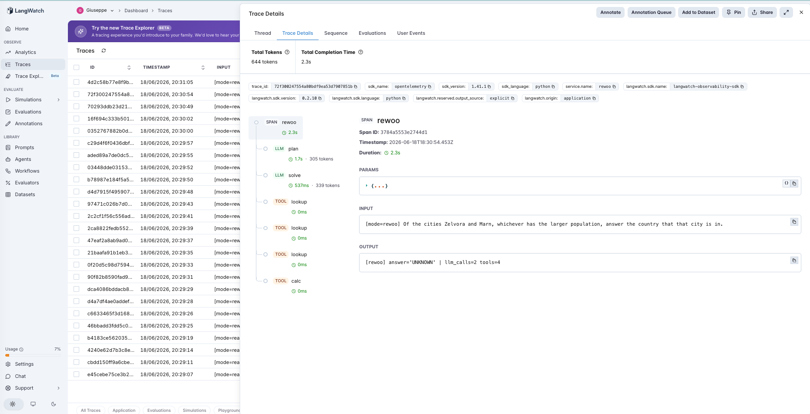

# 13 · ReWOO (Reasoning WithOut Observation)

A ReWOO agent: a **planner** writes the entire plan upfront as a list of interdependent tool calls using `#E` variables as placeholders for results it cannot see yet; a **worker** executes them and fills in the variables; a **solver** reads the plan plus all the evidence and writes the answer. The LLM is called exactly **twice** — plan, then solve — no matter how many tool calls the plan contains (Xu et al., 2023). Where #6 ReAct *interleaves* reasoning and observation, ReWOO *decouples* them.

The variable under test is **interleaved vs decoupled tool use**:

- **react** — Thought → Action → Observation, repeated. **One LLM call per tool call**; the model sees each observation before choosing the next action.
- **rewoo** — plan blind → execute → solve. **Exactly 2 LLM calls** regardless of hop count.

Both modes use the **same tools** (`lookup[entity, attribute]`, `calc[expr]`) and the **same text action syntax**, so the only difference is the architecture. The PM question isn't "is ReWOO cheaper?" — of course it is — it's "**what does the flat 2-call cost actually buy, and where does planning-without-observation break?**"

> **Fictional knowledge base.** The world (`mordania`, `zelvora`, `aurelia`, …) is invented, so the model *cannot* answer from memory — it has to use the tools. That's what makes blind planning a real test rather than a recall exercise. The KB lives in [`agent.py`](agent.py); every answer is oracle-verified.

## The pipeline

```
react:   iteration_k: reason (llm) → lookup/calc (tool) → observation, repeated
         (≈ one LLM call per hop, +1 to finish)

rewoo:   plan   (llm)            → #E1 = lookup[zelvora, country]
                                   #E2 = lookup[#E1, capital]    (blind — no results seen)
         worker (tool × N)       → execute, substituting #E values forward
         solve  (llm)            → read plan + evidence → answer
         (always exactly 2 LLM calls)
```

Each step is a typed LangWatch span. See [`agent.py`](agent.py) — ~270 lines, raw OpenAI + LangWatch, no agent framework.

### Two real traces

**ReWOO does a 4-hop chain in 2 LLM calls.** `rewoo` on *"the currency of the largest country on the continent of the country that contains Zelvora"*: the `plan` span emits four dependent `#E` steps, four `lookup` worker spans resolve them (`mordania → aurelia → mordania → drake`), and the `solve` span answers — **2 LLM calls** for what ReAct did in **5**.



**Blind planning hits a wall it can't see.** `rewoo` on a comparison-branch row (*"whichever of Zelvora and Marn has the larger population, give that city's country"*): the planner, unable to observe the populations, tries to fake control flow with `calc[#E1 > #E2 ? 1 : 2]` and `lookup[#E3 == 1 ? zelvora : marn, country]`. The arithmetic tool can't evaluate a ternary, the conditional lookup resolves to garbage, and the answer is `UNKNOWN`. The plan committed to a structure before it had the fact that determines the structure.



## The dataset

18 multi-hop questions over the fictional KB ([`dataset.csv`](dataset.csv)), all oracle-verified, in two families:

| Category | Count | What it is |
|---|---|---|
| `fixed` | 12 | multi-hop where the *structure* (which lookups, in what order) is fixed regardless of values — 2 to 5 tool calls deep |
| `branch` | 6 | the next step depends on a value you must **observe first** — 4 *threshold* rows ("if population > 25M, give capital, else currency") + 2 *comparison* rows ("whichever city is larger, give its country") |

The `branch` rows are the observation-dependent control flow ReWOO is, by design, not built for — the same brittleness #8's static planner showed, now in the ReWOO vs ReAct frame.

## The evaluators

Three scorers ([`evals.py`](evals.py)) — **all programmatic** (deterministic KB, single-token answers; no judge noise, same as #7–#10, #12):

| Evaluator | Type | Measures |
|---|---|---|
| `answer_correctness` | Programmatic | Does the final answer match the gold token/number? Pass/fail. Both modes. |
| `llm_call_efficiency` | Programmatic | LLM calls per query. ReWOO's headline claim: a flat 2 vs ReAct scaling with hops. |
| `react_to_rewoo_lift` | Programmatic | Paired `react → rewoo` per query: **+1** if react wrong & rewoo right, **−1** if react right & rewoo broke it (the blind-planning failure), 0 otherwise. **The discriminator.** |

## The tuning experiment

> **react vs rewoo on 18 multi-hop questions (12 fixed, 6 branch)**

### Three hypotheses to discriminate

| | Outcome | What it would teach |
|---|---|---|
| **H1** (free lunch) | rewoo ≈ react on accuracy, far fewer LLM calls everywhere | Decoupling reasoning from observation is a strict efficiency win. |
| **H2** (efficiency–adaptivity tradeoff) | rewoo matches react on fixed rows at lower cost, but loses on branch rows | The 2-call cost is free *only* when the plan structure is observation-independent. |
| **H3** (blind planning too costly) | rewoo loses accuracy broadly | Planning without feedback is too brittle to be worth the savings. |

### Results

**Aggregate across 18 queries**

| mode | correct | mean llm_calls | mean tool_calls |
|---|---|---|---|
| `react` | **18/18 (100%)** | 4.0 | 3.0 |
| `rewoo` | **16/18 (89%)** | **2.0** | 3.8 |

**By category — accuracy and mean LLM calls**

| mode | fixed acc | fixed calls | branch acc | branch calls |
|---|---|---|---|---|
| `react` | 12/12 | 3.9 | 6/6 | 4.2 |
| `rewoo` | **12/12** | **2.0** | **4/6** | **2.0** |

**Paired lift + efficiency**

| | value |
|---|---|
| `react_to_rewoo_lift` mean | **0.44** (helped 0, hurt 2, neutral 16) |
| the 2 HURT rows | both *comparison*-branch rows → `UNKNOWN` |
| branch breakdown | rewoo **4/4 threshold**, **0/2 comparison** |
| total LLM calls | react **72** vs rewoo **36** → **2.0× fewer for ReWOO** |

### What's actually happening — H2, with a twist

**On fixed-structure multi-hop, ReWOO is a free lunch.** Same 12/12 accuracy as ReAct, at **2.0 LLM calls instead of 3.9** — and the gap *widens* with depth, because ReWOO stays at 2 calls whether the chain is 2 hops or 5 while ReAct pays one call per hop. Across the whole set it used **half the LLM calls** (36 vs 72). When the set of tool calls is knowable upfront, planning blind costs nothing.

**ReWOO has no native control flow — and it shows in two opposite ways on the branch rows.** The planner *tries* to express conditionals by emitting `calc[#E2 > 25000000]` and ternaries, but the arithmetic tool can't evaluate a comparison, so those steps error. What happens next depends on *what the branch controls*:

- **Threshold rows (give capital **or** currency): ReWOO survives — by over-gathering.** Its plan looks up *both* outcomes (`#E4 = capital`, `#E5 = currency`) plus the population, and the tool-less **solver** — which can see the population evidence — resolves the condition itself. 4/4 correct, but at **6 tool calls** for a canonical-2 problem. ReWOO traded *more tool calls* for *fewer LLM calls* and quietly absorbed the branch.
- **Comparison rows (which city is bigger → look up *that* city's country): ReWOO fails.** Here the observed value decides **which entity to look up next**, and that lookup cannot be made blind. The planner emits `lookup[#E3 == 1 ? zelvora : marn, country]`, it resolves to garbage, and the solver has *no tool* to recover the missing fact. Both rows → `UNKNOWN`. 0/2.

So the dividing line isn't "branch vs no branch" — it's **what the unobserved value controls**. If it controls the *output* (which of several gathered facts to report), ReWOO over-gathers and the solver picks. If it controls the *structure* (which entity/tool comes next), blind planning has already lost: neither the planner (can't see) nor the solver (can't act) can choose.

### The lesson

> **ReWOO's flat 2-call cost is genuinely free when the set of tool calls is knowable without seeing any results — and it even absorbs value-conditioned *outputs* by over-gathering. But it cannot handle a value-conditioned *plan structure*: when an observation must decide which tool comes next, decoupling reasoning from observation has thrown away the one thing you needed.**

The efficiency win is real and large (2× fewer LLM calls here, more on deeper chains). The precondition for it to be *free* is precise: **the plan's structure must not depend on any value the plan will discover.** ReAct pays one LLM call per hop precisely so it can let each observation steer the next action; ReWOO refunds those calls by giving that steering up. On observation-independent work that's pure savings; the moment structure depends on a fact, ReAct's interleaving is the feature you were paying for.

This is the decoupled-tool-use entry in the catalog's recurring finding — a bolted-on mechanism only helps under a precondition that must be *measured*, not assumed:

| Agent | Mechanism | Precondition for it to help |
|---|---|---|
| #7 reflexion | self-critique + retry | the critic must be **calibrated** |
| #8 plan-and-execute | replan on divergence | the monitor must be **calibrated** |
| #9 chain-of-thought | self-consistency vote | the samples must actually **disagree** |
| #10 tree-of-thoughts | search + pruning | the value function must be **calibrated** |
| #11 constitutional-ai | critique + revise vs a constitution | the base model must **deviate** from the constitution |
| #12 least-to-most | explicit decompose + sequential solve | single-pass reasoning must **break down** (depth headroom) |
| **#13 rewoo** | **plan blind → execute → solve (flat 2 calls)** | **the plan structure must be observation-independent** |

For an AI PM in 2026 weighing "let's plan all the tool calls upfront to cut latency and cost," the operational takeaway is concrete: ReWOO pays off in proportion to how much of your workload is observation-independent multi-hop. Audit your traces for steps where *which tool comes next* depends on a prior result — that fraction is exactly where ReWOO will silently return `UNKNOWN` (or worse, a confident wrong answer), and it's the fraction you must keep interleaved.

## Quick start

```bash
cd agents/13-rewoo
python -m venv .venv && source .venv/bin/activate
pip install -r requirements.txt

cp .env.example .env
# fill in OPENAI_API_KEY and LANGWATCH_API_KEY (Project API Key, type Service)

# One query, each mode
python agent.py "What is the capital of the country that the city Zelvora is in?"
REWOO_MODE=rewoo python agent.py "What is the currency of the largest country on the continent of the country that contains the city Zelvora?"

# Full comparison (both modes, 18 rows)
python run_eval.py
python run_eval.py --limit 4     # smoke test
```

If you hit the macOS Xcode-Python SSL issue (`Errno 2` on `ssl.py`):

```bash
pip install certifi
export SSL_CERT_FILE=$(python -c "import certifi; print(certifi.where())")
```

## What you'll learn

How a ReWOO agent looks in LangWatch when `plan` and `solve` are the only two LLM spans and the worker's `lookup`/`calc` calls sit between them — and how to read, from a plan full of `#E` placeholders, whether the task was safe to plan blind. The PM-relevant takeaway is that decoupling reasoning from observation is a measurable efficiency win with a sharp precondition: it's free on observation-independent multi-hop, it can absorb value-conditioned *outputs* by over-gathering, but it structurally cannot handle a value-conditioned *next step* — and that's the slice of your workload that has to stay interleaved.

## Status

✅ Complete. On 18 multi-hop questions, `rewoo` matches `react` on accuracy for fixed-structure chains (**12/12**) at **half the LLM calls** (2.0 vs 3.9), and across the set used **2× fewer LLM calls total** (36 vs 72) — the efficiency win is real and grows with hop depth. But it scored **4/6 on branch rows**: it absorbs *threshold* branches by over-gathering both outcomes and letting the solver pick (4/4, at extra tool calls), and fails *comparison* branches where the observed value decides which entity to look up next (0/2 → `UNKNOWN`). The decoupled-tool-use entry in the calibration/precondition thread (#7→#13): a bolted-on mechanism only helps when its precondition — here, an observation-independent plan structure — actually holds.
