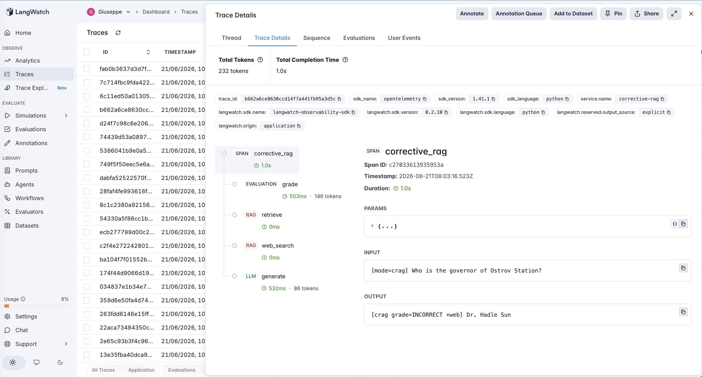
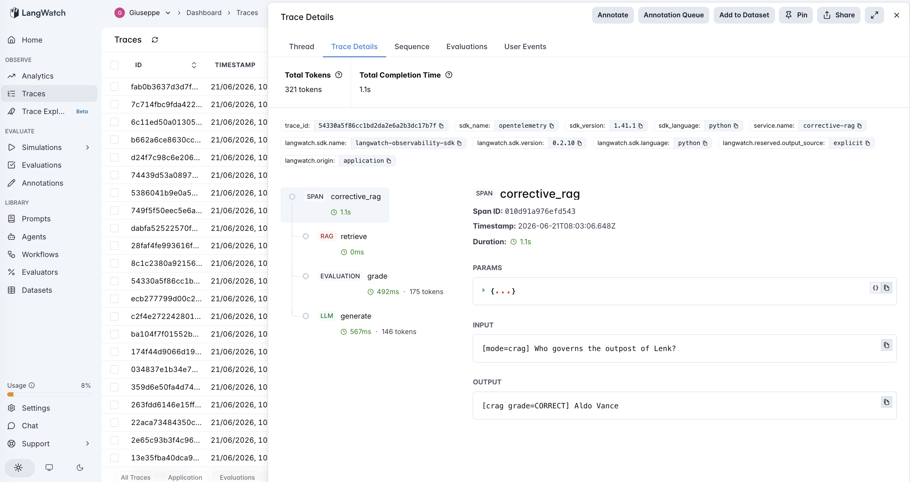

# 14 · Corrective-RAG (CRAG)

A corrective-RAG agent: retrieve, then **grade the retrieval and fix it before generating** (Yan et al., 2024). A *retrieval grader* judges whether the retrieved passages actually contain the answer; if they don't, the agent discards them and runs a corrective **web search** against a broader fallback corpus, then generates. This is the catalog's first **retrieval-tier** agent — and, after a long run of mechanisms whose precondition failed, its first **positive control**: a bolted-on mechanism whose precondition *holds*, so it actually pays off.

The variable under test is **plain RAG vs grade-and-correct**:

- **vanilla** — retrieve top-k from the local corpus → generate. 1 LLM call, no safety net.
- **crag** — retrieve → grade (CORRECT / INCORRECT) → if INCORRECT, web-search a fallback corpus → generate. 2 LLM calls.

The PM question isn't "does correcting bad retrieval help?" — obviously it can — it's "**how good does the grader have to be, and what happens on the rows where the bad retrieval LOOKS relevant?**" So the dataset is built around grader calibration, and the experiment reports the grader's accuracy as a first-class number.

> **Fictional corpus.** The world (`Thessaly`, `Vex`, `Ostrov Station`, the `Sirin Reach`…) is invented, so the model can't answer from memory — retrieval genuinely decides the outcome. The local corpus ([`corpus.md`](corpus.md)) and the web fallback ([`web_corpus.md`](web_corpus.md)) **don't share facts**, so an over-eager grader that routes a good local hit to the web is punished — making over-correction a real, measurable risk, not a hypothetical.

## The pipeline

```
vanilla:  retrieve (rag) → generate (llm)

crag:     retrieve (rag) → grade (evaluation) ─ CORRECT ──────────────→ generate (llm)
                                              └ INCORRECT → web_search (rag) → generate (llm)
```

Each step is a typed LangWatch span — the `grade` step is an `evaluation` span (an LLM-judge inside the pipeline), visually distinct from the `llm` generator. See [`agent.py`](agent.py) — ~210 lines, raw OpenAI + LangWatch, no framework.

### Two real traces

**CRAG catches retrieval that's on-topic but answer-free.** `crag` on *"Who is the governor of Ostrov Station?"* — the local corpus has an Ostrov passage (residents, research) and a governor passage (for a *different* colony), so retrieval looks plausible. The `grade` span returns **INCORRECT** anyway (the specific answer isn't there), a `web_search` span fires, and `generate` answers **Dr. Hadle Sun**. Vanilla, on the same retrieval, said "I don't know."



**And it doesn't over-correct.** `crag` on an in-corpus question (e.g. *"Who governs Lenk?"*) — retrieval hits the right passage, the `grade` span returns **CORRECT**, and there is **no `web_search` span**: it generates straight from local. The grader routing correctly in *both* directions — flag the bad, keep the good — is the whole ballgame.



## The dataset

15 questions over the fictional corpus ([`dataset.csv`](dataset.csv)), each labelled with whether the answer is actually in the local corpus (the grader's ground truth):

| Category | Count | Answer in local? | What it tests |
|---|---|---|---|
| `in_corpus` | 6 | yes | clean retrieval — grader should keep local; CRAG must not over-correct |
| `out_obvious` | 5 | no | answer only on the "web"; local retrieval is clearly irrelevant |
| `out_tricky` | 4 | no | answer not local, **but local has a deceptive look-alike** (same entity/topic, no answer) — the grader-calibration stressor |

The `out_tricky` rows are the heart of it: a grader fooled by topical overlap (the classic relevance-gate trap) says CORRECT, skips the web, and fails exactly like vanilla.

## The evaluators

Three scorers ([`evals.py`](evals.py)) — **all programmatic** (short factual answers over a known corpus; no judge noise, same as #7–#10, #12, #13):

| Evaluator | Type | Measures |
|---|---|---|
| `answer_correctness` | Programmatic | Is the gold answer present in the response? (normalized substring.) Both modes. |
| `vanilla_to_crag_lift` | Programmatic | Paired `vanilla → crag`: **+1** vanilla wrong & crag fixed it, **−1** vanilla right & crag broke it (over-correction), 0 else. **The net-benefit discriminator.** |
| `grader_accuracy` | Programmatic | CRAG-only: did the grade (CORRECT/INCORRECT) match `answer_in_local`? **The calibration number CRAG's value rides on.** |

## The tuning experiment

> **vanilla vs crag on 15 questions (6 in-corpus, 5 obvious-miss, 4 tricky-miss)**

### Three hypotheses to discriminate

| | Outcome | What it would teach |
|---|---|---|
| **H1** (correction pays) | crag ≫ vanilla on out-of-corpus rows, no loss on in-corpus | A calibrated grader turns bad retrieval into right answers for a flat extra call. |
| **H2** (grader fooled) | crag beats vanilla on `out_obvious` but not `out_tricky` | The grader is calibrated for clear misses but fooled by look-alikes — correction has a blind spot. |
| **H3** (over-correction) | crag loses on some `in_corpus` rows | The grader over-flags good retrieval and routes it to a web that lacks the fact. |

### Results

**Aggregate across 15 queries**

| mode | correct | mean llm_calls |
|---|---|---|
| `vanilla` | 6/15 (40%) | 1.0 |
| `crag` | **15/15 (100%)** | **2.0** |

**Accuracy by category**

| mode | in_corpus | out_obvious | out_tricky |
|---|---|---|---|
| `vanilla` | 6/6 | 0/5 | 0/4 |
| `crag` | **6/6** | **5/5** | **4/4** |

**Grader calibration + paired lift**

| | value |
|---|---|
| `grader_accuracy` | **15/15 (100%)** — incl. **4/4 on the look-alike traps**, 6/6 no over-flag |
| `vanilla_to_crag_lift` mean | **0.80** (helped 9, **hurt 0**, neutral 6) |
| cost | 2× LLM calls (1 → 2) |

### What's actually happening — H1, cleanly, because the grader held

**CRAG converted every failure into a correct answer.** Vanilla scored 40% — perfect on in-corpus, zero on everything out-of-corpus (it either abstained or answered from a distractor). CRAG scored **100%**, and the paired lift shows why: **9 helped, 0 hurt.** The +60pp came entirely from the out-of-corpus rows, with no damage to the in-corpus ones.

**The result is clean for one measurable reason: the grader was perfectly calibrated.** `grader_accuracy` = 15/15 — and the two ways it could have failed both stayed at zero:

- **It didn't get fooled by look-alikes.** All 4 `out_tricky` rows — where local retrieval is on-topic but answer-free (an Ostrov passage with no governor, Vex passages with no shaft depth) — were graded INCORRECT and routed to the web. This is the case a naive relevance check (keyword overlap, embedding similarity) gets wrong; an LLM grader told *"being on the same topic is not enough"* got it right.
- **It didn't over-flag.** All 6 `in_corpus` rows were graded CORRECT and kept local. Since the web fallback shares no facts with local, a single over-flag would have produced a HURT row — there were none.

So this is **H1, and it's the thread's positive control.** Every prior agent in the calibration line (#7→#13) bolted on a mechanism that no-op'd or broke because its precondition didn't hold. CRAG's precondition — *a calibrated retrieval grader* — **does** hold here, and we measured it holding (15/15). That, not the architecture, is why the mechanism delivered.

### What this did NOT test (the honest edge)

CRAG's grader judges whether the answer is **present**, not whether it is **true**. This experiment only ever puts *missing* answers in the bad retrievals — never *wrong* ones. Against a local passage that confidently states an incorrect answer, the grader would (correctly, by its own definition) say CORRECT, and CRAG would serve the wrong answer with no correction. CRAG fixes retrieval that lacks the answer; it does not fix retrieval that contains a wrong answer. Worth stating plainly so the 100% isn't mistaken for "CRAG can't be wrong."

### The lesson

> **Corrective-RAG turns bad retrieval into right answers — but only as well as its grader can tell good retrieval from bad. The mechanism's entire value is the grader's accuracy; here that number was 15/15 (including the look-alikes), so CRAG bought +60pp of correctness for one extra call and zero over-correction. Measure the grader before you trust the correction.**

The operational takeaway for an AI PM in 2026 is the same number, twice: `grader_accuracy` predicts both halves of CRAG's value. A grader that **misses** bad retrieval (false CORRECT) makes CRAG no better than plain RAG on exactly the queries you added it for; a grader that **over-flags** good retrieval (false INCORRECT) makes it *worse* (and slower) whenever the fallback is thinner than your primary index. Before shipping a correction step, label a set for "is the answer actually in the retrieved context?" and measure your grader against it — that single number tells you whether the second LLM call is insurance or theater.

This is the retrieval-tier entry — and the **positive control** — in the catalog's recurring finding: a bolted-on mechanism helps exactly when its precondition holds, and the precondition is something you must *measure*.

| Agent | Mechanism | Precondition for it to help | Held here? |
|---|---|---|---|
| #7 reflexion | self-critique + retry | the critic must be **calibrated** | ✗ |
| #8 plan-and-execute | replan on divergence | the monitor must be **calibrated** | ✗ |
| #9 chain-of-thought | self-consistency vote | the samples must actually **disagree** | ✗ |
| #10 tree-of-thoughts | search + pruning | the value function must be **calibrated** | partial |
| #11 constitutional-ai | critique + revise vs a constitution | the base model must **deviate** | ✗ |
| #12 least-to-most | explicit decompose + solve | single-pass reasoning must **break down** | ✗ |
| #13 rewoo | plan blind → execute → solve | plan structure must be **observation-independent** | partial |
| **#14 corrective-rag** | **grade retrieval → web-correct** | **the retrieval grader must be calibrated** | **✓ (15/15)** |

## Quick start

```bash
cd agents/14-corrective-rag
python -m venv .venv && source .venv/bin/activate
pip install -r requirements.txt

cp .env.example .env
# fill in OPENAI_API_KEY and LANGWATCH_API_KEY (Project API Key, type Service)

# One query, each mode (a tricky look-alike row)
python agent.py "Who is the governor of Ostrov Station?"
CRAG_MODE=crag python agent.py "Who is the governor of Ostrov Station?"

# Full comparison (both modes, 15 rows)
python run_eval.py
python run_eval.py --limit 4     # smoke test
```

If you hit the macOS Xcode-Python SSL issue (`Errno 2` on `ssl.py`):

```bash
pip install certifi
export SSL_CERT_FILE=$(python -c "import certifi; print(certifi.where())")
```

## What you'll learn

How a corrective-RAG flow looks in LangWatch when the `grade` step is its own `evaluation` span between `retrieve` and `generate`, and a `web_search` span appears only on the rows the grader rejected — so you can read the grader's routing decisions straight off the trace. The PM-relevant takeaway is that CRAG is a measurable, high-leverage upgrade whose payoff is fully predicted by one number — grader accuracy — and that the same number bounds its two failure modes (missing bad retrieval, over-flagging good retrieval), which is why it belongs in your eval set before the correction step belongs in production.

## Status

✅ Complete. On 15 questions over a fictional corpus, `crag` lifts accuracy from **40% → 100%** over vanilla RAG (+60pp, 9 helped / 0 hurt) for one extra LLM call — because its retrieval grader was **15/15 calibrated**, catching all 9 out-of-corpus rows (including 4 look-alike traps) and over-flagging none of the 6 in-corpus rows. The retrieval-tier entry and the **positive control** of the calibration/precondition thread (#7→#14): the one agent so far whose precondition demonstrably holds — which is exactly why the mechanism pays off. (Scope: the grader judges answer *presence*, not *truth*; correcting confidently-wrong retrieval is out of scope.)
