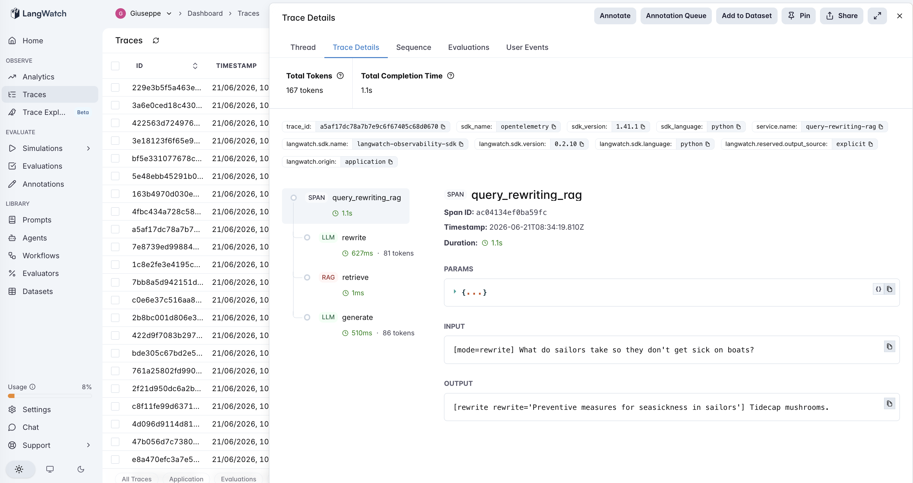
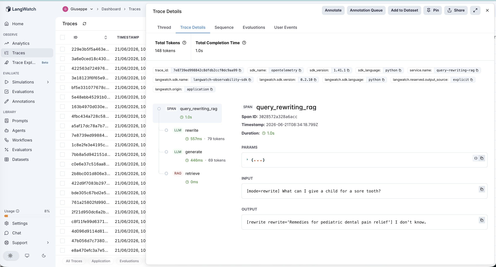

# 15 · Query-Rewriting RAG

A query-rewriting RAG agent: **rewrite the question into a better search key *before* retrieving** (rewrite-retrieve-read; Ma et al., 2023). An LLM turns the user's raw, possibly-vague question into a concise, formal search query, retrieval runs on *that*, then the answer is generated. Where #14 CRAG fixes bad retrieval *after* the fact (grade the docs, web-correct), query-rewriting tries to prevent it *before* the fact — by fixing the key.

The variable under test is **raw query vs rewritten query**:

- **vanilla** — retrieve on the user's raw query → generate. 1 LLM call.
- **rewrite** — an LLM rewrites the query → retrieve on the rewrite → generate. 2 LLM calls.

The PM question isn't "does a better query retrieve better?" — it's "**when is the raw query actually the bottleneck, and what happens when the rewrite guesses the wrong words?**" Because the rewriter never sees the corpus, rewriting is an *open-loop* fix: it can only help if (a) the raw query is a poor retrieval key and (b) the rewrite happens to land on the vocabulary the corpus actually uses.

> **Fictional corpus.** A herbalist's compendium of invented plants ([`corpus.md`](corpus.md)) — so the model must retrieve, not recall. The passages use *formal* terms ("joint inflammation", "seasickness", "toothache"); the `poor` queries use layperson phrasing ("achy joints", "sick on boats", "sore tooth"). Retrieval is keyword-overlap, which makes the vocabulary gap bite — and makes the rewrite's effect cleanly measurable.

## The pipeline

```
vanilla:  retrieve (rag) → generate (llm)

rewrite:  rewrite (llm) → retrieve (rag) → generate (llm)
          "sailors... sick on boats"  →  "...seasickness in sailors"  →  hits the Tidecap passage
```

Each step is a typed LangWatch span. See [`agent.py`](agent.py) — ~190 lines, raw OpenAI + LangWatch, no framework.

### Two real traces

**Rewriting rescues a query that retrieved nothing.** `rewrite` on *"What do sailors take so they don't get sick on boats?"* — the raw query shares **zero** keywords with the corpus, so vanilla retrieves nothing and answers "I don't know." The `rewrite` span turns it into *"Preventive measures for seasickness in sailors"*, the `retrieve` span now hits the Tidecap passage, and `generate` answers **Tidecap mushrooms**.



**Rewriting drifts to the wrong words and still misses.** `rewrite` on *"What can I give a child for a sore tooth?"* (answer: Emberleaf, which the corpus says "dulls **toothache**"). The rewrite span produces *"Remedies for pediatric dental pain relief"* — more formal, but *further* from the corpus's word "toothache" than the original. Retrieval misses again, and the answer is still "I don't know." The rewriter optimized blind: it never saw that the corpus says "toothache."



## The dataset

14 questions over the fictional corpus ([`dataset.csv`](dataset.csv)), in two families:

| Category | Count | Phrasing | What it tests |
|---|---|---|---|
| `clean` | 7 | names the entity, uses corpus vocabulary | vanilla should retrieve fine — does rewriting *hurt* (drift)? |
| `poor` | 7 | vague / layperson, no entity name | vanilla keyword retrieval struggles — does rewriting rescue it? |

## The evaluators

Three scorers ([`evals.py`](evals.py)) — **all programmatic** (short answers over a known corpus; no judge noise, same as #7–#10, #12–#14):

| Evaluator | Type | Measures |
|---|---|---|
| `answer_correctness` | Programmatic | Is the gold answer in the response? Pass/fail. Both modes. |
| `retrieval_hit` | Programmatic | Did the **retrieved passages** contain the gold answer? Isolates the *retrieval* effect from generation — rewriting's actual job. Both modes. |
| `rewrite_lift` | Programmatic | Paired `vanilla → rewrite`: **+1** vanilla wrong & rewrite fixed it, **−1** vanilla right & rewrite broke it (drift), 0 else. **The discriminator.** |

## The tuning experiment

> **vanilla vs rewrite on 14 questions (7 clean, 7 poor)**

### Three hypotheses to discriminate

| | Outcome | What it would teach |
|---|---|---|
| **H1** (rewrite pays where queries are poor) | rewrite ≫ vanilla on `poor`, tie on `clean` | Rewriting is targeted insurance for badly-phrased queries; harmless elsewhere. |
| **H2** (rewrite drifts) | rewrite < vanilla on some `clean` | The rewrite changes a fine query into a worse one — open-loop drift hurts. |
| **H3** (rewrite is blind) | rewrite helps some `poor` but not all | Rewriting can normalize toward the *wrong* vocabulary, because it never sees the corpus. |

### Results

**Aggregate across 14 queries**

| mode | correct | retrieval hit | mean llm_calls |
|---|---|---|---|
| `vanilla` | 11/14 (79%) | 11/14 (79%) | 1.0 |
| `rewrite` | **13/14 (93%)** | **13/14 (93%)** | 2.0 |

**By category — accuracy / retrieval-hit**

| mode | clean | poor |
|---|---|---|
| `vanilla` | 7/7 · 7/7 | 4/7 · 4/7 |
| `rewrite` | **7/7 · 7/7** | **6/7 · 6/7** |

**Paired lift**

| | value |
|---|---|
| `rewrite_lift` mean | **0.57** (helped 2, **hurt 0**, neutral 12) |
| where it helped | 2 of the 3 `poor` queries vanilla actually missed |
| where it didn't | 1 `poor` query rewritten *away* from corpus vocabulary |

### What's actually happening — H1 and H3 together

**`answer_correctness` equals `retrieval_hit`, row for row.** That's the cleanest thing in the experiment: every answer the agent got right, it got right because the gold passage was in context, and every one it got wrong, the passage was missing. The generator never hallucinated a right answer or fumbled a retrieved one — so this is purely a story about retrieval, which is exactly what query-rewriting is supposed to move.

**Rewriting is a no-op on clean queries — zero drift.** All 7 `clean` rows: 7/7 in both modes. When the raw query already names the entity in the corpus's own words, the rewrite doesn't break it (H2 did **not** happen). So the extra call is wasted, not harmful, on well-formed queries.

**On poor queries it helped — but only where it guessed the corpus's words.** Of the 7 `poor` queries, vanilla already retrieved 4 (they happened to share a content word). Of the 3 it genuinely missed, rewriting fixed **2**: "sick on boats" → "seasickness", "achy joints" → "joint pain/inflammation" — the rewrite landed on the formal term the corpus uses, and retrieval hit.

**The one it couldn't fix is the whole lesson.** "What can I give a child for a sore tooth?" became *"Remedies for pediatric dental pain relief."* More formal — but *further* from the corpus's actual word, "toothache." Retrieval missed again. The rewriter is **open-loop**: it normalizes the query's register without ever seeing the corpus, so it can confidently rewrite toward vocabulary the corpus doesn't use. That's H3, and it's the structural limit of rewriting.

### The lesson

> **Query-rewriting is an open-loop retrieval fix: it pays exactly when the raw query is a poor search key *and* the rewrite happens to land on the corpus's vocabulary — and it can't check the second condition, because it never sees the corpus. It cured 2 of 3 genuine misses here and drifted on the third.**

This is the precise complement to #14 CRAG, and the contrast is the point:

| | #15 query-rewriting | #14 CRAG |
|---|---|---|
| When it acts | **before** retrieval (fix the key) | **after** retrieval (fix the docs) |
| Feedback loop | **open** — never sees the corpus | **closed** — grades the retrieved docs |
| Failure mode | rewrites toward the wrong vocabulary | grader miscalibration |
| Cost | 2 LLM calls (rewrite + generate) | 2 LLM calls (grade + generate) |

For an AI PM in 2026: query-rewriting is cheap, safe (no drift on good queries here), and helps real misses — but it is a *blind* fix, so it caps out where the rewrite can't guess your corpus's words. If your retrieval misses are vocabulary-mismatch (jargon vs lay terms), rewriting buys a lot; if they're *missing knowledge*, rewriting can't help (CRAG's web-correction can). The two compose: rewrite to improve the key, then grade-and-correct what still comes back weak.

This is the second retrieval-tier entry, and a precondition the same shape as the rest of the catalog (#7→#15): a bolted-on mechanism helps only when its precondition holds — here, *the raw query is a worse retrieval key than a rewrite that lands on the corpus's vocabulary.*

## Quick start

```bash
cd agents/15-query-rewriting-rag
python -m venv .venv && source .venv/bin/activate
pip install -r requirements.txt

cp .env.example .env
# fill in OPENAI_API_KEY and LANGWATCH_API_KEY (Project API Key, type Service)

# One query, each mode (a poor, vaguely-phrased one)
python agent.py "What do sailors take so they don't get sick on boats?"
QR_MODE=rewrite python agent.py "What do sailors take so they don't get sick on boats?"

# Full comparison (both modes, 14 rows)
python run_eval.py
python run_eval.py --limit 4     # smoke test
```

If you hit the macOS Xcode-Python SSL issue (`Errno 2` on `ssl.py`):

```bash
pip install certifi
export SSL_CERT_FILE=$(python -c "import certifi; print(certifi.where())")
```

## What you'll learn

How a rewrite-retrieve-read flow looks in LangWatch when the `rewrite` span sits before `retrieve`, so you can read the rewritten query and see — by whether the right passage shows up next — whether the rewrite moved toward or away from the corpus's vocabulary. The PM-relevant takeaway is that query rewriting is a cheap, drift-free retrieval upgrade that's bounded by a blind guess: it fixes vocabulary-mismatch misses only when it guesses the corpus's words, which is why `retrieval_hit` (not answer quality) is the number to watch and why it pairs naturally with a closed-loop corrector like CRAG.

## Status

✅ Complete. On 14 questions over a fictional corpus, `rewrite` lifts accuracy from **79% → 93%** over vanilla RAG — entirely through retrieval (`answer_correctness` equals `retrieval_hit` row-for-row), with **zero drift** on the 7 clean queries (7/7 both). The win came from the genuinely-mis-retrieved poor queries (fixed 2 of 3); the third stayed wrong because the rewrite drifted *away* from the corpus's vocabulary ("sore tooth" → "pediatric dental pain relief", not "toothache") — the structural limit of an open-loop, corpus-blind rewriter. The before-retrieval, open-loop complement to #14's after-retrieval, closed-loop CRAG, and the latest entry in the calibration/precondition thread (#7→#15).
