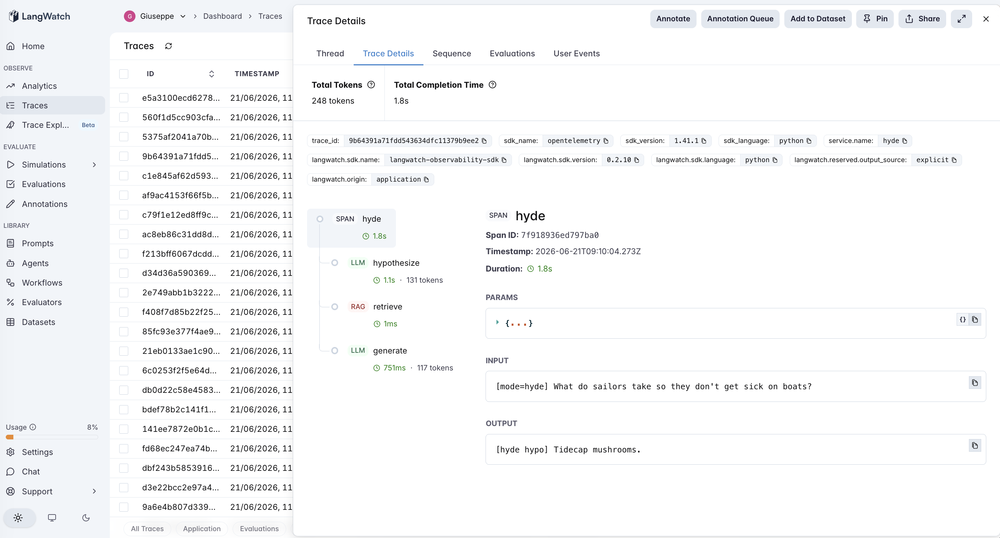
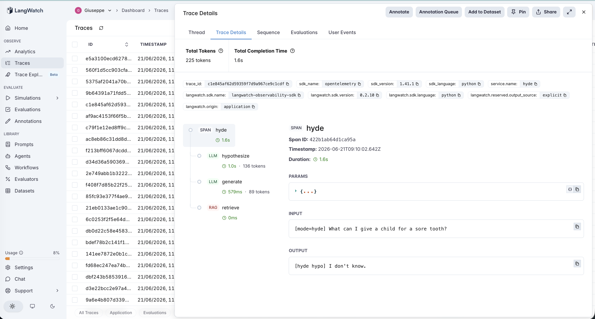

# 16 · HyDE (Hypothetical Document Embeddings)

A HyDE agent: instead of retrieving with the user's question, first ask an LLM to **write a hypothetical answer** — a short passage that *would* answer the question if it existed — and retrieve with that (Gao et al., 2022). The intuition: a corpus is full of *answers* (statements), and a question is a poor structural match for an answer; a fake answer is shaped like the real documents, so it retrieves them better, even if some invented details are wrong.

The variable under test is **what you search with**:

- **vanilla** — retrieve on the raw question → generate. 1 LLM call.
- **hyde** — an LLM writes a hypothetical answer; retrieve on *that*; then generate from the **real** retrieved passages. 2 LLM calls. (The hypothetical doc is used **only** as a search key — never shown to the final generator, so its invented facts can't leak into the answer.)

This is the sibling of **#15 query-rewriting**, run on the **same corpus and same 14 queries** on purpose. Both transform the retrieval key before retrieving; the difference is *where they aim it*:

- #15 keeps the key a **question**, just better phrased (stays in question-space).
- #16 turns the key into an **answer** (jumps to document-space).

The PM question: HyDE is the fancier, more-cited technique — **does jumping to answer-space actually beat just cleaning up the question, and what is the hypothetical answer made of?**

> **Fictional corpus (this is the crux).** The herbalist compendium is invented ([`corpus.md`](corpus.md)), so the model has **never seen it**. That makes HyDE's hypothetical answer come entirely from the model's *general* knowledge — which is the realistic situation for any proprietary, internal, or niche corpus. Watch what that does.

## The pipeline

```
vanilla:  retrieve (rag) → generate (llm)

hyde:     hypothesize (llm) → retrieve (rag) → generate (llm)
          "...sore tooth?"  →  "give acetaminophen, apply a cold compress..."  →  retrieve with THAT
```

Each step is a typed LangWatch span. See [`agent.py`](agent.py) — ~190 lines, raw OpenAI + LangWatch, no framework.

### Two real traces

**HyDE helps — but only by accident.** `hyde` on *"What do sailors take so they don't get sick on boats?"* — the `hypothesize` span writes *"Sailors commonly take anti-nausea medications such as **meclizine**…"* (real-world medicine, none of it in the corpus). It retrieves the Tidecap passage anyway, because the hypothetical happened to contain "seasickness/nausea/sailors" — the query's own concept. Answer: **Tidecap mushrooms**. The win came from the query's words surviving inside the hallucination, not from the invented content.



**HyDE hallucinates out of the corpus and misses.** `hyde` on *"What can I give a child for a sore tooth?"* (answer: Emberleaf). The `hypothesize` span writes a confident real-world passage — *"administer acetaminophen or ibuprofen… apply a cold compress… rinse with warm salt water"* — which has **nothing** to do with the fictional Emberleaf. Worse, its words ("sore", "soothe") pull the **wrong** plant (Frostbloom, for sore *throat*). The generator, grounded on the real passage, correctly returns "I don't know." The hypothetical document was fluent, plausible, and entirely off-corpus.



## The dataset

The **same** 14 questions as #15 ([`dataset.csv`](dataset.csv)) — 7 `clean` (corpus-aligned vocabulary) and 7 `poor` (vague, layperson phrasing) — so HyDE and query-rewriting can be read side by side.

## The evaluators

Three scorers ([`evals.py`](evals.py)), **all programmatic** and **identical to #15** (so the comparison is exact):

| Evaluator | Type | Measures |
|---|---|---|
| `answer_correctness` | Programmatic | Is the gold answer in the response? Both modes. |
| `retrieval_hit` | Programmatic | Did the **retrieved passages** contain the gold answer? Isolates retrieval — HyDE's actual job. Both modes. |
| `hyde_lift` | Programmatic | Paired `vanilla → hyde`: **+1** vanilla wrong & HyDE fixed it, **−1** vanilla right & HyDE broke it, 0 else. **The discriminator.** |

## The tuning experiment

> **vanilla vs hyde on 14 questions (7 clean, 7 poor) — same data as #15**

### Three hypotheses to discriminate

| | Outcome | What it would teach |
|---|---|---|
| **H1** (HyDE wins) | hyde > rewrite — answer-space retrieval beats a better question | The hypothetical-document trick earns its hype, even here. |
| **H2** (tie) | hyde ≈ rewrite | Both key-transforms reach the same ceiling on this corpus. |
| **H3** (HyDE is off-corpus) | hyde helps only where the hallucination echoes the query; the invented content is irrelevant or misleading | On a corpus the model hasn't seen, the hypothetical answer is the model's *priors*, not the corpus — so HyDE's edge collapses. |

### Results

**Aggregate across 14 queries** (and #15's rewrite numbers for reference)

| mode | correct | retrieval hit | mean llm_calls |
|---|---|---|---|
| `vanilla` | 11/14 (79%) | 11/14 | 1.0 |
| `hyde` | **13/14 (93%)** | **13/14** | 2.0 |
| *(#15 `rewrite`)* | *13/14 (93%)* | *13/14* | *2.0* |

**By category — accuracy / retrieval-hit**

| mode | clean | poor |
|---|---|---|
| `vanilla` | 7/7 · 7/7 | 4/7 · 4/7 |
| `hyde` | 7/7 · 7/7 | **6/7 · 6/7** |

**Paired lift**

| | value |
|---|---|
| `hyde_lift` mean | **0.57** (helped 2, hurt 0, neutral 12) |
| rows helped | Sunmoss, Tidecap — **the exact same two #15 rewrite fixed** |
| row still missed | sore-tooth → Emberleaf — **the exact same one #15 missed**, for a different reason |

### What's actually happening — H2 in the score, H3 in the mechanism

**HyDE and query-rewriting score identically: 93%, +2, same rows, same miss.** On the numbers alone, the fancier technique bought nothing over just cleaning up the question (H2). But the *traces* show the two reached that tie by completely different routes — and HyDE's route is the riskier one (H3).

**HyDE's hypothetical answer is the model's prior knowledge, not the corpus.** Because the corpus is fictional (out-of-distribution), every `hypothesize` span produced confident *real-world* content: meclizine for seasickness, acetaminophen for toothache. None of it exists in the herbalist corpus. So:

- It **helped** (Sunmoss, Tidecap) only where the hypothetical still carried the query's own concept word ("seasickness", "joints") — i.e., where HyDE accidentally did what query-rewriting does on purpose: surface the concept. The invented medicine was dead weight that happened not to hurt.
- It **missed** the sore-tooth row because the hypothetical went *fully* into real medicine and its words ("sore", "soothe") matched the wrong plant. Query-rewriting missed the same row too — but by drifting to formal jargon ("pediatric dental pain"), not by importing a parallel real-world domain.

**The textbook HyDE win assumes the model can write an answer in the corpus's domain.** When the corpus is proprietary, internal, or otherwise out-of-distribution — the case where RAG is most needed — the model *can't*, so the hypothetical document is a fluent hallucination from the wrong distribution. HyDE's headline advantage didn't fail loudly; it quietly collapsed to "query-rewriting, but with extra hallucinated text and the same cost."

### The lesson

> **HyDE retrieves with a hypothetical answer — but that answer is written from the model's parametric knowledge, so HyDE only beats a plain better-question when the corpus is in-distribution with the model. On an out-of-distribution corpus it ties query-rewriting at best, and gets there by a riskier route: a confident off-corpus hallucination that helps only when it incidentally echoes the query.**

This completes the **retrieval-key trio** and its ordering by *how much outside knowledge you inject*:

| | Retrieval key | Anchored to | Risk on an OOD corpus |
|---|---|---|---|
| plain RAG | the raw question | the user's words | misses on vocabulary mismatch |
| #15 query-rewriting | a cleaned question | the user's words | low — stays near the query |
| **#16 HyDE** | a hypothetical answer | the **model's priors** | **high — hallucinates the wrong domain** |

For an AI PM in 2026: HyDE is widely recommended, but its benefit is conditional on a precondition nobody states out loud — *your corpus must look like something the base model already knows.* For public/general-knowledge corpora, HyDE's answer-space matching can genuinely help. For the private, jargon-heavy, or proprietary corpora most enterprise RAG actually runs on, the hypothetical document is a hallucination from the wrong distribution; a cheaper, query-anchored rewrite is the safer transform, and a closed-loop corrector (#14 CRAG) is what catches what's still wrong. Test HyDE against plain query-rewriting on *your* corpus before adopting it — on an out-of-distribution one, this experiment is what you'll see.

This is the third retrieval-tier entry and the same-shaped precondition as the rest of the catalog (#7→#16): a bolted-on mechanism helps only when its precondition holds — here, *the corpus is in-distribution with the model's parametric knowledge.*

## Quick start

```bash
cd agents/16-hyde
python -m venv .venv && source .venv/bin/activate
pip install -r requirements.txt

cp .env.example .env
# fill in OPENAI_API_KEY and LANGWATCH_API_KEY (Project API Key, type Service)

# One query, each mode (watch the hypothetical doc hallucinate real-world content)
python agent.py "What can I give a child for a sore tooth?"
HYDE_MODE=hyde python agent.py "What can I give a child for a sore tooth?"

# Full comparison (both modes, 14 rows)
python run_eval.py
python run_eval.py --limit 4     # smoke test
```

If you hit the macOS Xcode-Python SSL issue (`Errno 2` on `ssl.py`):

```bash
pip install certifi
export SSL_CERT_FILE=$(python -c "import certifi; print(certifi.where())")
```

## What you'll learn

How a HyDE flow looks in LangWatch when the `hypothesize` span sits before `retrieve` — and how to read, straight from that span, whether the hypothetical answer landed in your corpus's domain or hallucinated a parallel one. The PM-relevant takeaway is that HyDE's much-cited advantage is conditional on the corpus being in-distribution with the model: on an out-of-distribution corpus it ties a plain query-rewrite at best, by a riskier route, which is why you compare the two on your own corpus and watch the hypothetical-document span before adopting it.

## Status

✅ Complete. On the same 14 questions and corpus as #15, `hyde` scores **79% → 93%** over vanilla — **identical to query-rewriting** (same +2 rows, same single miss) — but the traces show it got there by writing *real-world* hypothetical answers (meclizine, acetaminophen) that have nothing to do with the fictional corpus: it helped only where the hallucination incidentally echoed the query's concept, and missed where it drifted fully off-corpus. The third retrieval-key transform (after raw query and query-rewrite), and the entry that shows HyDE's precondition is an **in-distribution corpus** — absent here, its headline advantage collapses to "query-rewriting with extra hallucinated text." Latest in the calibration/precondition thread (#7→#16).
