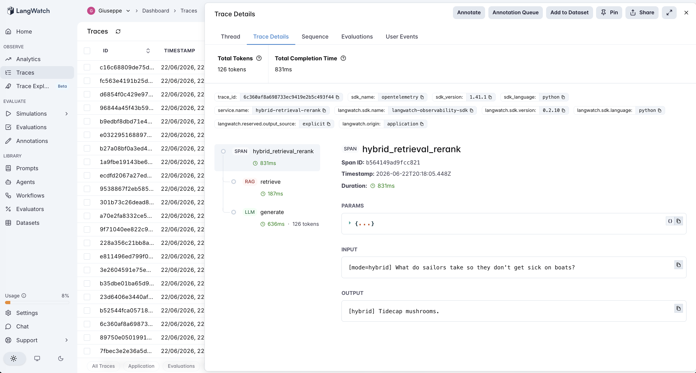
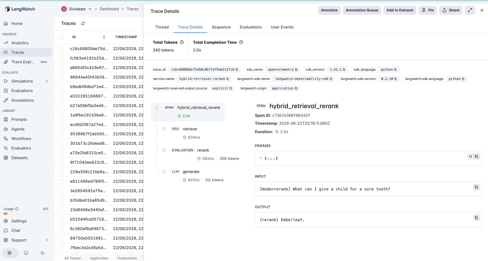

# 17 · Hybrid Retrieval + Rerank

A hybrid-retrieval-plus-rerank agent: fix retrieval at the **retriever and ranking layer** instead of by transforming the query (#15, #16). Lexical (keyword) retrieval is fused with **semantic (embedding) retrieval** via Reciprocal Rank Fusion, and an optional LLM **reranker** reorders a wider candidate pool before the top-k goes to the generator.

Three modes form a staircase, each adding one layer:

- **lexical** — keyword-overlap retrieval → top-k → generate. *(This is the exact `vanilla` baseline from #15/#16.)* 1 LLM call.
- **hybrid** — fuse keyword + semantic rankings (RRF) → top-k → generate. 1 LLM call + 1 embedding.
- **rerank** — take a wider hybrid candidate pool, have an LLM rerank it, keep top-k → generate. 2 LLM calls + 1 embedding.

Same corpus and 14 queries as #15 and #16, **on purpose**: those agents transformed the *query* to make lexical retrieval work on vocabulary-mismatched questions ("achy joints" vs "joint inflammation"). This one changes the *retriever*. So we can ask, on identical data:

1. Does **semantic retrieval** just fix the vocab-mismatch misses directly — no query rewriting, no hypothetical documents?
2. Does **reranking** add anything once retrieval recall is already maxed — i.e., does its precondition even hold at this corpus size?

> **Fictional corpus.** The herbalist compendium ([`corpus.md`](corpus.md)) is invented, so retrieval genuinely decides the outcome. Semantic search uses OpenAI `text-embedding-3-small`; passage embeddings are computed once and cached.

## The pipeline

```
lexical:  retrieve (rag, keyword)                      → generate (llm)
hybrid:   retrieve (rag, RRF[keyword, embedding])      → generate (llm)
rerank:   retrieve (rag, pool of 6) → rerank (eval, llm) → generate (llm)
```

Each step is a typed LangWatch span; the `rerank` step is an `evaluation` span (an LLM-judge inside the pipeline). See [`agent.py`](agent.py) — ~240 lines, raw OpenAI + LangWatch, no framework.

### Two real traces

**Semantic retrieval fixes a vocab-mismatch miss with no query surgery.** `hybrid` on *"What do sailors take so they don't get sick on boats?"* — lexical retrieval returns **nothing** (no shared keywords with "remedy for seasickness"), but the embedding ranks the Tidecap passage first, RRF surfaces it, and the answer is **Tidecap mushrooms**. #15 needed a query rewrite and #16 a hypothetical document to get here; semantic search just does it.



**Reranking breaks a distractor tie the embedding couldn't.** `rerank` on *"What can I give a child for a sore tooth?"* — the row #15 (rewrite) and #16 (HyDE) **both failed**. Hybrid retrieval gets the Emberleaf ("toothache") passage into the top-3, but ranks **Frostbloom ("sore *throat*")** above it — semantically "sore tooth" and "sore throat" are close — and the generator, distracted, says "I don't know." The `rerank` span reasons that *tooth ≠ throat*, promotes Emberleaf to #1, and the answer is **Emberleaf**.



## The dataset

The **same** 14 questions as #15/#16 ([`dataset.csv`](dataset.csv)) — 7 `clean` (corpus-aligned vocabulary) and 7 `poor` (vague, layperson phrasing).

## The evaluators

Three scorers ([`evals.py`](evals.py)), **all programmatic** (no judge noise; answer/retrieval evaluators match #15/#16):

| Evaluator | Type | Measures |
|---|---|---|
| `answer_correctness` | Programmatic | Is the gold answer in the response? All modes. |
| `retrieval_hit` | Programmatic | Did the **final top-k** (what the generator sees) contain the gold passage? All modes. |
| `candidate_recall` | Programmatic | Was the gold passage anywhere in the **candidate pool** before the top-k cut? **Reranking's ceiling** — a reranker can only promote a passage that was retrieved. |

## The tuning experiment

> **lexical vs hybrid vs rerank on 14 questions (7 clean, 7 poor) — same data as #15/#16**

### Three hypotheses to discriminate

| | Outcome | What it would teach |
|---|---|---|
| **H1** (semantic fixes recall) | hybrid ≫ lexical on `poor`, via retrieval_hit | Vocab mismatch is a *lexical*-retriever problem; embeddings dissolve it without touching the query. |
| **H2** (rerank earns its call) | rerank > hybrid | Even with good recall, ranking precision still leaves answers on the table. |
| **H3** (rerank is a no-op here) | rerank ≈ hybrid; `candidate_recall` == `retrieval_hit` | At this corpus size the gold is never buried below the cutoff, so the classic rerank job never fires. |

### Results

**The staircase** (and #15/#16 for reference — same data)

| mode | correct | retrieval hit | mean llm_calls |
|---|---|---|---|
| `lexical` *(= #15/#16 vanilla)* | 11/14 (79%) | 11/14 (79%) | 1.0 |
| `hybrid` | 13/14 (93%) | **14/14 (100%)** | 1.0 |
| `rerank` | **14/14 (100%)** | 14/14 (100%) | 2.0 |
| *(#15 rewrite / #16 HyDE)* | *13/14 (93%)* | *13/14* | *2.0* |

**Accuracy by category**

| mode | clean | poor |
|---|---|---|
| `lexical` | 7/7 | 4/7 |
| `hybrid` | 7/7 | 6/7 |
| `rerank` | 7/7 | **7/7** |

**Reranking's room to help (rerank mode)**

| | value |
|---|---|
| `candidate_recall` (gold in pool) | 14/14 |
| `retrieval_hit` (gold in final top-k) | 14/14 |
| rows where gold was in the pool but **not** in top-k (the classic rerank job) | **0** |

### What's actually happening — H1 strongly, H2 by a side door, H3 confirmed

**Semantic retrieval alone fixed the vocab mismatch — `retrieval_hit` jumped 79% → 100%.** Every `poor` query that lexical retrieval missed (zero keyword overlap with the corpus's formal terms) was retrieved correctly once embeddings entered the fusion. This is the cleanest result in the retrieval tier: the thing #15 needed a query *rewrite* for and #16 needed a hypothetical *document* for, plain semantic search does directly — **one embedding call, no extra LLM call, no drift, no hallucination.** On a vocabulary-mismatch problem, upgrading the retriever beats transforming the query.

**But 100% retrieval was not 100% answers.** Hybrid put the gold passage in the top-3 every time, yet scored 13/14 — because on the sore-tooth row it *also* ranked a near-synonym distractor (Frostbloom, "sore throat") above the gold (Emberleaf, "toothache"), and the generator, handed both, hedged to "I don't know." Embedding similarity can't tell "sore tooth" from "sore throat"; they're neighbors in vector space.

**Reranking recovered that row — but not by its textbook mechanism.** The classic job of a reranker is to promote a gold doc that first-stage retrieval buried *below* the cutoff. That job **never fired here**: `candidate_recall` and `retrieval_hit` are both 14/14, and "gold in pool but not in top-k" is **0** (H3 confirmed — at 8 passages nothing is ever buried). What rerank actually did was reorder *within* the top-k: an LLM that reasons about the query knows tooth ≠ throat, so it promoted Emberleaf above Frostbloom, and the generator stopped being distracted. Rerank helped via *intra-top-k precision*, not recall.

So the sore-tooth query — which beat both the query-rewrite (#15) and HyDE (#16) — is finally solved here, and it took *both* new layers: semantic recall to get Emberleaf into the room, and an LLM reranker to put it at the front.

### The lesson

> **Hybrid retrieval and reranking fix two different failures. Semantic search fixes *recall* — it dissolves vocabulary mismatch that no amount of query-rewriting reliably can, for the price of an embedding. Reranking fixes *precision* — it disambiguates near-synonym distractors the embedding ranks as neighbors — but only when retrieval has recall to begin with, and its headline "rescue the buried doc" job needs a corpus big enough to bury one.**

The precondition map for this agent has two parts:

- **Hybrid helps** when lexical and semantic retrievers fail on *different* queries (complementary errors). Here they were perfectly complementary: lexical owned the `clean` queries, semantic owned the `poor` ones.
- **Reranking helps** when the candidate pool has recall but imperfect ordering — a confusable distractor at or above the gold (held for 1 row), or a gold buried below the cutoff (needs scale; did not hold at 8 passages).

For an AI PM in 2026: if your retrieval misses are vocabulary mismatch, reach for **semantic/hybrid retrieval before query-rewriting** — it's cheaper (no extra generation), safer (no drift/hallucination), and here it was strictly better (100% recall). Add a **reranker** when your traces show the right passage *is* being retrieved but the answer is still wrong or hedged — that's a precision problem, and it's exactly what `candidate_recall` > `retrieval_hit` (or, as here, distractor-confusion within top-k) diagnoses. Reranking a corpus where recall is already perfect and nothing is buried buys you only distractor-disambiguation — real, but smaller than the recall win.

The third retrieval-tier entry, completing the **fix-retrieval** quartet (#14 correct-after, #15 rewrite-key, #16 answer-key, #17 better-retriever) and the same precondition shape as the rest (#7→#17): a bolted-on layer helps only where its precondition holds.

## Quick start

```bash
cd agents/17-hybrid-retrieval-rerank
python -m venv .venv && source .venv/bin/activate
pip install -r requirements.txt

cp .env.example .env
# fill in OPENAI_API_KEY and LANGWATCH_API_KEY (Project API Key, type Service)

# One query through each layer (a vocab-mismatch one)
python agent.py "What do sailors take so they don't get sick on boats?"
HR_MODE=hybrid python agent.py "What do sailors take so they don't get sick on boats?"
HR_MODE=rerank python agent.py "What can I give a child for a sore tooth?"   # the distractor-tie case

# Full staircase (all three modes, 14 rows)
python run_eval.py
python run_eval.py --limit 4     # smoke test
```

If you hit the macOS Xcode-Python SSL issue (`Errno 2` on `ssl.py`):

```bash
pip install certifi
export SSL_CERT_FILE=$(python -c "import certifi; print(certifi.where())")
```

## What you'll learn

How a hybrid-retrieve-then-rerank flow looks in LangWatch when the `retrieve` span fuses keyword and embedding rankings and an `evaluation` rerank span reorders the pool — and how reading `candidate_recall` against `retrieval_hit` tells you, per query, whether your problem is recall (reach for semantic/hybrid) or precision (reach for a reranker). The PM-relevant takeaway is that "improve retrieval" is two distinct levers with two distinct preconditions, and the staircase makes visible which one your corpus actually needs.

## Status

✅ Complete. On the same 14 questions and corpus as #15/#16, the staircase runs **79% → 93% → 100%**: hybrid's semantic retrieval lifts `retrieval_hit` to **100%** — fixing every vocab-mismatch miss that #15 needed a query-rewrite and #16 a hypothetical document for, at one embedding call and no drift — and reranking recovers the last row (the sore-tooth query both #15 and #16 failed) by disambiguating a "sore throat" distractor the embedding ranked as a neighbor. The classic rerank job (promote a buried doc) never fired (`candidate_recall` == `retrieval_hit` == 14/14): at 8 passages nothing is buried, so rerank earned its keep on *precision*, not recall. Completes the fix-retrieval quartet (#14→#17) in the calibration/precondition thread.
