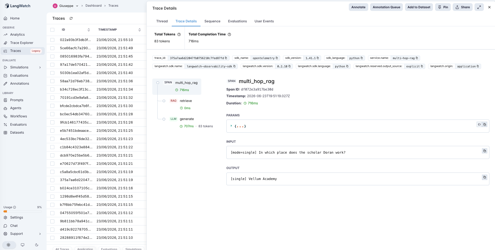
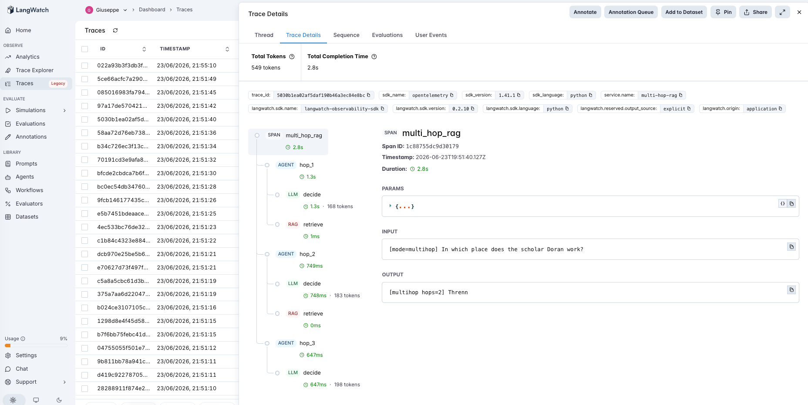

# 18 · Multi-Hop RAG

A multi-hop RAG agent: answer questions that require **chaining several retrievals**, where the bridge entity for the next hop is only learned from the previous one. A self-ask loop repeatedly asks for the next single fact it needs, retrieves it, and stops when the gathered facts entail an answer.

The variable under test is **one retrieval vs an iterative retrieve-reason loop**:

- **single** — retrieve top-k once on the raw question → generate. 1 retrieval, 1 LLM call.
- **multihop** — the LLM emits `SEARCH: <next fact>` or `ANSWER: <final>`; each search is retrieved and added to the evidence, until it can answer. Several retrievals, several LLM calls.

The corpus is built so **each passage holds exactly one fact**, and the answer-bearing passage **shares no keyword with the original question** — because the bridge entity (the academy) isn't in the question. So single-shot retrieval is *structurally* unable to reach a multi-hop answer: it can only ever retrieve the first hop. The PM question: how much does the loop buy on questions that need it, what does it cost on questions that don't, and how far does it scale?

> **Fictional academic registry.** Scholars belong to academies, academies stand in cities, cities answer to governing bodies ([`corpus.md`](corpus.md)). A question like *"which body governs the place where Aldric works?"* is a 3-hop chain (Aldric → Vellum Academy → Threnn → Pell Concord) with no single passage spanning more than one link.

## The pipeline

```
single:   retrieve (rag) → generate (llm)

multihop: hop_1: decide (llm) → retrieve (rag)     "where does Aldric work?" → Aldric belongs to Vellum
          hop_2: decide (llm) → retrieve (rag)     "where is the Vellum Academy?" → Vellum stands in Threnn
          ...                                       ANSWER: Threnn
```

Each step is a typed LangWatch span; each hop is an `agent` span wrapping its `decide` (llm) and `retrieve` (rag) children. See [`agent.py`](agent.py) — ~210 lines, raw OpenAI + LangWatch, no framework.

### Two real traces

**Single-shot can't bridge — it returns the link, not the answer.** `single` on *"In which place does the scholar Aldric work?"* — retrieval gets the two Aldric passages ("belongs to the Vellum Academy", "specializes in astronomy") but **not** "The Vellum Academy stands in Threnn" (zero shared keywords with the question). The generator answers **"Vellum Academy"** — the bridge entity, not the city. It literally cannot retrieve the answer.



**The loop chains the hops.** `multihop` on the same question — `hop_1`'s `decide` span asks *"Where does Aldric work?"* → retrieves Aldric → Vellum; `hop_2` asks *"Where is the Vellum Academy located?"* → retrieves Vellum → Threnn; then `ANSWER: Threnn`. The bridge entity discovered in hop 1 becomes the retrieval key for hop 2.



## The dataset

13 questions over the fictional registry ([`dataset.csv`](dataset.csv)):

| Category | Count | Hops | What it tests |
|---|---|---|---|
| `single` | 5 | 1 | answer is in one passage — single-shot should handle it; does the loop *break* it or just cost more? |
| `multi` | 8 | 2–3 | answer requires chaining 2–3 passages — single-shot structurally cannot retrieve it |

## The evaluators

Three scorers ([`evals.py`](evals.py)), **all programmatic** (no judge noise; consistent with the rest of the catalog):

| Evaluator | Type | Measures |
|---|---|---|
| `answer_correctness` | Programmatic | Is the gold answer in the response? Both modes. |
| `answer_retrieved` | Programmatic | Did the passages the agent **saw** (single: one retrieval; multihop: the union across hops) contain the gold answer? Isolates the structural retrieval failure. Both modes. |
| `single_to_multihop_lift` | Programmatic | Paired `single → multihop`: **+1** single wrong & loop fixed it, **−1** single right & loop broke it, 0 else. **The discriminator.** |

## The tuning experiment

> **single vs multihop on 13 questions (5 single-hop, 8 multi-hop)**

### Three hypotheses to discriminate

| | Outcome | What it would teach |
|---|---|---|
| **H1** (loop is necessary) | single fails the multi-hop rows; multihop fixes them | Chained questions need iterative retrieval — single-shot can't reach the answer. |
| **H2** (loop is overhead on easy ones) | multihop ties single on the single-hop rows, at higher cost | The loop is wasted (but harmless) when one retrieval suffices — route by need. |
| **H3** (loop frays with depth) | multihop's reliability drops on the deepest chains | Each hop is a chance to mis-decompose or stop early; error compounds with hops. |

### Results

**Aggregate across 13 questions**

| mode | correct | answer retrieved | mean llm_calls |
|---|---|---|---|
| `single` | 5/13 (38%) | 5/13 (38%) | 1.0 |
| `multihop` | **12/13 (92%)** | **12/13 (92%)** | 3.0 |

**Accuracy by category**

| mode | single (1-hop) | multi (2–3 hop) |
|---|---|---|
| `single` | 5/5 | **0/8** |
| `multihop` | 5/5 | **7/8** |

**Paired lift + cost**

| | value |
|---|---|
| `single_to_multihop_lift` mean | **0.77** (helped 7, **hurt 0**, neutral 6) |
| total LLM calls | single 13 vs multihop 39 → **3×** |

### What's actually happening — H1 decisively, H2 confirmed, a hint of H3

**Single-shot is not merely worse on multi-hop questions — it is structurally incapable.** It scored **0/8**, and `answer_retrieved` equals `answer_correctness` exactly (5/13 both): every miss is because the answer passage was *never retrieved*, not because the generator fumbled it. With the bridge entity absent from the question, one keyword retrieval can only reach the first hop. The model dutifully answered "Vellum Academy" to "where does Aldric work" — the link, not the location.

**The loop fixed 7 of 8, with zero collateral damage.** Every multi-hop row single-shot missed, multihop recovered by discovering the bridge entity and re-querying with it — `+54pp` overall, **0 hurt**. And on the 5 single-hop rows it was a clean **no-op** (5/5 in both modes): the loop searched once and answered, never over-decomposing an easy question into a wrong one. So the loop is *necessary* where chaining is needed and *harmless* where it isn't — but it isn't free: **3× the LLM calls**, including on the single-hop questions where the extra hops bought nothing.

**The one miss is at the depth-3 edge.** multihop's single failure was a 3-hop chain (Beya → Sere → Oloss → Maelor League). It's borderline, not broken: re-run, it solves cleanly in 3 hops — the miss is temperature-0 nondeterminism at the limit of the loop's reliability. The deeper chains also showed wobble in *how* they were solved: the three 3-hop questions took 2, 4, and 3 search hops respectively — one inferred a link without searching, one searched a redundant extra time. Each hop is a fresh chance to mis-phrase the sub-query or stop early, and that variance grows with depth (H3, in miniature). At 2 hops the loop was rock-solid (5/5); at 3 hops it frayed slightly (2/3 in this run).

### The lesson

> **Multi-hop retrieval isn't an optimization for chained questions — it's a prerequisite: single-shot retrieval literally cannot fetch an answer whose passage shares no keyword with the question. But the loop is a 3× cost you only want to pay when the question needs it, and its reliability decays with hop depth, because every hop is another chance to mis-decompose.**

The precondition is unusually crisp here, and it cuts both ways:

- **Multi-hop helps** exactly when the answer requires chaining facts that don't co-occur in one passage (the 8 `multi` rows: single 0/8 → multihop 7/8).
- **Multi-hop is pure overhead** when one retrieval suffices (the 5 `single` rows: 5/5 either way, at 3× the calls for the loop). The practical move is to *gate* it — try single-shot, escalate to the loop only when retrieval comes back thin or the answer is unsupported (this is also where #14 CRAG's grader would slot in as the trigger).

For an AI PM in 2026: if your eval set has questions whose answer entity never appears alongside the question's entities, no amount of better single-shot retrieval (semantic, rerank, query-rewrite — #15/#16/#17) will reach them; you need iteration. But measure your hop-depth distribution before turning the loop on globally — most questions are single-hop, and on those the loop is a 3× tax with a small but nonzero chance of a deep-chain miss.

This is the retrieval tier's final entry, and the same precondition shape as the rest of the catalog (#7→#18): a bolted-on mechanism — here, iterative retrieval — helps only where its precondition (a genuine multi-hop question, correctly decomposed) holds.

## Quick start

```bash
cd agents/18-multi-hop-rag
python -m venv .venv && source .venv/bin/activate
pip install -r requirements.txt

cp .env.example .env
# fill in OPENAI_API_KEY and LANGWATCH_API_KEY (Project API Key, type Service)

# One question, each mode (a 2-hop chain)
python agent.py "In which place does the scholar Aldric work?"
MH_MODE=multihop python agent.py "Which body governs the place where the scholar Aldric works?"

# Full comparison (both modes, 13 rows)
python run_eval.py
python run_eval.py --limit 4     # smoke test
```

If you hit the macOS Xcode-Python SSL issue (`Errno 2` on `ssl.py`):

```bash
pip install certifi
export SSL_CERT_FILE=$(python -c "import certifi; print(certifi.where())")
```

## What you'll learn

How a multi-hop self-ask loop looks in LangWatch when each hop is its own `agent` span with `decide` + `retrieve` children — and how, by reading whether the answer passage ever entered the evidence, you can tell a *retrieval-impossible* question (needs the loop) from one a single retrieval already covers (the loop is a tax). The PM takeaway is that iterative retrieval is a prerequisite, not a tuning knob, for genuinely chained questions — and that its 3× cost and depth-dependent reliability are why you gate it on need rather than running it everywhere.

## Status

✅ Complete. On 13 questions, `multihop` lifts accuracy **38% → 92%**: single-shot scores **0/8 on multi-hop** questions because the answer passage shares no keyword with the question and is *never retrieved* (`answer_retrieved` == `answer_correctness`), while the loop recovers 7/8 by discovering each bridge entity and re-querying — `+54pp`, 0 hurt, at **3× the LLM calls**. It's a clean no-op on the 5 single-hop rows (5/5 both), and its one miss is a depth-3 chain that re-runs correctly (temp-0 nondeterminism at the reliability edge; the 3-hop questions took 2–4 hops). The final retrieval-tier entry in the calibration/precondition thread (#7→#18): iterative retrieval is required where chaining is, wasted where it isn't, and frays with depth.
