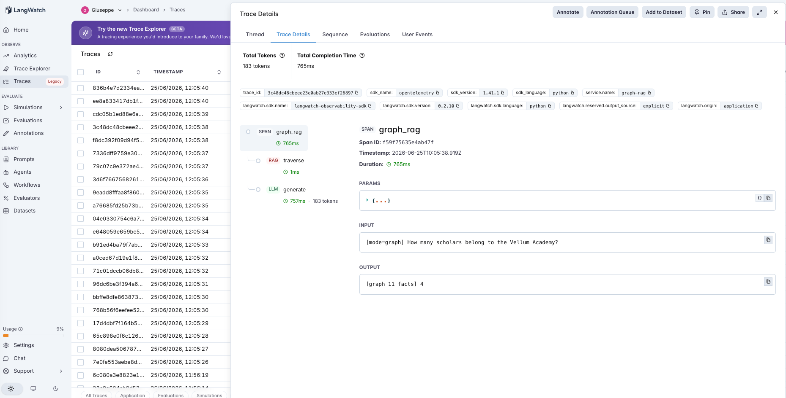

# 19 · Graph-RAG

A graph-RAG agent: parse the corpus into a **knowledge graph** and answer by **traversing relationships**, instead of keyword-matching flat passages. For a question about an entity, gather its connected subgraph; for a global question, gather the whole graph. The point is structural: some answers depend on the graph as a whole, and no top-k of independent passages can hold them.

The variable under test is **how the context is assembled**:

- **flat** — keyword top-k over the passages → generate. (Baseline RAG: similarity over independent chunks, capped at k.)
- **graph** — link the query to graph entities, traverse their connected subgraph (whole graph if the question names no entity), serialize it → generate.

Both make exactly **one** LLM call and feed the generator text; the only difference is what context that text contains. The PM question: flat retrieval is capped at k surface-similar snippets — *which questions does that cap make unanswerable, and what does traversal cost when it isn't needed?*

> **Fictional registry as a graph.** Scholars belong to academies, academies sit in cities, cities answer to governing bodies, scholars have specialties ([`corpus.md`](corpus.md) — 24 edges). Expanded from #18 so academies have **different scholar counts** (Vellum 4, Sere 3, Tarn 2) — which is what makes the global/aggregate questions real.

## The pipeline

```
flat:   retrieve (rag, keyword top-k)            → generate (llm)
graph:  traverse (rag, entity-linked subgraph)   → generate (llm)
        "how many scholars at Vellum?" → gather Vellum's neighborhood (all 4 scholars) → count
```

Each step is a typed LangWatch span. See [`agent.py`](agent.py) — ~220 lines, raw OpenAI + LangWatch, no graph DB: the graph is parsed from the passages and traversed with a tiny BFS.

### Two real traces

**Flat retrieval can't even hold the evidence.** `flat` on *"How many scholars belong to the Vellum Academy?"* (answer: 4 — Aldric, Doran, Faye, Iven). Top-k=3 retrieves only **three** of the four `belongs to Vellum` edges; the fourth never makes the cut. The generator counts what it sees and answers **3**. The miss isn't reasoning — the evidence was physically capped out of context.


**Graph traversal assembles the whole connected subgraph.** `graph` on the same question — the `traverse` span seeds on "Vellum Academy" and walks its neighborhood, gathering all four scholars (plus the city and governing body 2 hops out). With every relevant edge in context, the generator answers **4**. The win is completeness, not a better count.



## The dataset

11 questions over the registry ([`dataset.csv`](dataset.csv)), each tagged with the `support` facts the answer depends on:

| Category | Count | What it needs |
|---|---|---|
| `local` | 4 | one edge (a specialty, a location) — flat handles it |
| `multihop` | 3 | a 2–3 edge chain — flat can't reach the far end (no shared keyword) |
| `global` | 4 | an aggregate over many edges ("how many scholars at Vellum?", "which academy has the most?") — more support than any top-k can hold |

## The evaluators

Three scorers ([`evals.py`](evals.py)), **all programmatic** (no judge noise):

| Evaluator | Type | Measures |
|---|---|---|
| `answer_correctness` | Programmatic | Is the gold answer in the response? Both modes. |
| `evidence_complete` | Programmatic | Were **all** the support facts present in the retrieved context? The mechanism metric — flat top-k cannot hold a global question's support; traversal can. Both modes. |
| `flat_to_graph_lift` | Programmatic | Paired `flat → graph`: **+1** flat wrong & graph right, **−1** the reverse, 0 else. **The discriminator.** |

## The tuning experiment

> **flat vs graph on 11 questions (4 local, 3 multi-hop, 4 global)**

### Three hypotheses to discriminate

| | Outcome | What it would teach |
|---|---|---|
| **H1** (graph wins on structure) | graph ≫ flat on multi-hop and global; tie on local | Relationship/aggregate questions need traversal; flat is capped out of them. |
| **H2** (graph also fixes reasoning) | graph solves *every* global question | Completeness of evidence is sufficient for aggregates. |
| **H3** (bottleneck shifts) | graph gathers complete evidence but still misses the hardest aggregate | Traversal solves retrieval; deep aggregation then becomes a *reasoning* problem. |

### Results

**Aggregate across 11 questions**

| mode | correct | evidence complete | mean facts in context |
|---|---|---|---|
| `flat` | 4/11 (36%) | 4/11 (36%) | 2.6 |
| `graph` | **10/11 (91%)** | **11/11 (100%)** | 10.4 |

**Accuracy by category**

| mode | local | multihop | global |
|---|---|---|---|
| `flat` | 4/4 | **0/3** | **0/4** |
| `graph` | 4/4 | **3/3** | **3/4** |

**Paired lift**

| | value |
|---|---|
| `flat_to_graph_lift` mean | **0.77** (helped 6, **hurt 0**, neutral 5) |
| graph's one miss | a 4-level aggregate (G4) — **complete evidence, wrong count** |

### What's actually happening — H1 decisively, and a clean dose of H3

**Flat retrieval is structurally locked out of the multi-hop and global questions — 0/7.** And `evidence_complete` proves it's retrieval, not reasoning: flat scored evidence-complete on only the 4 local rows (4/11), exactly matching its accuracy. On multi-hop it never retrieved the far end of the chain (no shared keyword with the question); on global it could only ever hold k=3 of the many edges the answer spans. The "count" questions expose it most cleanly: asked how many scholars belong to Vellum, flat saw 3 of 4 and answered **3** — confidently, completely, wrong.

**Graph traversal makes the evidence complete every time — 11/11.** By walking the connected subgraph it gathered all the support facts for every question (mean 10.4 facts in context vs flat's 2.6), and accuracy jumped to **91%**, fixing all 3 multi-hop and 3 of 4 global, with **zero** regressions on local. Completeness of evidence was the whole game on H1.

**But completeness isn't sufficiency — H3 in one row.** Graph's single miss (G4: *"how many scholars work in cities governed by the Pell Concord?"*, answer 6) had **complete evidence** — every needed edge was in context — yet the model miscounted. That question is a 4-level aggregation (body → its cities → their academies → count scholars), and once retrieval is solved the residual difficulty is the LLM's multi-step counting, not the graph. Graph-RAG moved the bottleneck downstream — the same lesson as #17 (100% retrieval ≠ 100% answers) and #18 (reliability frays with depth), now on aggregation depth.

**On local questions graph is a no-op with a cost.** Both modes 4/4, but graph dragged 10.4 facts into context where flat used 2.6 — irrelevant subgraph the generator had to read past. Harmless here, but on a large graph that bloat is real, and it's wasted on single-fact lookups.

### The lesson

> **Graph-RAG's value is structural completeness: by traversing relationships it assembles the connected subgraph — chains and global neighborhoods — that top-k flat retrieval physically cannot hold, which is the only way to answer relationship and aggregate questions. But completeness only solves *retrieval*; deep aggregation over the gathered facts is a reasoning problem traversal doesn't touch, and on simple lookups the traversal is just context bloat.**

The precondition is about the *shape of the question*, not the corpus:

- **Graph helps** when the answer depends on graph structure — a multi-hop chain, or a global aggregate spanning more edges than k (multi-hop 0→3/3, global 0→3/4, `evidence_complete` 36%→100%).
- **Graph is overhead** when the answer is a single fact (local 4/4 either way, at 4× the context).
- **Graph is not enough** when the gathered evidence still requires hard multi-step reasoning (G4: complete evidence, wrong count).

For an AI PM in 2026: reach for graph-RAG when your questions are *about relationships or totals* ("how many", "which has the most", "what connects X and Y") — vector/keyword RAG is not merely worse on these, it is structurally incapable, and `evidence_complete` is the metric that proves it before you ever look at answer quality. But don't expect the graph to do your arithmetic: once the subgraph is complete, deep aggregates are back to being a reasoning eval, and for plain fact lookups a flat retriever is leaner.

This is the relationship/aggregate entry in the catalog's precondition thread (#7→#19): traversal helps exactly where the question's answer lives in the graph's structure, and the residual failure is reasoning, not retrieval.

## Quick start

```bash
cd agents/19-graph-rag
python -m venv .venv && source .venv/bin/activate
pip install -r requirements.txt

cp .env.example .env
# fill in OPENAI_API_KEY and LANGWATCH_API_KEY (Project API Key, type Service)

# One question, each mode (a global count flat can't hold)
python agent.py "How many scholars belong to the Vellum Academy?"
GRAPH_MODE=graph python agent.py "Which academy has the most scholars?"

# Full comparison (both modes, 11 rows)
python run_eval.py
python run_eval.py --limit 4     # smoke test
```

If you hit the macOS Xcode-Python SSL issue (`Errno 2` on `ssl.py`):

```bash
pip install certifi
export SSL_CERT_FILE=$(python -c "import certifi; print(certifi.where())")
```

## What you'll learn

How a graph-RAG flow looks in LangWatch when the `traverse` span reports the subgraph it gathered, and how reading `evidence_complete` (did the context hold every support fact?) separates a *retrieval-incapable* question — chains and aggregates flat top-k can never cover — from one a flat retriever already handles. The PM takeaway is that relationship and aggregate questions are a structural gap in vector RAG, not a quality gap, and that graph traversal closes the retrieval side while leaving deep aggregation as a downstream reasoning problem.

## Status

✅ Complete. On 11 questions, `graph` scores **36% → 91%** over flat RAG: it fixes every multi-hop (0→3/3) and 3 of 4 global/aggregate questions (0→3/4) by traversing the connected subgraph, lifting `evidence_complete` from **36% → 100%** — flat is *structurally* locked out of these (top-k can't hold the support), not merely worse. Its one miss is a 4-level aggregate with complete evidence but a wrong count — once traversal solves retrieval, deep aggregation becomes a reasoning problem (H3). No-op on local lookups (4/4 both, at 4× the context). The relationship/aggregate entry in the calibration/precondition thread (#7→#19): traversal helps where the answer lives in the graph's structure, and the residual failure is reasoning, not retrieval.
