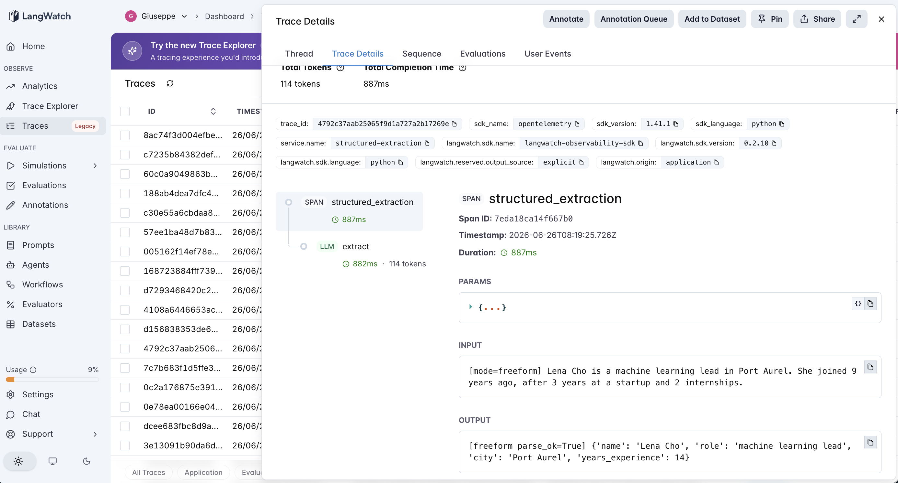
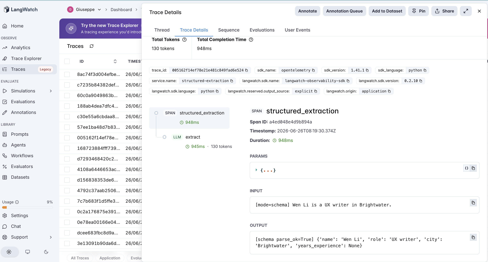

# 20 · Structured Extraction

A structured-extraction agent: pull a fixed set of fields out of an unstructured bio, either **free-form** (ask for the fields, parse the reply) or under a **typed JSON schema** (OpenAI JSON mode + an explicit null rule). Not RAG — this is the "turn text into a record" pattern every data pipeline needs.

The variable under test is **format discipline**:

- **freeform** — "extract name, role, city, years — one `Field: value` line each." Parse the reply heuristically. No structure guarantee.
- **schema** — OpenAI **JSON mode** with a typed schema (`years_experience` is an integer; "use null if not stated"). Parse with `json.loads`.

Same four fields, same bios; the only difference is whether output is constrained. The questions: how much does the schema buy in **parse reliability** and accuracy — and, since it asks for every field, does its slot-filling pressure make the model **fabricate** values the bio never states?

## The pipeline

```
freeform:  extract (llm, plain completion)   → heuristic line parser
schema:    extract (llm, JSON-mode)          → json.loads
```

One LLM call either way; the only difference is `response_format` and the prompt. See [`agent.py`](agent.py) — ~190 lines, raw OpenAI + LangWatch, no framework.

### An honest detour that *is* the finding

The first version of this experiment scored free-form at **0/10 parse success** — a damning result. It was wrong. My line-parser matched the label `name`, but `gpt-4o-mini` wrote **`Full Name:`** and **`Job Role:`**; the model had extracted every field perfectly, and my parser threw it all away. Free-form's real cost isn't that the model can't extract — it's that **you have to anticipate however it phrases the output**, and the moment your parser guesses wrong, free-form silently collapses to zero while the model looks fine. After making the parser forgiving (match label *variants*, strip markdown), free-form jumped to 80%. JSON mode is the feature that removes that brittle, format-anticipating parser from your pipeline entirely. (Both numbers are reported below — the gap between them is the lesson.)

### Two real traces

**Schema stays literal on messy input; free-form over-reasons.** On *"Lena Cho… joined 9 years ago, after 3 years at a startup and 2 internships"* (answer: 9), `freeform` **summed the distractors to 14**; `schema`, asked for an integer field, extracted **9**. Constraining the output to "a value for this field" curbed the model's urge to compute.



**Schema nulls an absent field instead of inventing one.** On *"Wen Li is a UX writer in Brightwater"* (no years of experience stated), the `schema` span returns clean JSON with `"years_experience": null` — it declined to fabricate, exactly as instructed.



## The dataset

10 fictional bios ([`dataset.csv`](dataset.csv)), extracting `{name, role, city, years_experience}`:

| Category | Count | What it tests |
|---|---|---|
| `clean` | 3 | all four fields, simple values — both modes should nail it |
| `tricky` | 3 | multi-word city, name-with-comma, **distractor numbers** — stresses value extraction |
| `incomplete` | 4 | one field absent — tests **fabrication** (does the model invent a value to fill the slot?) |

## The evaluators

Three programmatic scorers ([`evals.py`](evals.py)) — gold is a value per field, or the marker `ABSENT`:

| Evaluator | Type | Measures |
|---|---|---|
| `parse_success` | Programmatic | Did the output yield a complete, usable 4-field record? The reliability axis. |
| `record_accuracy` | Programmatic | All four fields correct, **including correctly leaving an absent field null**. |
| `field_accuracy` | Programmatic | Fraction of the 4 fields correct (partial credit), so the gap shows even when no record is perfect. |

(`run_eval` also tallies **fabrication** — absent fields that got a made-up value.)

## The tuning experiment

> **freeform vs schema on 10 bios (3 clean, 3 tricky, 4 incomplete)**

### Three hypotheses to discriminate

| | Outcome | What it would teach |
|---|---|---|
| **H1** (schema wins big) | schema ≫ freeform on accuracy and parsing | Structure is a large capability win. |
| **H2** (schema = reliability, not accuracy) | schema ≈ freeform on accuracy, but freeform's parsing is fragile | The win is guaranteed structure, not better extraction. |
| **H3** (schema fabricates) | schema fills absent fields with invented values | Slot-filling pressure trades fabrication for completeness. |

### Results

**Aggregate across 10 bios**

| mode | parse_success | record correct | field accuracy |
|---|---|---|---|
| `freeform` (naïve parser) | **0/10 (0%)** | 0/10 | 48% |
| `freeform` (fair parser) | 10/10 (100%) | 8/10 (80%) | 95% |
| `schema` | 10/10 (100%) | **9/10 (90%)** | **98%** |

**Record-correct by category** (fair parser)

| mode | clean | tricky | incomplete |
|---|---|---|---|
| `freeform` | 3/3 | **2/3** | 3/4 |
| `schema` | 3/3 | **3/3** | 3/4 |

**Fabrication on absent fields**

| mode | fabricated |
|---|---|
| `freeform` | **0/4** |
| `schema` | **0/4** |

### What's actually happening — H2, decisively; H1 and H3 both rejected

**The schema's accuracy edge is real but modest: 90% vs 80%, 98% vs 95% per field.** With a capable model and a forgiving parser, free-form extraction is *nearly as good*. The single differentiating row is `tricky`/Lena Cho, and it's instructive: faced with "9 years ago, after 3 years… and 2 internships," free-form **added them to 14** while schema returned **9**. Constraining the output to a typed field discouraged the model from treating extraction as a math problem. That's the whole accuracy gap — one over-reasoned number (H1 rejected: structure is a small win, not a big one).

**The reliability gap, though, is the headline — and it's a parser story, not a model story.** Free-form's score swung from **0% to 80%** purely on how forgiving the downstream parser was. The model extracted the fields fine both times; what changed was whether my code anticipated "Full Name" vs "Name." JSON mode makes that question disappear: the structure is guaranteed regardless of how the model would have phrased a label. **That is the actual value of structured output — not accuracy, but deleting the brittle parser you'd otherwise have to maintain and that fails silently when the model's phrasing drifts** (H2 confirmed).

**Neither mode fabricated — 0/4 both.** With an explicit "use null if not stated" instruction, the schema's required fields did *not* pressure the model into inventing values; it nulled every absent field, and so did free-form. H3 is rejected: fabrication is a prompt problem (omit the null rule), not an inherent cost of schemas. The one row both modes missed is the same one — "the analyst has worked in **Veor**" — where both left `city` null rather than commit to Veor being a city versus an employer. That shared conservatism on ambiguous phrasing is the *same* caution that prevented fabrication: told to only extract what's stated, the model abstains when the type is genuinely unclear.

### The lesson

> **A typed schema's value is reliability, not intelligence. With a forgiving parser a capable model extracts nearly as well free-form (80% vs 90%); the schema's real win is that JSON mode guarantees a parseable, typed record — deleting the brittle, format-anticipating parser that scored the very same model at 0% when it wrote "Full Name" instead of "Name." It does not cause fabrication if you instruct null, and it only modestly improves accuracy, mostly by stopping the model from over-reasoning messy values.**

The precondition for the schema to be worth it:

- **Schema helps most** when (a) the output feeds code — you need guaranteed structure and types, not prose a parser has to reverse-engineer, and (b) inputs are messy enough that free-form values get mis-read (the distractor-number case). On clean inputs piped to a human, free-form is nearly equivalent.
- **Schema does *not* help** raw extraction capability much — and it does *not* protect against fabrication on its own; the "null if not stated" instruction does, in either mode.

For an AI PM in 2026: reach for JSON mode / structured output whenever the extraction feeds a system, because the alternative is a free-form parser you must keep in sync with the model's formatting whims — and that parser fails *silently* (a perfect-looking model, 0% usable output). But don't expect the schema to make extraction smarter, and don't rely on it alone to prevent hallucinated fields — that's a prompt instruction, not a format guarantee.

This is the final retrieval/knowledge-tier entry, and a precondition the same shape as the rest of the catalog (#7→#20): structured output helps where the bottleneck is *consumable structure*, not where it's extraction skill.

## Quick start

```bash
cd agents/20-structured-extraction
python -m venv .venv && source .venv/bin/activate
pip install -r requirements.txt

cp .env.example .env
# fill in OPENAI_API_KEY and LANGWATCH_API_KEY (Project API Key, type Service)

# One bio, each mode (a tricky one with distractor numbers)
python agent.py "Lena Cho is a machine learning lead in Port Aurel. She joined 9 years ago, after 3 years at a startup and 2 internships."
EX_MODE=schema python agent.py "Wen Li is a UX writer in Brightwater."

# Full comparison (both modes, 10 bios)
python run_eval.py
python run_eval.py --limit 4     # smoke test
```

If you hit the macOS Xcode-Python SSL issue (`Errno 2` on `ssl.py`):

```bash
pip install certifi
export SSL_CERT_FILE=$(python -c "import certifi; print(certifi.where())")
```

## What you'll learn

How free-form vs JSON-mode extraction looks in LangWatch on the same bio, and why the metric that matters is `parse_success` — because the difference between a usable record and silent garbage is whether your downstream parser anticipated the model's label phrasing, which JSON mode removes from the equation entirely. The PM takeaway is that structured output is a reliability and integration feature, not an accuracy or anti-hallucination one: it guarantees the shape, leaves extraction skill roughly unchanged, and defers fabrication control to a "null if absent" instruction either mode can use.

## Status

✅ Complete. On 10 bios, `schema` and `freeform` both extract well (90% vs 80% record-correct, 98% vs 95% per field) — the schema's accuracy edge is one over-reasoned number on a distractor-heavy bio, not a capability gap. The real result is reliability: free-form parse success swung **0% → 80%** purely on parser forgiveness (the model wrote "Full Name", a naïve parser dropped everything), while JSON mode is guaranteed parseable by construction. Neither mode fabricated on absent fields (0/4) given an explicit null rule. The closing retrieval/knowledge-tier entry (#7→#20): structured output's value is consumable structure, not intelligence — and its famed fabrication risk is a prompt issue, not an inherent one. **Tier 3 complete (#14–#20).**
