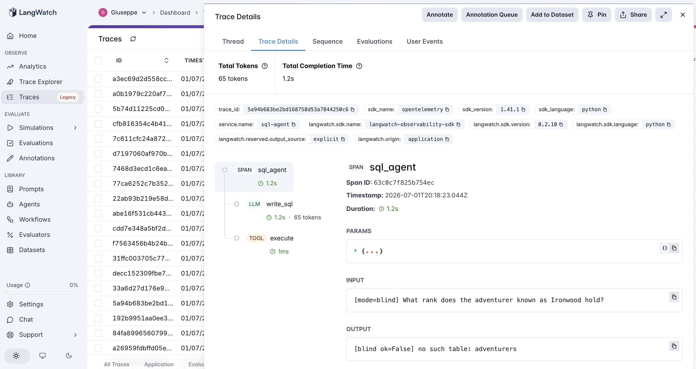
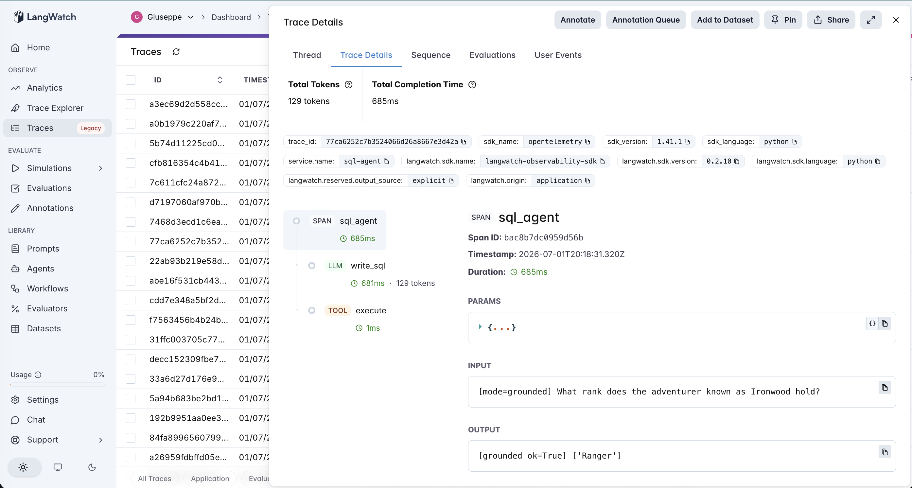

# 21 · SQL Agent

A text-to-SQL agent: natural-language question → SQL → **execute against a real SQLite database**. This opens **Tier 4 (tools / environment)** — agents that *act on a system*, not just reason or retrieve.

The variable under test is **schema grounding**:

- **blind** (default) — write SQL with **no schema shown**. The model must guess table and column names.
- **grounded** — the schema (CREATE statements) is in the prompt; the model writes SQL against the real names.

Same questions, same database, one LLM call each; the only difference is whether the schema is in the prompt. The database uses deliberately **non-obvious identifiers** — `members.handle` (not `name`), `quests.reward_gp`, `members.joined_year`, `quests.region` — and the questions are phrased in natural language that **never names a column** ("the adventurer known as Ironwood", "the total reward earned", "signed up in 1203"). So a blind guess of the conventional name errors out. The experiment measures how much of a SQL agent's correctness is simply *knowing the schema* — and what still fails once it does.

> **Fully deterministic, no dependencies.** The DB is built in-memory with stdlib `sqlite3` ([`agent.py`](agent.py)); gold answers come from executing gold SQL, so `answer_correct` is exact. A fresh DB is built per query, so a stray model statement can't corrupt the run.

## The pipeline

```
blind:     write_sql (llm, no schema)      → execute (tool, sqlite3)
grounded:  write_sql (llm, schema in prompt) → execute (tool, sqlite3)
```

Each step is a typed LangWatch span; `execute` is a `tool` span that captures the rows or the error. See [`agent.py`](agent.py) — ~180 lines, raw OpenAI + LangWatch + `sqlite3`.

### Two real traces

**Blind hallucinates the schema and the query won't run.** `blind` on *"What rank does the adventurer known as Ironwood hold?"* — the model writes `SELECT rank FROM adventurers WHERE name = 'Ironwood'`. There is no `adventurers` table and no `name` column; the `execute` span returns **`no such table: adventurers`**. Confident SQL, zero rows — it never had a chance without the schema.



**Grounded writes runnable SQL against the real names.** `grounded` on the same question — with the schema in the prompt, the model writes `SELECT rank FROM members WHERE handle = 'Ironwood'`, the `execute` span returns **`Ranger`**. The only thing that changed was putting the schema in the prompt.



## The dataset

8 questions over the guild database ([`dataset.csv`](dataset.csv)), each with its gold SQL, across three tiers:

| Tier | Count | Example |
|---|---|---|
| `easy` | 3 | single table select / filter / count |
| `join` | 2 | member ↔ completions ↔ quests |
| `aggregate` | 3 | SUM of rewards, GROUP BY region, COUNT by year |

## The evaluators

Three programmatic scorers ([`evals.py`](evals.py)):

| Evaluator | Type | Measures |
|---|---|---|
| `executes_ok` | Programmatic | Did the SQL run at all, or error on a hallucinated table/column? **The mechanism metric.** |
| `answer_correct` | Programmatic | Does the result set match the gold set? (Compared as **sets** — a missing `DISTINCT` that only duplicates rows is not penalized; extra/missing distinct values are.) |
| `blind_to_grounded_lift` | Programmatic | Paired `blind → grounded`: +1 blind wrong & grounding fixed it, −1 the reverse, 0 else. **The discriminator.** |

## The tuning experiment

> **blind vs grounded on 8 questions (3 easy, 2 join, 3 aggregate)**

### Three hypotheses to discriminate

| | Outcome | What it would teach |
|---|---|---|
| **H1** (grounding is a prerequisite) | blind fails to even *run*; grounding fixes execution | Schema grounding isn't optimization — without it the query is unrunnable. |
| **H2** (grounding also nails logic) | grounded ≈ 100% correct | Knowing the schema is sufficient for correct SQL. |
| **H3** (logic remains) | grounded runs everything but still misses on query semantics | Grounding solves *identifiers*; query logic/shape is a separate problem. |

### Results

**Aggregate across 8 questions**

| mode | executes_ok | answer_correct |
|---|---|---|
| `blind` | **0/8 (0%)** | 0/8 (0%) |
| `grounded` | **8/8 (100%)** | **7/8 (88%)** |

**Answer-correct by tier**

| mode | easy | join | aggregate |
|---|---|---|---|
| `blind` | 0/3 | 0/2 | 0/3 |
| `grounded` | 3/3 | 2/2 | **2/3** |

**Paired lift**

| | value |
|---|---|
| `blind_to_grounded_lift` mean | **0.94** (helped 7, **hurt 0**, neutral 1) |
| blind failures that were **execution errors** | **8/8** (hallucinated `adventurers`, `name`, `area`, `reward`, `adventurer_ques`) |
| grounded's one miss | a **shape** error (returned an extra `count` column), not an identifier or logic error |

### What's actually happening — H1 decisively, H3 in the one residual

**Blind isn't merely worse — it's unrunnable: 0/8, and all 8 failures are execution errors.** `executes_ok` is the whole story: without the schema the model invents plausible names (`adventurers`, `name`, `area`, `reward`) and every query dies with `no such table/column`. This is different in kind from a wrong answer — there is no answer, because the SQL never executed. Schema grounding is not a tuning knob for a text-to-SQL agent; it is the thing that makes it *run at all* on any schema whose names it can't guess (H1).

**Grounding fixes execution completely (8/8 run) and lifts correctness to 88%** — every easy and join question, and 2 of 3 aggregates. The lift of 0.94 with **zero regressions** says grounding is pure upside here.

**The one residual miss is a query-shape problem, not a schema one (H3).** Asked "which area has the most quests?", grounded correctly found Frostpeak — but returned `region, COUNT(*)` (two columns) when the question wanted just the area, so its result set didn't match the gold's single column. It ran, it reasoned correctly, and it still "failed" because it returned the wrong *shape*. That's the residual once identifiers are solved: writing SQL that returns exactly what was asked is a semantics/precision task grounding doesn't address — the same downstream-of-retrieval pattern seen in #17/#19 (retrieval solved, reasoning remains).

### The lesson

> **For a text-to-SQL agent, schema grounding is a prerequisite, not an optimization: without the schema in the prompt the model hallucinates plausible table and column names and the query doesn't execute at all (0/8, every failure at execution). Put the schema in the prompt and it runs 100% and answers 88%; the residual failure is query shape/semantics — returning exactly what was asked — which grounding doesn't touch.**

This is the tools-tier form of the catalog's recurring finding, and it rhymes with the whole retrieval tier: an LLM acting on a system must be *grounded in the parts of that system it cannot guess*. #14–#20 grounded the model in facts it didn't know; #21 grounds it in a schema it can't invent. The precondition:

- **Grounding is mandatory** whenever the schema's identifiers aren't guessable from convention — which, for any real proprietary database, is always. `executes_ok` is the number that exposes it: a blind agent doesn't score low, it scores *zero, at execution*.
- **Grounding is not sufficient** for correctness: once the query runs, returning the right columns/shape and the right aggregation is a separate reasoning problem (the one aggregate miss).

For an AI PM in 2026: never ship a text-to-SQL feature without the schema (and ideally sample rows / column descriptions) in context — the failure mode without it isn't subtle wrongness, it's `no such column`, 100% of the time on your real tables. And keep an eval on result *shape*, not just values, because a grounded agent's remaining errors are "ran fine, returned the wrong columns."

## Quick start

```bash
cd agents/21-sql-agent
python -m venv .venv && source .venv/bin/activate
pip install -r requirements.txt

cp .env.example .env
# fill in OPENAI_API_KEY and LANGWATCH_API_KEY (Project API Key, type Service)

# One question, each mode (watch blind hallucinate the schema)
python agent.py "What rank does the adventurer known as Ironwood hold?"
SQL_MODE=grounded python agent.py "What is the total reward earned by Ironwood?"

# Full comparison (both modes, 8 questions)
python run_eval.py
python run_eval.py --limit 4     # smoke test
```

If you hit the macOS Xcode-Python SSL issue (`Errno 2` on `ssl.py`):

```bash
pip install certifi
export SSL_CERT_FILE=$(python -c "import certifi; print(certifi.where())")
```

## What you'll learn

How a text-to-SQL agent looks in LangWatch when the `execute` tool span captures either rows or a `no such column` error — and why `executes_ok` is the first metric to read: a blind agent's problem isn't answer quality, it's that its SQL never runs on a schema it had to guess. The PM takeaway is that schema grounding is table-stakes for text-to-SQL (the failure without it is total, at execution), and that the errors that survive grounding are about query shape and semantics, which need their own eval.

## Status

✅ Complete — opens Tier 4 (tools/environment). On 8 questions over a fictional SQLite DB with non-obvious column names, `blind` scores **0/8, failing every query at execution** (hallucinated tables/columns), while `grounded` runs **8/8** and answers **7/8** — schema grounding is a prerequisite, not an optimization. The one residual miss ran correctly but returned an extra column (a shape error), showing that once identifiers are grounded, query semantics is the separate remaining problem. The tools-tier echo of the retrieval lesson (#14→#21): ground the model in the parts of the system it cannot guess.
