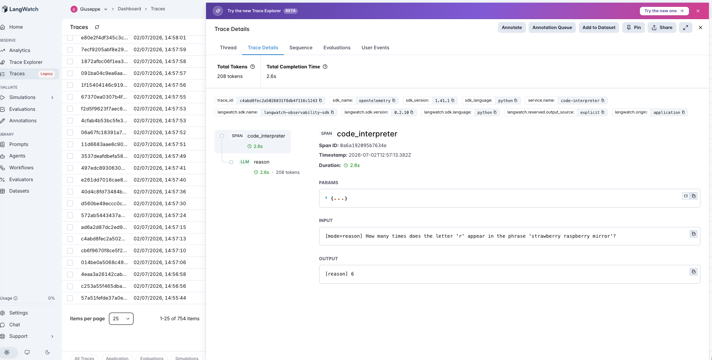
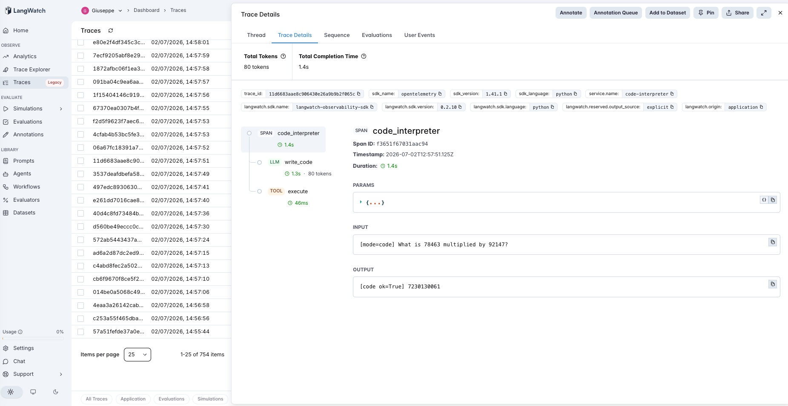

# 22 · Code Interpreter

A code-interpreter agent: answer a question either by **reasoning it out** or by **writing and running code**. The second Tier-4 (tools) agent — where sql-agent acted on a database, this one acts on a Python interpreter.

The variable under test is **compute in the head vs compute on a CPU**:

- **reason** (default) — solve step by step in prose, end with `Answer: X`. The model does the arithmetic itself.
- **code** — write a short Python program that prints the answer, **execute it in a subprocess**, use its stdout.

Same questions, one LLM call each; the only difference is whether the computation runs in the model or on a chip. The questions are deliberately computational — large products, letter counts, modulo, date math, compound interest, standard deviation. The PM question isn't "is code better at math?" (a modern model does a lot of arithmetic fine) — it's "**which computations exceed the model's reliable mental-arithmetic envelope, and is handing those to an interpreter free?**"

> **Deterministic and self-contained.** Gold answers are computed in Python; the agent runs the model's code with `subprocess` (stdlib `math`/`datetime`/`statistics` available), a 5-second timeout, and captures stdout. `answer_correct` is exact (small tolerance for rounding).

## The pipeline

```
reason:  reason (llm)                     → parse 'Answer: X'
code:    write_code (llm) → execute (tool) → stdout
         "how many 'r' in ...?" → print('...'.count('r')) → 9
```

Each step is a typed LangWatch span; `execute` is a `tool` span capturing stdout or the error. See [`agent.py`](agent.py) — ~180 lines, raw OpenAI + LangWatch + `subprocess`.

### Two real traces

**Reasoning miscounts; the interpreter doesn't.** `reason` on *"how many times does the letter 'r' appear in 'strawberry raspberry mirror'?"* answers **6** — the classic tokenization blind spot (the answer is 9). `code` writes `print('strawberry raspberry mirror'.count('r'))`, the `execute` span prints **9**. The model doesn't "see" letters, but Python does.



**Code nails a computation reasoning fumbles.** `code` on *"what is 78463 multiplied by 92147?"* writes `print(78463 * 92147)` → **7230130061**. `reason` computed **7222029041** — plausible, confident, and ~8 million off. Exact large-number arithmetic is exactly what an interpreter is for.



## The dataset

12 questions ([`dataset.csv`](dataset.csv)):

| Category | Count | What it is |
|---|---|---|
| `compute` | 9 | big multiplication, `3^25`, modulo, letter counts, leap-year date diff, compound interest, population stdev, median |
| `trivial` | 3 | `12+15`, `100/4`, `7×8` — both modes get these; is code just overhead? |

## The evaluators

Three programmatic scorers ([`evals.py`](evals.py)):

| Evaluator | Type | Measures |
|---|---|---|
| `answer_correct` | Programmatic | Does the answer match the gold value (numeric, small tolerance)? Both modes. |
| `executes_ok` | Programmatic | code mode: did the program run without error? The tool-path health metric. |
| `reason_to_code_lift` | Programmatic | Paired `reason → code`: +1 reasoning wrong & code fixed it, −1 the reverse (buggy code), 0 else. **The discriminator.** |

## The tuning experiment

> **reason vs code on 12 questions (9 compute, 3 trivial)**

### Three hypotheses to discriminate

| | Outcome | What it would teach |
|---|---|---|
| **H1** (code wins broadly) | code ≫ reason across all compute | The model can't do arithmetic; always execute. |
| **H2** (code wins selectively) | reason handles a lot; code fixes a specific subset | Modern models compute plenty in-head; code's value is the *residual* they can't. |
| **H3** (code hurts) | code introduces bugs / misreads and loses somewhere | Executing code trades mental-math errors for program errors. |

### Results

**Aggregate across 12 questions**

| mode | answer_correct | executes_ok |
|---|---|---|
| `reason` | 7/12 (58%) | 12/12 |
| `code` | **12/12 (100%)** | **12/12** |

**Answer-correct by category**

| mode | compute | trivial |
|---|---|---|
| `reason` | 4/9 | 3/3 |
| `code` | **9/9** | 3/3 |

**Paired lift**

| | value |
|---|---|
| `reason_to_code_lift` mean | **0.71** (helped 5, **hurt 0**, neutral 7) |
| where code helped | 5-digit ×, modulo, two letter-counts, population stdev |
| where reason already coped | `3^25`, leap-year date diff, compound interest, median, all 3 trivial |

### What's actually happening — H2, cleanly; H3 rejected

**Code is perfect and never backfires: 12/12, zero execution errors, zero regressions.** On well-specified computational questions, `gpt-4o-mini` writes correct Python every time, so `code` is a strict improvement here — the buggy-program failure mode (H3) simply didn't occur.

**But reasoning isn't hopeless — it's 4/9 on compute, and the misses are a specific profile.** This is the interesting part (H2). The model reasoned its way correctly to `3^25` (a 12-digit power), a leap-year-spanning date difference, compound interest to the cent, and the median — real computation, done in-head. What it got wrong was a recognizable set:

- **Exact large-number arithmetic** — `78463 × 92147` came out `7222029041` instead of `7230130061` (right magnitude, wrong digits).
- **Modulo** — `1234567 mod 89` → `67`, not `48`.
- **Letter counting** — `6` and `17` instead of `9` and `20`; the model operates on tokens, not characters, so counting letters is a structural blind spot no amount of "careful" reasoning fixes.
- **Precise statistics** — population stdev `12.3032` vs `12.3153`, a small but real error from hand-rolling the formula.

So the tell for when to reach for the interpreter is **not** "is this a math question" — the model does plenty of math in-head. It's "does this need *exact large-number arithmetic, modular/precise operations, or character-level counting*," which is precisely where token-based mental math is unreliable and a CPU is exact.

**On trivial arithmetic, code is a no-op with overhead.** Both modes 3/3; `code` spent an extra tool round-trip to confirm `12+15`. Harmless, but wasted.

### The lesson

> **Handing computation to a code interpreter is a strict win where the task exceeds the model's reliable mental-arithmetic envelope — exact large products, modulo, character-level counting, precise statistics — and it never backfired here (12/12, 0 buggy programs). But a modern model already computes a lot correctly in-head (powers, dates, compound interest, medians), so code's value is the *residual* of hard-exact operations, not "the model can't do math." The signal to route to code is the *kind* of computation, not the presence of a number.**

The precondition, for the tools tier:

- **Code helps** when correctness requires exactness beyond in-head arithmetic — and the standout, guaranteed case is **anything character-level** (letter/substring counting), which the model *structurally* cannot do reliably because it doesn't see characters.
- **Code is overhead** on arithmetic simple enough to be reliable in-head (the trivial tier).
- **Code's own risk** (a buggy or mis-scoped program) is real in general but did not appear on well-specified questions — the more ambiguous the *problem statement*, the more that risk shifts from mental-math error to "correctly ran the wrong computation."

For an AI PM in 2026: don't reach for a code interpreter for *every* number — a good model computes plenty correctly and the extra execution is latency. Reach for it when the task is exact-heavy or character-level, where mental math has a structural failure mode; there, execution isn't an optimization, it's the difference between `6` and `9`. And keep `executes_ok` on your dashboard — once you're executing model-written code, "it ran the wrong thing" replaces "it did the math wrong" as your failure mode.

This is the second tools-tier entry (#21 sql-agent → #22), and the same precondition shape as the rest of the catalog (#7→#22): the mechanism — executing code — helps exactly where its precondition (a computation the model can't reliably do in-head) holds.

## Quick start

```bash
cd agents/22-code-interpreter
python -m venv .venv && source .venv/bin/activate
pip install -r requirements.txt

cp .env.example .env
# fill in OPENAI_API_KEY and LANGWATCH_API_KEY (Project API Key, type Service)

# One question, each mode (watch reasoning miscount letters)
python agent.py "How many times does the letter 'r' appear in 'strawberry raspberry mirror'?"
CI_MODE=code python agent.py "What is 78463 multiplied by 92147?"

# Full comparison (both modes, 12 questions)
python run_eval.py
python run_eval.py --limit 4     # smoke test
```

If you hit the macOS Xcode-Python SSL issue (`Errno 2` on `ssl.py`):

```bash
pip install certifi
export SSL_CERT_FILE=$(python -c "import certifi; print(certifi.where())")
```

## What you'll learn

How a code-interpreter agent looks in LangWatch when the `execute` tool span runs model-written Python and captures its stdout — and how the `reason → code` lift reveals which computations actually needed an interpreter versus which the model already did in-head. The PM takeaway is that code execution is a targeted fix, not a blanket one: it's decisive for exact large-number and character-level work (where mental math structurally fails) and pure overhead on the arithmetic a modern model already gets right.

## Status

✅ Complete. On 12 questions, `code` scores **100%** vs `reason`'s **58%**, with **zero buggy programs and zero regressions** — but reasoning wasn't hopeless (4/9 compute; it handled powers, dates, compound interest, medians in-head). Code's wins were a specific profile: exact 5-digit multiplication, modulo, letter counting (a structural tokenization blind spot), and precise stdev. The tell for reaching for the interpreter is the *kind* of computation, not the presence of a number. The second tools-tier entry (#21→#22) in the calibration/precondition thread: executing code helps exactly where the computation exceeds the model's reliable mental-arithmetic envelope.
