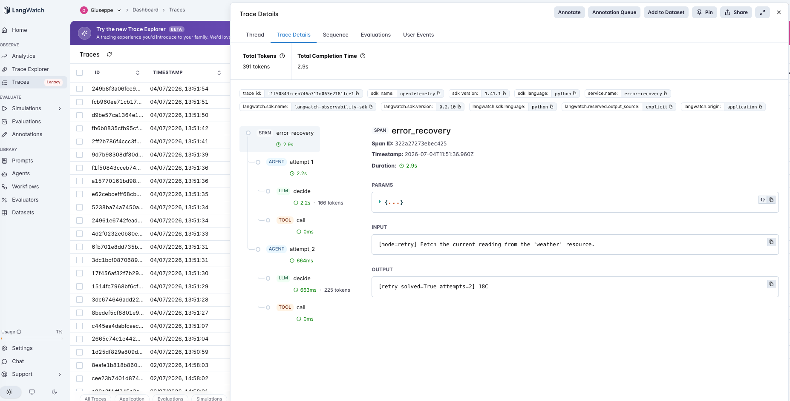
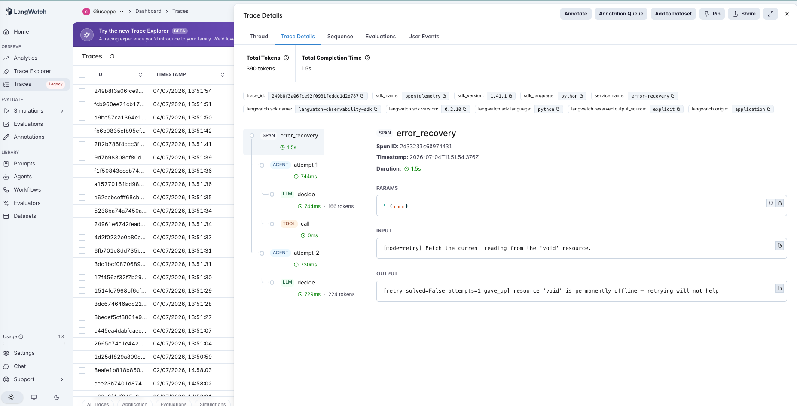

# 23 · Error Recovery

An error-recovery agent: when a tool call fails, does the agent **retry and repair**, or give up on the first error? The third Tier-4 (tools) agent — #21 and #22 both generate calls that *can* fail; this one is about what happens next.

The variable under test is **give up vs retry-with-repair**:

- **no_retry** (default) — one tool attempt. On error, fail.
- **retry** — feed the error back to the LLM, let it fix the call and try again (up to `MAX_ATTEMPTS`), or decide the error is unrecoverable and **give up**.

Both drive the same mock service, whose failures are deliberately **classifiable**:

- **clean** resources succeed on the first call.
- **recoverable** resources fail once with an error that *contains the fix* — an access token the agent can't guess up front but can copy from the error message on retry.
- **unrecoverable** resources fail on every call and *say so* ("permanently offline — retrying will not help"). A good retry loop should recognize that and give up, not burn attempts.

The PM question: retrying obviously recovers *some* failures — but which, at what cost, and does the loop know when to stop?

> **Deterministic.** The service ([`agent.py`](agent.py)) returns fixed results/errors; the recoverable token is un-guessable (`9F3K`, `A7B2`, …), so `no_retry` *cannot* solve a recoverable task on one shot and `retry` *can* by copying the token — no luck involved.

## The pipeline

```
no_retry:  attempt_1: decide (llm) → call (tool)                          (stop on error)
retry:     attempt_1: decide (llm) → call (tool)  → error
           attempt_2: decide (llm, given the error) → call (tool)  → success, or give_up
           ... up to MAX_ATTEMPTS
```

Each attempt is an `agent` span wrapping its `decide` (llm) and `call` (tool) children. The LLM replies with a JSON action — `{"action":"call","resource":...,"token":...}` or `{"action":"give_up"}`. See [`agent.py`](agent.py) — ~190 lines, raw OpenAI + LangWatch.

### Two real traces

**Retry recovers by reading the fix out of the error.** `retry` on the `weather` resource — `attempt_1`'s `call` span returns `resource 'weather' requires a valid access token. Retry with token=9F3K`; `attempt_2`'s `decide` span copies the token and calls again → **`18C`**. `no_retry` stopped at the error and failed. The fix was *in the error* — retrying is how you use it.



**Retry knows when to quit.** `retry` on the `void` resource — `attempt_1`'s `call` returns `resource 'void' is permanently offline — retrying will not help`, and the `decide` span responds `give_up` instead of trying again. One attempt, not four. A retry loop that can't tell recoverable from unrecoverable would either abandon fixable errors or burn its whole budget here.



## The dataset

9 fetch tasks ([`dataset.csv`](dataset.csv)):

| Category | Count | First-call outcome | Recoverable? |
|---|---|---|---|
| `clean` | 2 | succeeds | n/a |
| `recoverable` | 4 | errors with the fix (a token) in the message | yes — via retry |
| `unrecoverable` | 3 | errors, "permanently unavailable" | no — retry cannot help |

## The evaluators

Three programmatic scorers ([`evals.py`](evals.py)):

| Evaluator | Type | Measures |
|---|---|---|
| `solved` | Programmatic | Did it get a successful result? (Only possible for clean + recoverable.) |
| `outcome_correct` | Programmatic | Did it reach the RIGHT outcome — solve the solvable, and correctly *not* solve the unsolvable? |
| `no_retry_to_retry_lift` | Programmatic | Paired `no_retry → retry`: +1 retry recovered it, −1 retry lost a success, 0 else. **The discriminator.** |

(`run_eval` also reports **attempts on unrecoverable tasks** — the efficiency axis.)

## The tuning experiment

> **no_retry vs retry on 9 tasks (2 clean, 4 recoverable, 3 unrecoverable)**

### Three hypotheses to discriminate

| | Outcome | What it would teach |
|---|---|---|
| **H1** (retry recovers) | retry ≫ no_retry on recoverable tasks | Feeding the error back turns fixable failures into successes. |
| **H2** (retry wastes) | retry burns MAX_ATTEMPTS on unrecoverable tasks | A naive loop retries errors it can never fix. |
| **H3** (retry is disciplined) | retry recovers *and* gives up early on unrecoverable | A good loop reads the error and knows when to stop. |

### Results

**Aggregate across 9 tasks**

| mode | solved | outcome_correct | mean attempts |
|---|---|---|---|
| `no_retry` | 2/9 (22%) | 5/9 (56%) | 1.0 |
| `retry` | **6/9 (67%)** | **9/9 (100%)** | 1.4 |

**Solved by category**

| mode | clean | recoverable | unrecoverable |
|---|---|---|---|
| `no_retry` | 2/2 | **0/4** | 0/3 |
| `retry` | 2/2 | **4/4** | 0/3 |

**Lift + efficiency**

| | value |
|---|---|
| `no_retry_to_retry_lift` mean | **0.72** (helped 4, **hurt 0**, neutral 5) |
| unrecoverable: gave up early | **3/3** (1 attempt each, not the MAX of 4) |
| retry mean attempts | 1.4 — the extra cost lands only where recovery is possible |

### What's actually happening — H1 and H3 together

**Retry recovered every recoverable failure: 0/4 → 4/4.** `no_retry` structurally can't solve these — the required token only exists in the error message it never reads. `retry` feeds that error back, the model copies the token, and the second call succeeds. This is the core win, and it's clean: **+4, zero regressions** (H1).

**And the loop was disciplined, not naive — it gave up early on all 3 unrecoverable tasks** (H3, H2 rejected). Handed `resource 'void' is permanently offline — retrying will not help`, the model responded `give_up` on attempt 1 rather than burning four attempts. That's why `retry`'s mean attempts is only **1.4**: it spends the extra round-trip *only* on recoverable tasks (2 attempts) and stays at 1 on clean and unrecoverable ones. The cost of retrying was proportional to the chance of recovery.

**The real story is in `outcome_correct`, which went 56% → 100%.** `retry` didn't just solve more — it reached the *correct* outcome on all 9: it solved everything solvable and correctly abandoned everything unsolvable. `no_retry` was "wrong" on the 4 recoverable tasks (gave up on fixable errors). Neither mode ever fabricated a success on an unrecoverable task, because the tool never returns one — the honesty came for free from grounding the outcome in a real tool result.

### The lesson

> **A retry loop's value is bounded by how *classifiable* your errors are. When an error carries its own fix (a token, a corrected parameter), retrying recovers the failure — that's the whole 0/4 → 4/4. When an error clearly signals it's unrecoverable, a well-prompted loop gives up instead of burning attempts. Both halves depend on the same thing: error messages that are actionable and honest about recoverability. Vague errors ("something went wrong") defeat retry in both directions at once — it can't fix them and can't tell it should stop.**

The precondition is about the *errors*, not the loop:

- **Retry helps** when failures are recoverable *and* the error says how — the fix has to be reachable from the message (H1).
- **Retry stays cheap** when unrecoverable failures announce themselves, so the loop can bail (H3). This is why "retry N times" is the wrong default and "retry until the error stops being actionable" is the right one.
- **Retry is a no-op** on clean calls (2/2, 1 attempt) — no cost when nothing failed.

For an AI PM in 2026: the highest-leverage investment for a self-healing agent isn't a cleverer retry policy — it's **error messages that are specific and classify themselves** (here's the fix / this is permanent). Given those, a plain retry-with-give-up loop reaches the correct outcome on everything at ~1.4× the calls. Without them, no retry policy can distinguish "try again" from "stop," and you get either lost recoveries or runaway attempt budgets. Watch mean-attempts-on-failure as the tell.

This is the third tools-tier entry (#21 → #22 → #23), and the same precondition shape as the whole catalog (#7→#23): the mechanism — retrying — helps exactly where its precondition (classifiable, actionable errors) holds.

## Quick start

```bash
cd agents/23-error-recovery
python -m venv .venv && source .venv/bin/activate
pip install -r requirements.txt

cp .env.example .env
# fill in OPENAI_API_KEY and LANGWATCH_API_KEY (Project API Key, type Service)

# One task, each mode
python agent.py "Fetch the current reading from the 'weather' resource."          # recoverable
RECOVER_MODE=retry python agent.py "Fetch the current reading from the 'void' resource."  # unrecoverable

# Full comparison (both modes, 9 tasks)
python run_eval.py
python run_eval.py --limit 4     # smoke test
```

If you hit the macOS Xcode-Python SSL issue (`Errno 2` on `ssl.py`):

```bash
pip install certifi
export SSL_CERT_FILE=$(python -c "import certifi; print(certifi.where())")
```

## What you'll learn

How a retry-with-repair loop looks in LangWatch when each attempt is its own `agent` span and the error flows from one `call` span into the next `decide` span — and how mean-attempts, split by whether the task was recoverable, tells you if your loop is recovering failures or just burning budget. The PM takeaway is that self-healing agents are made of classifiable errors, not clever policies: given actionable, honest error messages, a simple retry-or-give-up loop reaches the right outcome everywhere at minimal extra cost.

## Status

✅ Complete. On 9 tasks, `retry` lifts solved **22% → 67%** and outcome-correct **56% → 100%** over `no_retry` — recovering all 4 recoverable failures by reading the fix out of the error (0/4 → 4/4), with zero regressions. Critically it was disciplined: it **gave up early on all 3 unrecoverable tasks** (1 attempt, not 4), keeping mean attempts at 1.4. The value rides on errors being classifiable — the fix reachable from the message, and unrecoverable failures announcing themselves. The third tools-tier entry (#21→#23): retrying helps exactly where the error is actionable, and a good loop reads the error to know when to stop.
