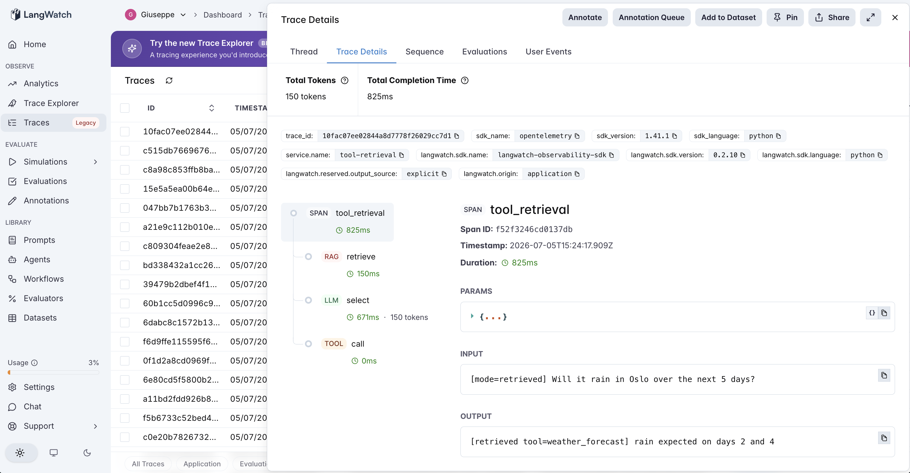
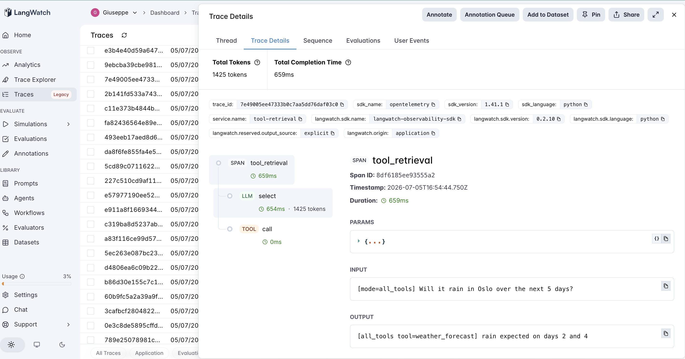

# 24 · Tool Retrieval

A tool-retrieval agent: with a **large tool registry**, does the model select the right tool better when it sees **all** the tools, or a **retrieved shortlist**? The fourth Tier-4 (tools) agent — about the increasingly common problem of an agent with dozens or hundreds of tools.

The variable under test is **how many tools the model must choose among**:

- **all_tools** (default) — put every tool description in the prompt, let the model pick one and call it.
- **retrieved** — first **semantically retrieve** the top-k tools relevant to the query (embed each tool's name+description, cosine to the query), put only those in the prompt, then pick and call.

Both make one selection call and one (mock) tool call; the only difference is the size of the menu. The registry has **101 tools** with many **near-duplicates** (exchange_rate near convert_currency, uv_index/pollen_count near weather, market_index near stock_price, map_directions near distance_between…). The PM question everyone assumes the answer to: *does dumping 100 tools into the prompt confuse the model — and does retrieval fix that?*

> **Semantic retrieval on purpose.** Tools are retrieved by **embedding** their descriptions, not keyword overlap — because "will it rain" shares no keywords with "weather forecast" (that's #15's vocabulary-mismatch lesson, not this agent's). Embeddings isolate the real question: does pre-filtering the tool set help? Tool embeddings are computed once and cached.

## The pipeline

```
all_tools:  select (llm, all 101 tools)          → call (tool)
retrieved:  retrieve (rag, top-k) → select (llm, k tools) → call (tool)
```

Each step is a typed LangWatch span. See [`agent.py`](agent.py) (~180 lines) and [`registry.py`](registry.py) (the 101-tool registry), raw OpenAI + LangWatch.

### Two real traces

**Retrieval hands the model a clean shortlist.** `retrieved` on *"Will it rain in Oslo over the next 5 days?"* — the `retrieve` span embeds the query and returns the weather cluster (`weather_forecast`, `weather_current`, `air_quality`), the `select` span picks `weather_forecast` from those few, and `call` returns the forecast. The prompt held ~5 tools, not 101.



**All-tools works too — it just costs 10× the prompt.** `all_tools` on the same query — the `select` span carries all 101 tool descriptions (~1,400 prompt tokens vs the shortlist's ~140), and still picks `weather_forecast` correctly. Same answer, an order of magnitude more tokens.



## The dataset

20 queries ([`dataset.csv`](dataset.csv)), each with exactly one correct tool, spanning clusters where near-duplicates make selection non-trivial: converters, weather, finance, geo, travel, comms, text, math.

## The evaluators

Three programmatic scorers ([`evals.py`](evals.py)):

| Evaluator | Type | Measures |
|---|---|---|
| `correct_tool` | Programmatic | Did the model pick the gold tool? The core selection metric. Both modes. |
| `retrieval_recall` | Programmatic | retrieved mode: was the gold tool even in the shortlist? **Retrieval's ceiling** — the model can't pick what retrieval didn't surface. |
| `all_to_retrieved_lift` | Programmatic | Paired `all_tools → retrieved`: +1 retrieval fixed a wrong pick, −1 it filtered the right tool out, 0 else. **The discriminator.** |

Plus **prompt tokens** per mode — the cost axis.

## The tuning experiment

> **all_tools vs retrieved on 20 queries over a 101-tool registry**

### Three hypotheses to discriminate

| | Outcome | What it would teach |
|---|---|---|
| **H1** (retrieval fixes selection) | retrieved ≫ all_tools on accuracy | Too many tools confuses the model; pre-filtering is necessary. |
| **H2** (retrieval saves cost, not accuracy) | equal accuracy, retrieved far cheaper | The model handles a big menu fine; retrieval's win is tokens/latency. |
| **H3** (retrieval hurts) | retrieved < all_tools because recall drops | Pre-filtering risks dropping the right tool. |

### Results

**At 101 tools** (the registry was first tested at 30 — both modes 100%, no headroom — then padded to 100 to look for degradation)

| mode | correct_tool | mean prompt tokens |
|---|---|---|
| `all_tools` | **20/20 (100%)** | 1,415 |
| `retrieved` | **20/20 (100%)** | **140** |

**Retrieval ceiling (retrieved mode)**

| | value |
|---|---|
| `retrieval_recall` (gold tool in shortlist) | **20/20** |
| `correct_tool` (gold then picked) | 20/20 |

**Lift + cost**

| | value |
|---|---|
| `all_to_retrieved_lift` mean | **0.50** (helped 0, hurt 0, neutral 20) |
| prompt tokens | all_tools **28,300** vs retrieved **2,806** → **10.1× more for all_tools** |

### What's actually happening — H2, decisively; H1 folklore rejected

**The "too many tools confuses the model" folklore did not reproduce.** `gpt-4o-mini` selected the correct tool **100% of the time from all 101**, including on the near-duplicate clusters built to trip it (it never picked `exchange_rate` for a currency *conversion*, `weather_current` for a *forecast*, or `map_directions` for a *distance*). I padded the registry from 30 to 100 tools specifically hunting for the accuracy degradation everyone assumes — and it isn't there for this model at this scale (H1 rejected).

**Retrieval was equally accurate, with perfect recall — so the risk of pre-filtering (H3) also didn't fire.** Semantic retrieval's top-k shortlist contained the gold tool on all 20 queries (`retrieval_recall` 20/20), and the model then picked it every time. Retrieval neither helped nor hurt accuracy: `lift` = 0.50, **0 helped, 0 hurt.**

**The entire, real difference is cost: retrieved used 10× fewer prompt tokens** (140 vs 1,415 per query; 2,806 vs 28,300 total). That gap *grows with the registry* — it was 3.6× at 30 tools and 10.1× at 100 — because `all_tools` pays for every description on every call while `retrieved` pays for a fixed handful. On latency and $/query, that's the whole story (H2).

**So the honest finding inverts the usual pitch.** Tool retrieval is sold as accuracy insurance ("the model can't handle 100 tools"). Empirically, a capable model *can* — selection stayed perfect. What retrieval actually buys is a **10× smaller prompt**, and it's safe to adopt **only as far as retrieval recall holds**: the one way retrieved could have lost is by dropping the right tool from the shortlist, which is why `retrieval_recall`, not `correct_tool`, is the metric that governs whether the token savings are free.

### The lesson

> **Tool retrieval's value is cost, not accuracy. A capable model selects correctly from a 100-tool menu with near-duplicates (20/20 from all 101) — the "too many tools confuses it" folklore didn't hold. Retrieval matched that accuracy at 10× fewer prompt tokens, a gap that grows with registry size. The catch is entirely in recall: retrieval only stays free while its shortlist reliably contains the right tool (here 20/20), so `retrieval_recall` — not selection accuracy — is the number that decides whether pre-filtering is a pure win or a silent way to drop the correct tool.**

The precondition, for the tools tier:

- **Retrieval helps cost** unconditionally once the registry is large — and the savings scale with it (10× at 100 tools). This is the real, measurable reason to adopt it.
- **Retrieval helps accuracy only if the registry actually degrades selection** — which it didn't, even at 100 clean-described tools. Don't adopt it *for* accuracy without measuring whether all-tools is actually failing first.
- **Retrieval's risk is recall**, not selection: it can only hurt by dropping the gold tool from the shortlist. Watch `retrieval_recall`; if it's below 100%, the token savings come at an accuracy cost.

For an AI PM in 2026: if your agent has a big toolset, reach for tool retrieval to cut prompt tokens, latency, and cost — not because the model can't cope with the menu (measure that; it may be fine). And put a recall eval on your retriever, because that's the only place tool retrieval can quietly make you *worse*: a top-k that misses the right tool caps your accuracy at exactly the rate it misses.

This is the fourth tools-tier entry (#21→#24), and the same precondition shape as the whole catalog (#7→#24): the mechanism — pre-filtering tools — pays off (on cost) once the registry is large, and its risk lives entirely in whether its precondition (recall of the right tool) holds.

## Quick start

```bash
cd agents/24-tool-retrieval
python -m venv .venv && source .venv/bin/activate
pip install -r requirements.txt

cp .env.example .env
# fill in OPENAI_API_KEY and LANGWATCH_API_KEY (Project API Key, type Service)

# One query, each mode (watch the prompt-token difference)
python agent.py "Will it rain in Oslo over the next 5 days?"
TR_MODE=retrieved python agent.py "What's the driving distance from Rome to Naples?"

# Full comparison (both modes, 20 queries)
python run_eval.py
python run_eval.py --limit 4     # smoke test
```

If you hit the macOS Xcode-Python SSL issue (`Errno 2` on `ssl.py`):

```bash
pip install certifi
export SSL_CERT_FILE=$(python -c "import certifi; print(certifi.where())")
```

## What you'll learn

How tool retrieval looks in LangWatch when a `retrieve` span narrows a 101-tool registry to a handful before the `select` span chooses — and why the metric to watch is `retrieval_recall` (did the shortlist contain the right tool?) rather than selection accuracy, because that's the only place pre-filtering can hurt. The PM takeaway is that tool retrieval is a cost/latency optimization (10× fewer prompt tokens here), not the accuracy insurance it's often sold as: a capable model selects fine from a large menu, so retrieve to save tokens and guard the retriever's recall.

## Status

✅ Complete. On 20 queries over a **101-tool registry** with near-duplicate clusters, `all_tools` and `retrieved` **both score 20/20** — a capable model selects the right tool from 100+ without degradation, so the "too many tools confuses it" folklore didn't reproduce (registry was pushed 30→100 hunting for it). Retrieval matched that accuracy at **10× fewer prompt tokens** with perfect recall (20/20), so its value is cost/latency, not accuracy, and its only risk is dropping the gold tool from the shortlist — making `retrieval_recall` the metric that governs whether the savings are free. The fourth tools-tier entry (#21→#24): pre-filtering tools pays off on cost once the registry is large, and its precondition is recall.
