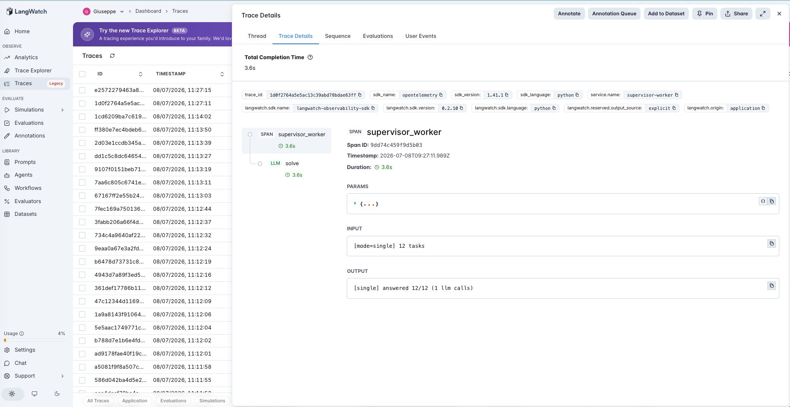
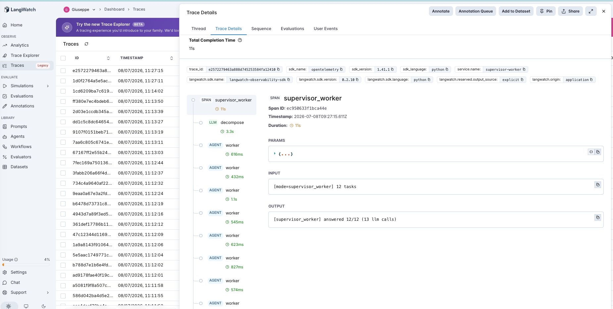

# 26 · Supervisor-Worker

A supervisor-worker agent: given a request that bundles N independent subtasks, does **splitting the work across a supervisor and one worker per subtask** beat a **single agent** doing the whole bundle in one pass? The first Tier-5 (multi-agent) agent — and a direct test of the tier's founding folklore: *break the work across specialized agents and you get better results.*

The variable under test is **whether each subtask gets its own isolated call**:

- **single** (default) — one LLM call receives all N numbered subtasks and returns a JSON map of answers.
- **supervisor_worker** — a supervisor **decomposes** the bundle into N subtasks, dispatches **one worker call per subtask**, and aggregates the answers.

Both see the identical numbered request. Every subtask is an **atomic op with an oracle-computed gold** (word counts, small arithmetic, string reversals, pick-the-nth-word, sorts), so a wrong answer in the bundle can be traced to a cause. The bundle size is swept **1 → 12** to hunt for the crossover where a single pass, stretched across many simultaneous instructions, starts dropping or fumbling subtasks — the same "push the stress variable until it breaks" method as [#12](../12-least-to-most/) (reasoning depth) and [#24](../24-tool-retrieval/) (registry size).

> **Same parser for both modes.** Every answer, single or worker, is scored through one forgiving normalizer (that's [#20](../20-structured-extraction/)'s lesson — a stricter parser on one side manufactures a fake difference). So any gap is real, not a scoring artifact.

## The pipeline

```
single:            solve (llm, all N subtasks → JSON)
supervisor_worker: decompose (llm) → worker (agent) ×N → aggregate
```

Each step is a typed LangWatch span. See [`agent.py`](agent.py) (~170 lines) and [`build_dataset.py`](build_dataset.py) (the seeded, oracle-verified generator), raw OpenAI + LangWatch.

### Two real traces

**One pass does the whole bundle.** `single` on a 12-task bundle — a single `solve` span reads all twelve numbered tasks and returns one JSON object with twelve answers. **One LLM call.**



**The supervisor fans out — at 13× the calls.** `supervisor_worker` on the same bundle — a `decompose` span splits it into twelve subtasks, then twelve `worker` spans each solve one in isolation, aggregated at the end. **Thirteen LLM calls for the same answers.**



## The dataset

20 bundles ([`dataset.csv`](dataset.csv), regenerate with `python build_dataset.py`), bundle sizes **1 / 3 / 6 / 9 / 12**, each a heterogeneous mix of distinct atomic ops so the model must switch modes on every task. Nine op types; six of them (`multiply`, `add`, `sortnums`, `maxnum`, `upper`, `lastchar`) a capable model does perfectly in isolation, three of them (`wordcount`, `nthword`, `reverse`) are the model's tokenization blind spots — which turns out to matter.

## The evaluators

Programmatic scorers ([`evals.py`](evals.py)), every subtask classified `correct` / `wrong` / `dropped`:

| Evaluator | Type | Measures |
|---|---|---|
| `bundle_correctness` | Programmatic | Fraction of subtasks answered correctly. Both modes, same normalizer. |
| `dropped` (per subtask) | Programmatic | A subtask with **no answer at all** — the bundling failure mode: a single pass silently omitting a task as N grows. |
| `decomposition_ok` | Programmatic | supervisor_worker: did the supervisor emit **exactly N** subtasks? Its own, multi-agent-specific failure surface. |

Plus **mean LLM calls** per mode — the cost axis (single = 1; supervisor_worker = N+1).

## The tuning experiment

> **single vs supervisor_worker on 20 bundles, sizes 1→12**

### Three hypotheses to discriminate

| | Outcome | What it would teach |
|---|---|---|
| **H1** (decomposition helps) | supervisor_worker ≫ single, especially at large N | Splitting across workers relieves attention split across many instructions. |
| **H2** (single doesn't degrade) | equal accuracy, single drops nothing even at N=12 | No load bottleneck exists to relieve; decomposition is pure cost. |
| **H3** (decomposition hurts) | supervisor_worker < single from its own errors | The supervisor mis-decomposes; multi-agent adds a failure surface. |

### Results

| mode | subtasks correct | wrong | dropped | mean LLM calls |
|---|---|---|---|---|
| `single` | **108/124 (87%)** | 16 | **0** | **1.0** |
| `supervisor_worker` | **108/124 (87%)** | 16 | **0** | **7.3** |

**Crossover — subtask correctness by bundle size** (the hunt for degradation):

| bundle size | single | supervisor_worker |
|---|---|---|
| 1 | 3/4 | 2/4 |
| 3 | 11/12 | 12/12 |
| 6 | 22/24 | 22/24 |
| 9 | 30/36 | 30/36 |
| 12 | 42/48 (88%) | 42/48 (88%) |

**Supervisor decomposition fidelity:** 19/20 — one size-1 task the supervisor split into 3.

### What's actually happening — H2 decisively, with a dash of H3; H1 rejected

**The two modes scored *identically* — 108/124, to the subtask (H1 rejected).** Not "close": the same 108 right, the same 16 wrong, at every bundle size the two lines track each other (they cross above and below by ±1 subtask, i.e. noise). Giving each subtask its own isolated worker call bought **nothing**.

**Single never degraded — 0 dropped subtasks, even at 12 simultaneous tasks (H2).** The whole premise of decomposition is that one pass, asked to do many things at once, starts forgetting some. It didn't: across all 20 bundles single answered **every** task number it was given (`dropped = 0`), and its accuracy at bundle-size 12 (88%) is no worse than at size 3. I pushed the bundle to twelve heterogeneous instructions hunting for the attention crossover — the way #24 padded a registry to 100 tools — and **it isn't there for this model.** With no load bottleneck to relieve, supervisor_worker's fan-out is pure overhead: **7.3× the LLM calls for the same answers.**

**Every error was intrinsic to the subtask, not to the bundle — which is why isolation couldn't fix it.** All 16 misses (both modes) landed on `wordcount` and `nthword` (and one `reverse`) — the model's tokenization blind spots ([#22](../22-code-interpreter/)'s lesson: it doesn't reliably see word/character boundaries). The tell: **they fail at bundle size 1**, a single task with nothing else in the prompt. The six op types the model actually knows (`multiply`, `add`, `sortnums`, `maxnum`, `upper`, `lastchar`) scored **100% in both modes** at every size. So supervisor_worker handed each hard subtask to a dedicated worker with zero distractions — and the worker got it wrong at the same rate, because the difficulty was never the bundle.

**And the supervisor added a failure mode single can't have (H3, in miniature).** Decomposition fidelity was 19/20: on one single-task bundle the supervisor invented structure that wasn't there, splitting one task into three and handing a worker a malformed fragment. Rare here, but it's a cost that only exists once you introduce an orchestrator — the more agents in the chain, the more seams to mis-cut.

### The lesson

> **Splitting work across a supervisor and workers relieves an *attention/load* bottleneck — so it only helps if one actually exists. Here it didn't: a single agent answered all twelve bundled subtasks with zero drops and no accuracy decline with bundle size, so decomposition scored *identically* (108/124 both) at 7.3× the LLM calls — and the orchestrator even added a failure single can't have (mis-decomposing 1 task into 3). The errors that remained were *capability* errors, not load errors — word-counting and nth-word indexing that fail at bundle size 1 — and per-worker isolation fixes those exactly never, because the difficulty was never the bundle. Measure whether your single agent actually drops tasks under load before paying N× for agents to split it up; if the bottleneck is the model's skill on a subtask, more agents just run the same skill more times.**

The precondition, for the multi-agent tier:

- **Decomposition pays only against a load bottleneck** — a single pass that measurably drops/mangles tasks as N grows. Check `dropped` vs bundle size first; here it was flat at 0.
- **It cannot touch a capability bottleneck** — a subtask the model gets wrong in isolation is wrong in a worker too. Isolation ≠ ability.
- **Every added agent is a new seam** — the supervisor's own decomposition can fail (19/20), a cost that scales with orchestration depth, not down.

For an AI PM in 2026: "we made it multi-agent" is not a quality argument. A capable model handles a dozen bundled tasks in one call without dropping any, so reach for a supervisor-worker split when you've *measured* single-agent overload (dropped/garbled subtasks under load, or a context window that genuinely won't hold the work) — not by default. Otherwise you've bought an N× bill and an extra failure surface for identical output.

This opens the multi-agent tier (#26→) on the same precondition shape as the whole catalog (#7→#26): the mechanism — decompose and delegate — pays off only where its precondition (a single agent actually overloaded by the bundle) holds, and here, measured out to twelve simultaneous tasks, it didn't.

## Quick start

```bash
cd agents/26-supervisor-worker
python -m venv .venv && source .venv/bin/activate
pip install -r requirements.txt

cp .env.example .env
# fill in OPENAI_API_KEY and LANGWATCH_API_KEY (Project API Key, type Service)

python build_dataset.py           # regenerate the oracle-verified dataset

# One bundle, each mode (watch the call count: 1 vs N+1)
python agent.py
MA_MODE=supervisor_worker python agent.py

# Full comparison (both modes, 20 bundles, sizes 1→12)
python run_eval.py
python run_eval.py --limit 4      # smoke test
```

If you hit the macOS Xcode-Python SSL issue (`Errno 2` on `ssl.py`):

```bash
pip install certifi
export SSL_CERT_FILE=$(python -c "import certifi; print(certifi.where())")
```

## What you'll learn

How a supervisor-worker split looks in LangWatch — a `decompose` span fanning out to one `worker` span per subtask — and why the metric that decides whether it's worth the fan-out is **whether the single-agent baseline actually drops tasks under load**, not the intuition that more agents must be better. The PM takeaway is that decomposition relieves an attention/load bottleneck and nothing else: with none present (single dropped 0 of 124 subtasks out to bundle-size 12), it scored identically at 7.3× the cost, and the errors that remained were per-subtask capability limits that isolation can't fix.

## Status

✅ Complete. On 20 bundles swept from 1 to 12 subtasks, `single` and `supervisor_worker` scored **identically — 108/124 (87%), same 16 wrong, 0 dropped in either mode at any bundle size** — so the multi-agent split bought no accuracy at **7.3× the LLM calls**, and the supervisor added a failure mode single can't have (decomposition fidelity 19/20). Every error was an intrinsic tokenization weakness (`wordcount`/`nthword`, failing already at bundle size 1); the six op types the model can actually do were 100% in both modes. The first multi-agent-tier entry (#26→): decomposition relieves a load bottleneck, and out to twelve simultaneous tasks there was none to relieve — so measure single-agent overload before paying for agents to split the work.
