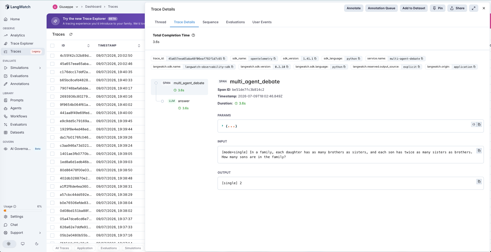
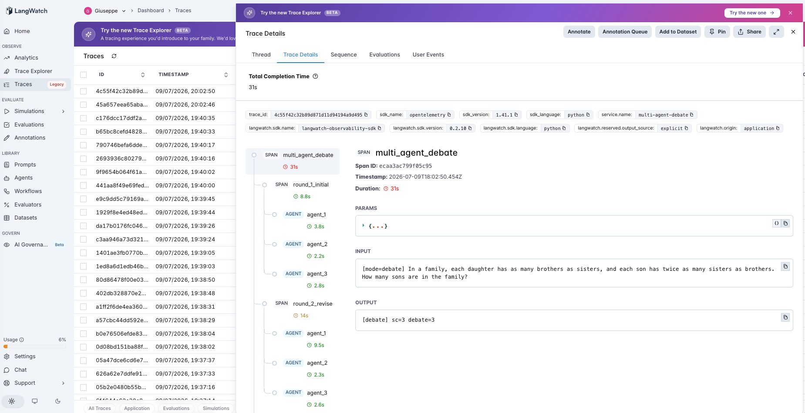

# 27 · Multi-Agent Debate

A multi-agent debate agent: N agents answer a question, then **see each other's answers and argue over several rounds** before a final vote. Does the arguing produce a better answer than a single agent — or than simply **voting N independent answers** with no interaction at all? The second Tier-5 (multi-agent) agent, and a test of the tier's most-repeated promise: *let the agents debate and they self-correct.*

Three modes, designed to isolate the one thing debate adds over an ensemble — **interaction**:

- **single** (default) — one agent answers once, at temperature 0. The baseline.
- **self_consistency** — N independent answers, majority vote, **no interaction**.
- **debate** — N agents answer independently (round 1), then for R rounds each sees the others' answers and reasoning and may revise; the final answer is a majority vote of the last round.

The trick that makes this clean: **debate's round 1 *is* self-consistency** (N independent samples, before any agent has seen another). So `run_eval` derives the SC result from debate's own round 1 — same samples — and `majority(round 1)` vs `majority(final round)` measures *exactly* what the arguing changed, including its risk, **conformity**: a correct agent talked out of the right answer by confident, wrong peers.

> **Agents must diverge to debate.** They sample at `DEBATE_TEMP` > 0 — at temperature 0 the N agents are identical and there is nothing to argue about (that's [#9](../09-chain-of-thought/)'s self-consistency lesson). The single baseline stays at temperature 0, its most-likely single shot.

## The pipeline

```
single:            answer (llm)
self_consistency:  answer (llm) ×N → vote                          (= debate round 1)
debate:            [answer (llm) ×N] → [see others + revise ×N] ×R → vote
```

Each step is a typed LangWatch span. See [`agent.py`](agent.py) (~180 lines) and [`dataset.csv`](dataset.csv), raw OpenAI + LangWatch.

### Two real traces

**Single gets it wrong — one call.** `single` on the sons-and-daughters puzzle (gold **3**) answers **2** in a single `answer` span. A hard constraint puzzle a single pass fumbles.



**Debate gets it right — at nine calls, but the win was already in round 1.** `debate` on the same question: round 1's three independent agents answer `[3, 2, 3]` — majority **3, already correct** (that's the self-consistency result, 3 calls). The two further revision rounds churn (`[1,3,3]`, `[3,3,1]`) but the majority never leaves 3. Nine calls to confirm what three independent votes already decided.



## The dataset

20 reasoning questions with exact numeric answers ([`dataset.csv`](dataset.csv)) — combinatorics (BANANA arrangements, divisor counts, painted-cube faces), counterintuitive rate/percentage traps, and constraint puzzles — chosen to be hard enough that a single agent errs and agents might genuinely disagree.

> **This dataset was stressed to create headroom** — the [#12](../12-least-to-most/)/[#24](../24-tool-retrieval/) move. The first cut was the famous CRT riddles (bat-and-ball, lily pads, the dying sheep); gpt-4o-mini has them memorized and scored **20/20 in every mode** — no disagreement, nothing to debate. A second cut of clean word problems: still 19/20 single. Only genuinely hard combinatorics/probability produced any round-1 disagreement at all — and even then, not much.

## The evaluators

Programmatic scorers ([`evals.py`](evals.py)), every answer through the **same** normalizer (both modes — [#20](../20-structured-extraction/)'s rule):

| Evaluator | Type | Measures |
|---|---|---|
| `correct` | Programmatic | Does an answer match gold? Applied to single / SC / debate. |
| `debate_delta` | Programmatic | Paired SC → debate per question: **correction** (SC wrong → debate right) vs **conformity harm** (SC right → debate wrong). The discriminator. |
| `agent_flips` | Programmatic | At the individual level, agents who went right→wrong vs wrong→right across the rounds — is the interaction even doing anything? |
| `initial_agreement` | Programmatic | Did round-1 agents already agree? Debate can only matter where they didn't. |

Plus **mean LLM calls** (single 1, SC N, debate N·(R+1)) — the cost axis.

## The tuning experiment

> **single vs self_consistency vs debate on 20 hard reasoning questions (N=3 agents, R=2 revision rounds)**

### Three hypotheses to discriminate

| | Outcome | What it would teach |
|---|---|---|
| **H1** (arguing helps) | debate ≫ self_consistency | Interaction adds real correction beyond ensembling. |
| **H2** (it's just ensembling) | debate ≈ self_consistency > single | The gain is N votes, not the arguing; interaction is inert-to-marginal. |
| **H3** (arguing hurts) | debate < self_consistency | Conformity: correct agents talked out of right answers. |

### Results (temperature 0.7, the standard setting)

| mode | correct | mean LLM calls |
|---|---|---|
| `single` | 19/20 (95%) | **1.0** |
| `self_consistency` | **20/20 (100%)** | 3.0 |
| `debate` | **20/20 (100%)** | 9.0 |

- **Paired SC → debate: 0 corrections, 0 conformity harm, 20 unchanged — net +0.**
- Round-1 agents **already agreed on 18 of 20** questions; debate can only matter on the other 2, and voting already got those right.
- Agent-level flips: **2 wrong→right, 1 right→wrong** — the interaction moves individual agents (including one conformity flip), but the moves cancel and never change a vote.

**Pushing diversity (temperature 1.1) to force disagreement:**

| mode | correct |
|---|---|
| `single` | 18/20 (90%) |
| `self_consistency` | 19/20 (95%) |
| `debate` | **20/20 (100%)** |

Here debate finally beat SC on exactly **one** question — the sons-and-daughters puzzle, where all three agents *agreed* on the wrong answer (2) at round 1 and the later rounds broke that unanimous consensus to reach 3. Net **+1**, at the cost of a worse baseline (single/SC both dropped). Across all four runs the debate-over-SC effect was **+0, +0, +0, +1** — noise-level.

### What's actually happening — H2, decisively; a flicker of H1's ceiling

**Debate's accuracy is entirely ensembling, not arguing (H1 rejected, H2 confirmed).** At the honest temperature it scored *identically* to self-consistency — 20/20 both, net +0 — for **3× the calls** (9 vs 3). Every bit of the multi-agent lift over a single agent (19→20) came from the round-1 vote; the R revision rounds added nothing to it. Whatever "debate improves reasoning" means, for this model it isn't the debate — it's the second and third opinion, which you get from voting alone at a third of the price.

**The interaction isn't inert — it just cancels out.** Agents genuinely move each other (2 wrong→right and 1 right→wrong at temp 0.7; 4 wrong→right at temp 1.1). So the arguing does something — but the rescues and the conformity flips roughly offset, and the majority vote was almost always already sitting on the right answer, so none of the churn changed an outcome. The one **conformity** flip (a correct agent argued off the right answer) is the failure mode H3 warns about; it fired at the agent level and simply didn't reach the vote.

**Debate has almost no surface to act on, because a capable model rarely disagrees.** Its interaction can only matter where round-1 agents split — that was 2 of 20 questions (and voting handled both). The whole premise of debate assumes productive disagreement; gpt-4o-mini, reasoning step by step, mostly lands the same (usually correct) answer three times, so there is nothing to argue about on 18 of 20.

**The one thing debate can do that voting can't — and why it barely showed.** Self-consistency is structurally incapable of fixing an error *all* agents share: voting on a unanimous wrong answer returns the wrong answer. Debate can, in principle, break that consensus — and did, once, at temperature 1.1 (the sons-and-daughters puzzle). But it took injecting enough diversity to make that error non-unanimous in the first place, which also dropped the baseline it was rescuing. That is the entire measured upside of the arguing: one question, non-deterministic, at 9× the cost of a single call.

### The lesson

> **Multi-agent debate's accuracy comes from ensembling, not from the arguing. At the standard temperature it scored identically to plain majority voting (20/20 both, net +0) at 3× the calls, because a capable model rarely produces the round-1 disagreement debate needs (18/20 questions were unanimous) and, where it errs, a minority slip that voting already fixes. The interaction is not inert — agents do move each other, including the conformity failure (a correct agent argued onto a wrong answer) — but the moves cancel and the vote was already right. Debate's one structural edge over voting is breaking an error every agent shares, which it did exactly once, only after cranking diversity high enough to also degrade the baseline. Reach for self-consistency; only pay for debate if you can show your agents both disagree AND that voting lands on the wrong side of the disagreement.**

The precondition, for the multi-agent tier:

- **Debate needs productive disagreement.** Its interaction only has a surface where round-1 agents split; for a capable model that's rare (2/20 here), and on those, voting usually suffices.
- **Its gain over voting is the shared-error case** — where every agent is wrong the same way, which ensembling can't fix. That's the one thing worth paying for, and it's rare and unreliable (one case, at forced-high diversity).
- **Its risk is conformity** — a correct agent argued off the right answer. Real at the agent level here; it stayed below the vote, but it's the reason debate can also make you *worse*.

For an AI PM in 2026: "the agents debate to a better answer" is, empirically, mostly "the agents vote to a better answer" — and voting is a third of the cost. Before shipping debate over self-consistency, measure two things on your own task: how often the agents actually disagree at round 1, and how often the majority vote is *wrong* on those. If disagreement is rare or voting already resolves it, the extra rounds are cost and conformity risk for nothing.

This is the second multi-agent-tier entry (#26→#27), and the same precondition shape as the whole catalog (#7→#27): the mechanism — agents arguing — pays off only where its precondition (disagreement that voting can't already resolve) holds, and for a capable model it seldom does. It extends [#9](../09-chain-of-thought/)'s finding: self-consistency changed nothing because the samples were unanimous; debate changes nothing *over* self-consistency for the same reason, plus a conformity risk voting doesn't carry.

## Quick start

```bash
cd agents/27-debate
python -m venv .venv && source .venv/bin/activate
pip install -r requirements.txt

cp .env.example .env
# fill in OPENAI_API_KEY and LANGWATCH_API_KEY (Project API Key, type Service)

# One question, each mode (watch the round-by-round answers and the call count)
python agent.py "How many distinct arrangements are there of the letters in BANANA?"
MA_MODE=debate python agent.py "..."

# Full comparison (single + debate, self-consistency derived from debate round 1)
python run_eval.py
python run_eval.py --limit 4     # smoke test
DEBATE_TEMP=1.1 python run_eval.py   # force more disagreement
```

If you hit the macOS Xcode-Python SSL issue (`Errno 2` on `ssl.py`):

```bash
pip install certifi
export SSL_CERT_FILE=$(python -c "import certifi; print(certifi.where())")
```

## What you'll learn

How multi-agent debate looks in LangWatch — round spans fanning out to per-agent spans, round after round — and why the metric that decides whether it's worth the fan-out is **debate vs self-consistency**, not debate vs a single agent. The PM takeaway is that debate's accuracy is the ensemble (the vote), not the argument: at the standard temperature it matched plain voting at 3× the cost, its one structural edge (fixing a shared error) fired once and unreliably, and its interaction carries a conformity risk voting doesn't.

## Status

✅ Complete. On 20 hard reasoning questions, `self_consistency` and `debate` scored **identically — 20/20 — with debate at 3× the LLM calls (9 vs 3) and net +0 corrections over voting**; round-1 agents already agreed on 18/20, so the arguing had almost no surface to act on, and where it moved individual agents (2 wrong→right, 1 right→wrong conformity) the moves cancelled below the vote. Forcing diversity (temp 1.1) yielded exactly one debate-over-SC correction — breaking a unanimous wrong answer, the one thing voting can't — at the cost of a worse baseline. The dataset was stressed through three difficulty tiers (memorized CRT 20/20 everywhere → clean word problems → hard combinatorics) to find any disagreement at all. The second multi-agent entry (#26→#27): debate's accuracy is ensembling, not arguing — reach for self-consistency unless you can show disagreement that voting can't resolve.
