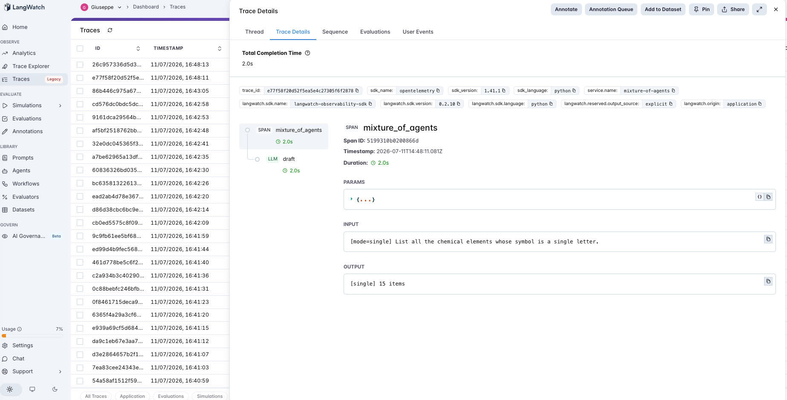
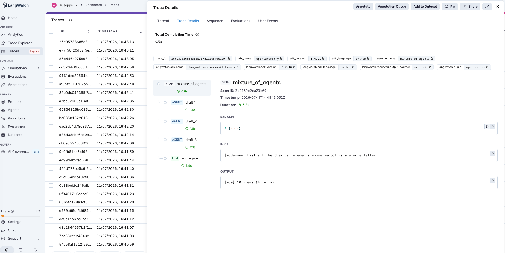

# 28 · Mixture-of-Agents

A mixture-of-agents agent: on a task where **no single answer is enough** — list a whole *set* — does combining several agents' drafts beat one agent, and is the win the **ensemble** (just merging the drafts) or the **synthesis** (an aggregator that reconciles them)? The third Tier-5 (multi-agent) agent, and the tier's best shot at a positive result: the first two ([#26](../26-supervisor-worker/), [#27](../27-debate/)) were *selection* tasks (pick the one right answer, where a single pass already wins); this is a *synthesis* task, where combining partial coverage is exactly what multi-agent is supposed to be for.

Three modes, each adding exactly one thing over the last:

- **single** (default) — one agent lists the set. The baseline.
- **union** — N agents draft independently; take the **union** of their items (dedup), no aggregator. Ensemble, no synthesis.
- **moa** — N agents draft, then an **aggregator LLM** synthesizes one final list: keep every correct item, drop duplicates *and* items that don't belong. Mixture-of-agents proper.

So `union − single` isolates whether more drafts add coverage, and `moa − union` isolates whether the aggregator adds anything over a naive merge (its job is precision — pruning the wrong items N drafts accumulate). Drafts sample at `MOA_TEMP` > 0 so they actually differ.

> **Same matcher everywhere.** Set membership is fuzzy ("Czech Republic" = "Czechia", "Burma" = "Myanmar"), so one normalizer + alias map scores every mode *and* does the agent's union-dedup — a mode can't be helped or hurt by a stricter matcher on its side ([#20](../20-structured-extraction/)'s lesson).

## The pipeline

```
single: draft (llm)
union:  draft (llm) ×N → merge (dedup in code)
moa:    draft (llm) ×N → aggregate (llm)
```

Each step is a typed LangWatch span. See [`agent.py`](agent.py) (~180 lines), [`evals.py`](evals.py) (the shared matcher), and [`build_dataset.py`](build_dataset.py), raw OpenAI + LangWatch.

### Two real traces

**One draft, one call.** `single` on "list the elements whose symbol is a single letter" — one `draft` span returns the list.



**Three drafts and an aggregator — four calls, for the same score.** `moa` on the same question: `draft_1/2/3` each produce a list, then `aggregate` reconciles them into the final set. Four LLM calls where single made one — and, across the dataset, no better on F1.



## The dataset

19 "list all X" questions with canonical gold sets ([`dataset.csv`](dataset.csv), rebuild with `python build_dataset.py`) — country borders, EU/ASEAN members, the zodiac, chemical-element ranges, all 50 US states. Sizes 7–50, weighted toward the **large** sets a single pass under-recalls, so the ensemble has real coverage to add — and where drafts add wrong items, so the aggregator has a precision job.

> **Stressed for headroom** — the [#24](../24-tool-retrieval/)/[#27](../27-debate/) move. A first cut of famous small/medium sets scored **0.95 F1 in all three modes** — single-pass recall was already 0.96, nothing to add. Swapping in hard enumerations (element ranges, single-letter symbols, all 50 states) dropped single recall to 0.89 — real misses to recover — and the result held.

## The evaluators

Programmatic set scorers ([`evals.py`](evals.py)):

| Evaluator | Type | Measures |
|---|---|---|
| `recall` | Programmatic | Of the gold items, how many did we list? Ensembling's target. |
| `precision` | Programmatic | Of the items we listed, how many are correct? The aggregator's target. |
| `f1` | Programmatic | Harmonic mean — the headline. All three modes, same matcher. |

Plus **mean LLM calls** (single 1, union N, moa N+1) — the cost axis.

## The tuning experiment

> **single vs union vs moa on 19 set-recall questions (N=3 agents)**

### Three hypotheses to discriminate

| | Outcome | What it would teach |
|---|---|---|
| **H1** (ensembling helps) | union recall ≫ single | More drafts cover more of the set; multi-agent finally wins. |
| **H2** (synthesis helps) | moa ≫ union | The aggregator adds real value over a naive merge (precision, reconciliation). |
| **H3** (homogeneous MoA is inert) | single ≈ union ≈ moa | Same-model drafts make *correlated* errors, so nothing to union or reconcile. |

### Results

| mode | recall | precision | F1 | mean LLM calls |
|---|---|---|---|---|
| `single` | 0.89 | 0.89 | 0.89 | **1.0** |
| `union` | 0.90 | 0.89 | **0.90** | 3.0 |
| `moa` | 0.89 | 0.90 | **0.90** | 4.0 |

- **`single → union`: recall +0.009, precision +0.000.** The two extra drafts recovered ~1 point of the 11 that single missed — **under 10% of its misses.**
- **`union → moa`: recall −0.008, precision +0.011** (moa beat union on precision for 1 of 19 questions). The aggregator nudges precision, sometimes at a small recall cost.
- **By set size (recall):** medium `0.90 → 0.91 → 0.91`, large `0.88 → 0.89 → 0.87` — no size where the ensemble opens a gap.

### What's actually happening — H3, decisively; H1 and H2 rejected

**Combining same-model drafts adds almost nothing (H1 rejected).** Union scored 0.90 recall to single's 0.89 — a 0.9-point gain for tripling the calls. The reason is the quiet killer of homogeneous ensembling: **the drafts make correlated errors.** Three samples of *the same model* don't miss random different items — they miss the *same* items (the ones outside the model's knowledge), so unioning them recovers almost none of what the first draft missed (< 10% of its misses). Ensembling only buys coverage when the members fail *independently*; N copies of one model, even at temperature 0.7, don't.

**The aggregator has nothing to reconcile (H2 rejected).** `moa` matched `union` on F1 (0.90) and actually cost it a hair of recall while returning a hair of precision. A synthesizer earns its keep by adjudicating *disagreements* between drafts — but when the drafts largely agree (because they're the same model), there's little to adjudicate; its main effect is trimming the occasional shared hallucination, which is why the one place it moved the needle was precision, on a single question.

**So homogeneous mixture-of-agents collapses to a single agent at 3–4× the cost.** All three modes sit at F1 0.89–0.90. The famous MoA result is real — but it depends on **model diversity**: the original mixes *different* models, whose different blind spots make the errors independent enough that unioning genuinely adds coverage and the aggregator has real disagreements to resolve. Run it with one model wearing three hats and you pay the N× bill for the correlation you built in.

### The lesson

> **Mixture-of-agents only helps when the agents fail independently — and N samples of one model don't. On set-recall, `single`, `union`, and `moa` scored the same F1 (0.89–0.90): unioning three same-model drafts recovered under 10% of what the first draft missed, because the drafts miss the *same* items (correlated errors), and the aggregator had nothing to reconcile because same-model drafts mostly agree — so it moved only precision, on one question, at 3–4× the calls. The famous MoA gains ride on *model diversity* (different models, different blind spots, independent errors); a homogeneous mixture collapses to a single agent plus a bill. Before shipping MoA, ask whether your agents are actually diverse — if they're one model sampled N times, you've ensembled the same mistakes.**

The precondition, for the multi-agent tier:

- **Ensembling helps only under error independence.** Union recovers a miss only if *some* member didn't make it; same-model members make it together. Measure whether extra drafts recover the first's misses — here, barely.
- **Synthesis needs disagreement to resolve.** The aggregator adds value where drafts conflict; same-model drafts mostly agree, so it only trims the rare shared error (precision), never adds coverage.
- **Diversity is the real ingredient, not agent count.** The lever that makes MoA work is *heterogeneous* members, not *more* of the same one.

For an AI PM in 2026: "mixture-of-agents" is not "run gpt-4o-mini three times and merge." That buys correlated errors at triple the cost. If you want the MoA lift, the design variable is model diversity — different models (or genuinely different prompts/tools that create independent failure modes) — and you should verify independence by checking whether the members actually recover each other's misses. Otherwise reach for a single call.

This is the third multi-agent-tier entry (#26→#28), and the same precondition shape as the whole catalog (#7→#28): the mechanism — combining agents — pays off only where its precondition (independent errors / real disagreement) holds, and with one model it doesn't. It extends [#9](../09-chain-of-thought/) and [#27](../27-debate/): self-consistency changed nothing because the samples were unanimous; debate added nothing over voting; and here even the *union* adds nothing over one draft — three faces of the same fact, that one model sampled N times is still, mostly, one model.

## Quick start

```bash
cd agents/28-mixture-of-agents
python -m venv .venv && source .venv/bin/activate
pip install -r requirements.txt

cp .env.example .env
# fill in OPENAI_API_KEY and LANGWATCH_API_KEY (Project API Key, type Service)

python build_dataset.py           # (re)generate the gold-set dataset

# One question, each mode (watch the draft count and the calls)
python agent.py "List all the countries that border Germany."
MA_MODE=moa python agent.py "..."

# Full comparison (single + union + moa)
python run_eval.py
python run_eval.py --limit 4      # smoke test
```

If you hit the macOS Xcode-Python SSL issue (`Errno 2` on `ssl.py`):

```bash
pip install certifi
export SSL_CERT_FILE=$(python -c "import certifi; print(certifi.where())")
```

## What you'll learn

How mixture-of-agents looks in LangWatch — N `draft` spans fanning into an `aggregate` span — and why the metric that decides whether it's worth the fan-out is **whether extra drafts recover the first draft's misses**, not agent count. The PM takeaway is that MoA's gains require *error independence*, which N samples of one model don't have: here `single`, `union`, and `moa` tied on F1 because same-model drafts miss the same items and agree on the rest, so the ensemble and the aggregator both had nothing to add — at 3–4× the cost. The real design variable is model diversity.

## Status

✅ Complete. On 19 set-recall questions, `single`, `union`, and `moa` scored the **same F1 (0.89–0.90)**: unioning three same-model drafts lifted recall by 0.9 point (recovering under 10% of single's misses, because the drafts make **correlated errors** — they miss the same items), and the aggregator moved only precision, on one question, at **3–4× the LLM calls**. Stressed through two difficulty tiers (easy sets scored 0.95 in every mode; hard enumerations dropped single recall to 0.89 and the tie held). The third multi-agent entry (#26→#28): mixture-of-agents needs **model diversity** to beat a single agent — a homogeneous mixture ensembles the same mistakes. Extends #9/#27: one model sampled N times is still one model.
