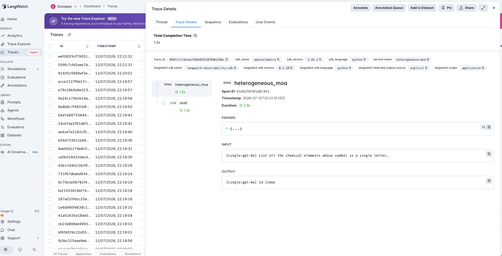
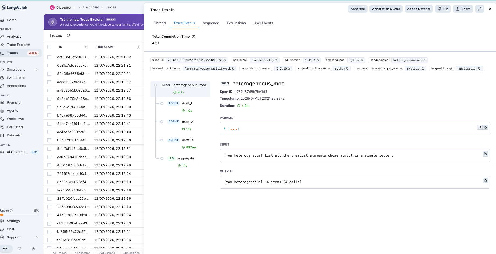

# 29 · Heterogeneous Mixture-of-Agents

A follow-up that tests the previous agent's parting claim. [#28](../28-mixture-of-agents/) found that a **homogeneous** mixture-of-agents — one model sampled N times — collapses to a single agent, because same-model drafts make *correlated* errors (they miss the same items). Its hypothesis for why the famous MoA result works anyway: **model diversity**. This agent puts that hypothesis on the stand, on the identical set-recall task and scorer, changing exactly one thing — whether the N drafters are the *same* model or *different* ones.

- **single** — one model lists the set. Run for both **gpt-4o-mini** and **gpt-4o**, so we know the best individual.
- **homogeneous** — 3× **gpt-4o-mini** → aggregator. (= #28's result, reproduced here.)
- **heterogeneous** — **gpt-4o-mini + gpt-3.5-turbo + gpt-4o** → aggregator. The test.

The aggregator is held fixed (gpt-4o-mini) so the *only* difference between homogeneous and heterogeneous is whether the drafts come from one model or three — isolating diversity. And the sharpest measurement isolates the mechanism directly: **of the gold items gpt-4o-mini's draft missed, how many do the *other* two drafters recover — two more gpt-4o-minis, versus a gpt-3.5-turbo and a gpt-4o?**

> **Same task, same matcher as #28.** Set-recall ("list all X" with a gold set), one shared normalizer + alias map scoring every config ([#20](../20-structured-extraction/)'s rule). Only the drafter models changed — so any difference from #28 is diversity, nothing else.

## The pipeline

```
single: draft (llm, model=X)
moa:    draft_1 (model A) · draft_2 (model B) · draft_3 (model C) → aggregate (llm)
```

Each step is a typed LangWatch span. See [`agent.py`](agent.py) and [`run_eval.py`](run_eval.py) (which runs all four configs and the independence test), raw OpenAI + LangWatch.

### Two real traces

**The best single model, in one call.** `single` gpt-4o on the single-letter-symbol elements — one `draft` span returns the full set (14/14).



**Three different models and an aggregator — four calls, same answer.** `heterogeneous` on the same question: `draft_1` (gpt-4o-mini), `draft_2` (gpt-3.5-turbo), `draft_3` (gpt-4o), then `aggregate` — the exact same 14 items, at four times the calls.



## The dataset

The same 19 set-recall questions as #28 ([`dataset.csv`](dataset.csv)) — country borders, EU/ASEAN members, the zodiac, chemical-element ranges, all 50 US states — sizes 7–50, weighted toward the large sets a single pass under-recalls, so there are real misses for a diverse drafter to recover.

## The evaluators

The shared set scorer from #28 ([`evals.py`](evals.py)): **recall**, **precision**, **F1** per config, plus two purpose-built views in [`run_eval.py`](run_eval.py):

| Measurement | What it isolates |
|---|---|
| **independence** | Of the items gpt-4o-mini missed, the fraction the *other* drafters recover — homogeneous (more gpt-4o-mini) vs heterogeneous (gpt-3.5-turbo + gpt-4o). The mechanism: does diversity give independent errors? |
| **synergy** | Does heterogeneous MoA beat the *best individual model*? If not, any apparent gain is just gpt-4o carrying it — not the mixture. |

## The tuning experiment

> **single (mini, gpt-4o) vs homogeneous vs heterogeneous MoA on 19 set-recall questions**

### Three hypotheses to discriminate

| | Outcome | What it would teach |
|---|---|---|
| **H1** (diversity is the ingredient) | hetero ≫ homo, and hetero > best individual | #28 was right — different models, independent errors, real synthesis. |
| **H2** (shared lineage → shared blind spots) | hetero ≈ homo ≈ best individual | Different *names*, but same training family → errors still correlate. |
| **H3** (it's just the strong model) | hetero ≈ gpt-4o alone, > mini | No mixture effect; you're paying 4× for what gpt-4o gives in one call. |

### Results

| config | recall | precision | F1 | calls |
|---|---|---|---|---|
| single gpt-4o-mini | 0.89 | 0.89 | 0.89 | 1 |
| **single gpt-4o** | 0.90 | 0.90 | **0.90** | **1** |
| homogeneous union | 0.90 | 0.87 | 0.88 | 3 |
| homogeneous moa | 0.89 | 0.90 | 0.90 | 4 |
| heterogeneous union | 0.90 | 0.88 | 0.89 | 3 |
| heterogeneous moa | 0.89 | 0.90 | 0.90 | 4 |

**Independence — recovering gpt-4o-mini's 23 missed items:**

| the other two drafters | recovered |
|---|---|
| homogeneous (2 more gpt-4o-mini) | **2 / 23 (9%)** |
| heterogeneous (gpt-3.5-turbo + gpt-4o) | **2 / 23 (9%)** |

**Synergy:** best individual F1 **0.901** (gpt-4o) · heterogeneous MoA F1 **0.897** · delta **−0.004** · heterogeneous MoA beat the best individual on **0 / 19** questions.

### What's actually happening — H2 and H3; H1 (and #28's hypothesis) rejected

**Different models recovered the *same 9%* of the misses as more copies of one model (H1 rejected).** This is the whole result in one number. #28's parting hypothesis was that MoA needs model diversity — so swapping two gpt-4o-mini drafts for a gpt-3.5-turbo and a *gpt-4o* should recover far more of what gpt-4o-mini missed. It recovered **2 of 23, exactly the same as the homogeneous mixture.** The items gpt-4o-mini gets wrong are, overwhelmingly, items gpt-3.5-turbo and gpt-4o *also* get wrong. The errors aren't independent across models — they're **correlated across the whole model family**, because these models share training lineage and therefore share blind spots. The misses are on objectively hard/rare items (an obscure element, the country everyone forgets), and being hard is a property of the *item*, not of one model's quirk.

**So heterogeneous MoA collapses to the best single model, at 4× the cost (H3).** Every MoA config lands at F1 0.90 — identical to just calling gpt-4o once. Heterogeneous MoA never once beat the best individual (0/19). Adding a weaker model (gpt-3.5-turbo) and a stronger one (gpt-4o) to a mixture, then having gpt-4o-mini aggregate, gets you exactly what gpt-4o gives you alone — for four calls instead of one, on three models instead of one.

**"Model diversity" was the right idea pointed at the wrong variable.** #28 wasn't wrong that MoA needs *error independence* — it is. It was wrong that *different models* supply it. Different *names* from the same vendor don't: shared data makes shared mistakes. What independence actually requires is different *knowledge* — genuinely different training corpora, or non-parametric sources (retrieval, tools, a calculator) whose failures don't line up with the model's. That's untested here (this key only reaches OpenAI models, one lineage), and that's exactly the honest boundary: the diversity available *within* a model family did not buy independence, so "just use different models" is not, by itself, the fix.

### The lesson

> **Heterogeneous mixture-of-agents didn't beat a single call to the best model. Swapping two same-model drafts for a gpt-3.5-turbo and a gpt-4o recovered the *same 9%* of gpt-4o-mini's misses that more gpt-4o-minis did — because models from one lineage share blind spots, so their errors correlate even across different model names. Every MoA config tied gpt-4o-alone at F1 0.90, at 4× the calls, winning on 0/19 questions. #28's fix ("MoA needs model diversity") was aimed at the wrong variable: MoA needs error *independence*, and different models from the same vendor don't provide it — the hard items are hard for all of them. Independence needs different *knowledge* (other vendors, other data, retrieval/tools), not different model IDs. Until you can show your agents actually recover each other's misses, a mixture is the best single model plus a bill.**

The precondition, for the multi-agent tier:

- **Ensembling's precondition is error independence** — and it's a property of the *knowledge sources*, not the *count* or even the *names* of the agents.
- **Same-vendor model diversity doesn't supply it** — shared training lineage → shared blind spots → correlated misses on the hard items (9% cross-model recovery, same as within-model).
- **Measure independence directly** — do the other members recover this member's misses? Here, almost never. If they don't, use the best single model.

For an AI PM in 2026: the fix for a disappointing mixture-of-agents is *not* "add gpt-4o and gpt-3.5 to the pool." Models from one family fail on the same inputs, so you pay N× for correlated votes. If you need a mixture to beat your best model, the members have to bring independent knowledge — different vendors trained on different data, or tools/retrieval that fail differently — and you should verify it by measuring whether they recover each other's misses. Otherwise, one call to the best model is the honest baseline that mixtures here never beat.

This is the fourth multi-agent-tier entry (#26→#29) and closes the loop [#28](../28-mixture-of-agents/) opened. It is the same precondition shape as the whole catalog (#7→#29): the mechanism — combining agents — pays off only where its precondition (independent errors) holds; #28 showed one model sampled N times doesn't have it, and #29 shows several models from one family don't either.

## Quick start

```bash
cd agents/29-heterogeneous-moa
python -m venv .venv && source .venv/bin/activate
pip install -r requirements.txt

cp .env.example .env
# fill in OPENAI_API_KEY and LANGWATCH_API_KEY (Project API Key, type Service)
# needs access to gpt-4o-mini, gpt-4o and gpt-3.5-turbo

# One question, all three drafter configs side by side
python agent.py "List all the countries that border Germany."

# Full comparison + the independence and synergy tests
python run_eval.py
python run_eval.py --limit 4     # smoke test
```

If you hit the macOS Xcode-Python SSL issue (`Errno 2` on `ssl.py`):

```bash
pip install certifi
export SSL_CERT_FILE=$(python -c "import certifi; print(certifi.where())")
```

## What you'll learn

How a heterogeneous mixture looks in LangWatch — `draft` spans from *different* models feeding one `aggregate` span — and why the metric that decides whether diversity helps is **whether the other models recover this model's misses**, not how many different models you used. The PM takeaway is that "mixture-of-agents needs model diversity" is only half true: it needs error *independence*, and different models from the same vendor share blind spots, so heterogeneous MoA here tied a single gpt-4o call (F1 0.90) at 4× the cost and never beat it. Independence comes from different knowledge, not different model names.

## Status

✅ Complete. On the same 19 set-recall questions as #28, **heterogeneous MoA (gpt-4o-mini + gpt-3.5-turbo + gpt-4o) tied a single gpt-4o call at F1 0.90** — winning on 0/19 questions at 4× the calls — because different models from one vendor make **correlated errors**: of the 23 items gpt-4o-mini missed, the two *different* models recovered 2 (9%), the *identical* number two more gpt-4o-minis recovered. #28's hypothesis (MoA needs model diversity) is refuted for shared-lineage models: MoA needs error *independence*, which different model names from the same family don't supply — the hard items are hard for all of them. The fourth multi-agent entry (#26→#29), closing #28's loop: independence needs different knowledge (other vendors / data / retrieval), not more model IDs.
